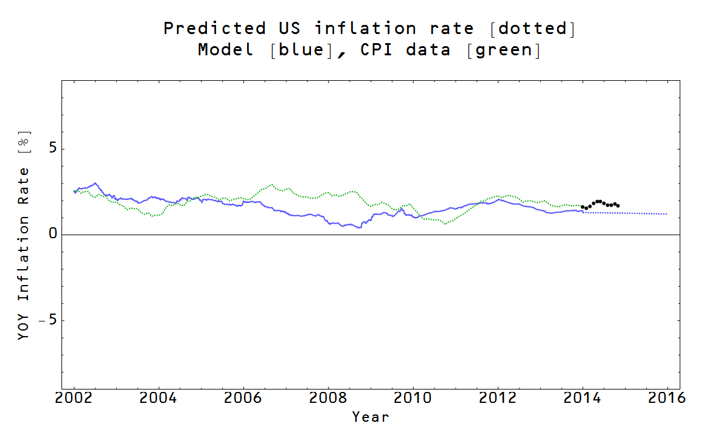
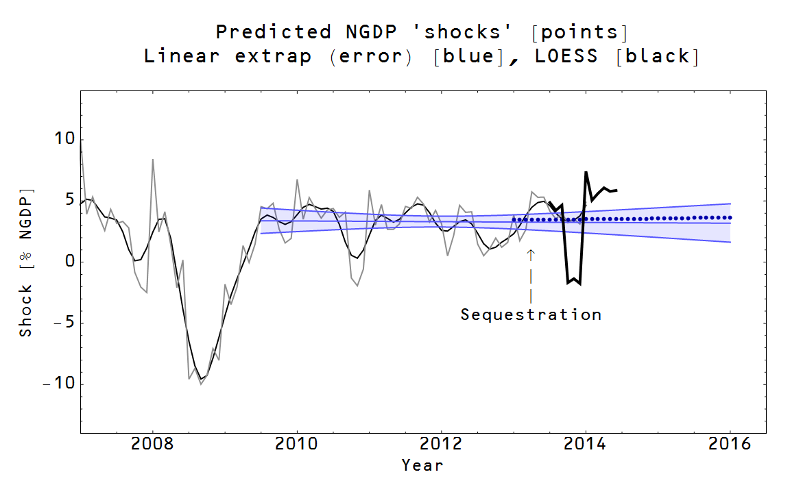
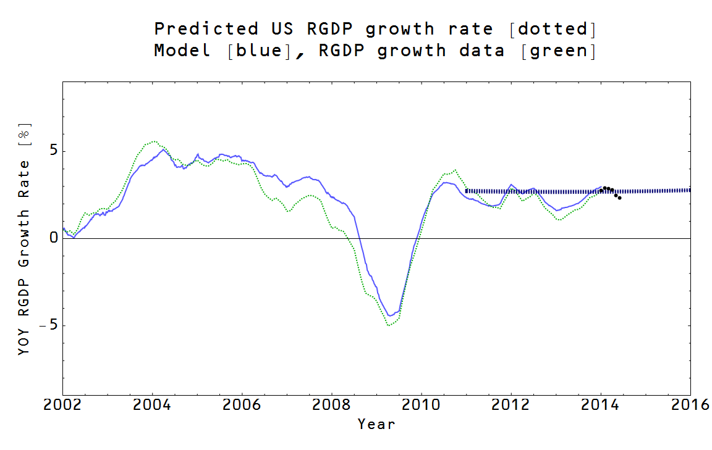

Here's the update of the predictions [last updated here](http://informationtransfereconomics.blogspot.com/2014/08/prediction-update-not-bad-for-five.html). The big story is that the monetary base isn't following my assumed counterfactual as well as it had been, which means that short term interest rates should start to be a bit higher than the predictions ... and sure enough, they seem to be on their way up.

The unemployment rate graph was always a more speculative prediction as the model only gives the "natural rate". In [the original prediction](http://informationtransfereconomics.blogspot.com/2014/03/macroeconomic-predictions-for-2016.html), I speculated that the unemployment rate might pause (reach a metastable state) at the blue band before either rising again or sinking further.

