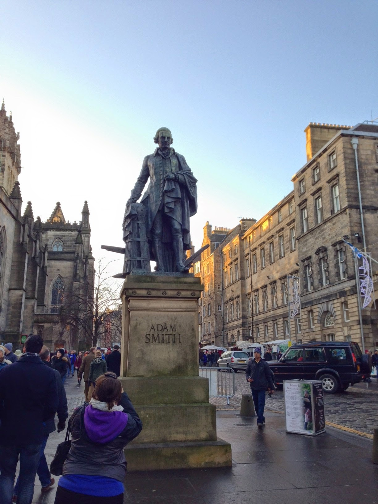
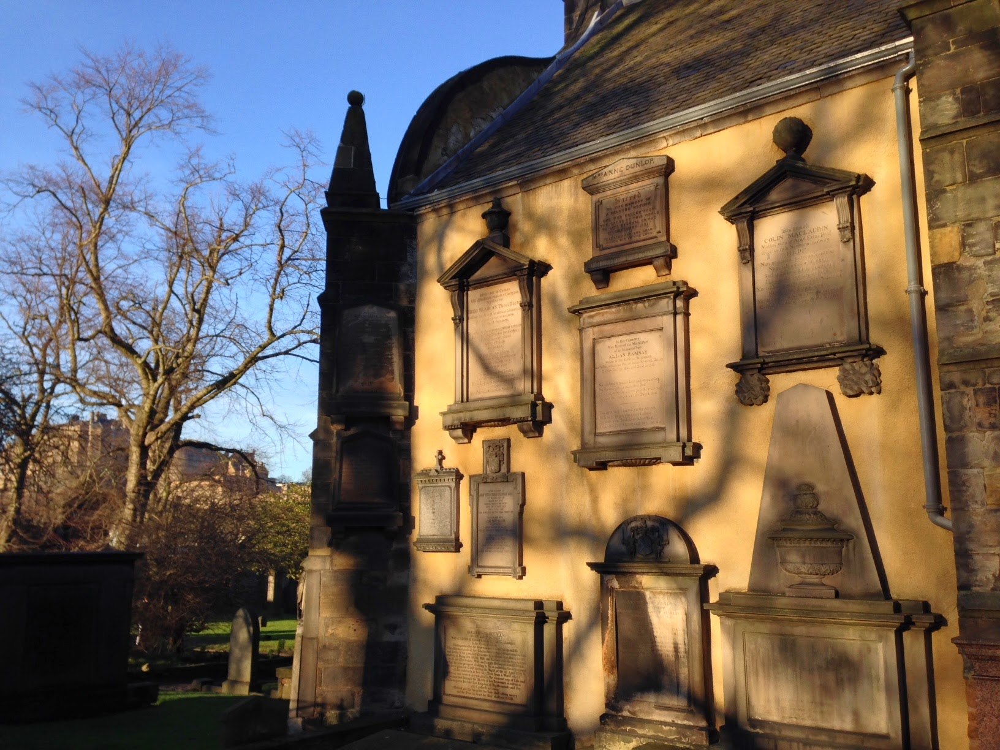
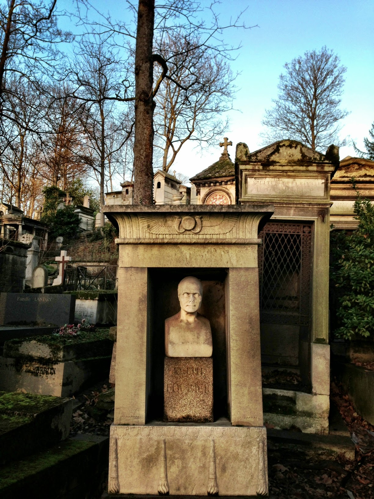

During my trip to Scotland, I took a couple of economically-relevant pictures in Edinburgh. I did manage to find a good place [in the archives](http://informationtransfereconomics.blogspot.com/2014/09/annihilation-and-sterilization.html) for my picture of David Hume's grave

I haven't found a good place to use it yet, but I also got one of this memorial to Adam Smith (I walked by it, but did not realize at the time that his grave was in Canongate Kirkyard a few blocks down the Royal Mile):

Not so much for economics, but as part of the greater [Scottish Enlightenment](http://en.wikipedia.org/wiki/Scottish_Enlightenment), here's mathematician [Colin Maclaurin](http://en.wikipedia.org/wiki/Colin_Maclaurin)'s memorial (at the upper right on the wall):

Not in Scotland, but while I'm at it, I got this one of Joseph Fourier's grave in Paris a couple years back:

