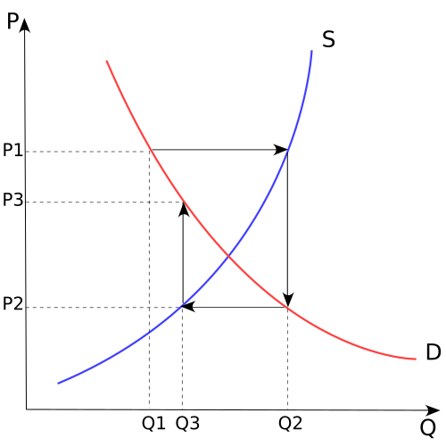
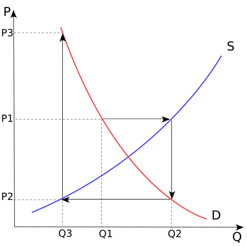

In writing the posts about [expectations](http://informationtransfereconomics.blogspot.com/2015/02/expectations.html) I stumbled across [the cobweb model](http://en.wikipedia.org/wiki/Cobweb_model) of how expectations can impact prices in the short run, creating periodic fluctuations and volatility. The basic idea is that there are two possibilities for a series of price adjustments, convergent and divergent \[from Wikipedia\]

.svg/500px-Cobweb_theory_\(convergent\).svg.png).svg/500px-Cobweb_theory_\(divergent\).svg.png)

If we assume an equilibrium market price $P_{0}$, then we can say the information source $Q_{0}^{d}$ and destination $Q_{0}^{s}$ are equivalent as well as the initial conditions ($Q_{ref}^{x}$)
