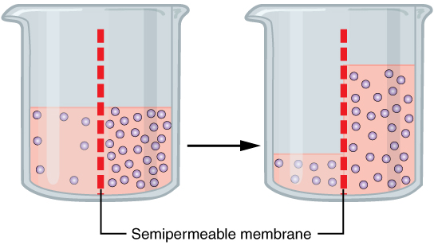

Jamie has a couple of [excellent comments](http://informationtransfereconomics.blogspot.com/2015/02/a-simple-example-of-information.html?showComment=1423322870191#c3445465730175994401) on my previous post and I thought I'd turn the response into a full post (as I've done [before](http://informationtransfereconomics.blogspot.com/2014/09/which-way-does-information-flow.html)). I broke my response up into two pieces more or less corresponding to the two comments with 'short answers' for the titles. I also left (i.e. will have left, after I write this) some responses to some of the side questions on the comments themselves.

**I. Supply and demand as entropic force free-body diagrams**

Jamie's first comment asks why I focus on supply and demand (my derivation of supply and demand diagrams is probably one of the most linked-to posts on this blog), especially in macroeconomics, when -- and I am paraphrasing here -- the counterfactual points along the curves that are not realized are unobservable.

First, there are some practical reasons. You can't get very far winning people over to your view if you start from the perspective that their entire education in their field was for naught. I try to make a connection with mainstream results -- where they are similar -- as a method of persuasion. I also try to use the language of the field where possible. My primary purpose is so that I can communicate with economists. \[1\]

Additionally, in the specific case of supply and demand, the concept been around for 200+ years and is still considered a good guiding principal by economists. There is probably something to it, even if it is just an approximation.

And it turns out the idea of information equilibrium when you hold one of the quantities constant leads to the logic of a supply and demand diagram. A good analogy for a supply and demand diagram is a [free-body diagram](http://en.wikipedia.org/wiki/Free_body_diagram) from introductory physics classes.

In physics we learn _F = ma_ and one way to figure out the acceleration (_a_) is to figure out all of the forces acting on an object, which is done with a free body diagram like this one from [wikimedia commons](http://commons.wikimedia.org/wiki/Category:Free_body_diagrams#mediaviewer/File:Free_body.svg):

Two of these (psuedo)forces, friction (_f_) and the normal force (_N_) are not directly observable on their own -- the force of gravity (or some other force) has to be acting in the opposite direction.

A supply and demand diagram is a bit like a free-body diagram, but for [entropic forces](http://en.wikipedia.org/wiki/Entropic_force). Take [osmosis](http://en.wikipedia.org/wiki/Osmotic_pressure) for example. Adding salt or water to either side of the semi-permeable membrane is a bit like shifting supply and demand curves with the osmotic pressure going up and down. When you shift one of the curves, your equilibrium price (pressure) travels along the other curve, and even though we may not add salt or water, the unobserved parts of these curves exist and are useful theoretical constructs.

> _"The observables of economics are accounting and other records. One should then try to construct a theory of economics that involves only observables. The importance of this kind of operational principle in physics and other sciences have been paramount"_

refers to something [a bit more technical](http://en.wikipedia.org/wiki/Observable) than constructing a theory only using observable quantities. Smolin, a theoretical physicist, is not arguing that the idea of a wavefunction (not observable) should be left out quantum mechanics! In fact, [in Smolin's view](http://arxiv.org/abs/0902.4274), the sale price of e.g. an iPad is not really an observable:

> _"In physics we have a basic rule which is that observables are always expressible as ratios of two quantities expressed in the same units, so they are a pure number. Applied to economics, this rule suggests that decisions should not be based on the units or currencies prices are expressed in."_

What Smolin is arguing (I believe -- his two statements about observables are somewhat contradictory) is that we should restrict the _**inputs and** **outputs**_ of economic theories to observable quantities (in the same way that that the inputs and outputs of quantum field theory are restricted to things that can be measured in a lab -- the Ψ's are in the theory, but aren't directly observable). Specifically, Smolin mentions utility which I think is the prime example (I would add expectations as well). Utility functions cannot be observed so there are things like the axiom of [revealed preference](http://en.wikipedia.org/wiki/Revealed_preference) -- which turns out to be equivalent (via Afriat’s theorem) to the idea that utility functions should be observable in Smolin's view!

To bring it back to the osmosis example, the movements of the water molecules are unobservable in principle. It takes [_kT log 2_](http://en.wikipedia.org/wiki/Landauer%27s_principle) units of energy to erase one bit of randomness, so observing the velocities of all the molecules would raise the temperature of the system and impact the experiment \[2\]. But we wouldn't think we should leave the idea of molecules out of a description of osmosis.

It is true that you can understand the information transfer framework without introducing supply and demand diagrams -- for example, an ideal gas is described by the exact same mathematics, but we don't draw supply and demand diagrams ([PV diagrams](http://en.wikipedia.org/wiki/Pressure_volume_diagram) are a more relevant way of discussing gasses). But sometimes these diagrams are a useful tool for explanations when there is a bunch of stuff going on or to appeal to intuition of the reader. Here is a [good example](http://informationtransfereconomics.blogspot.com/2014/03/the-effects-that-move-interest-rates.html).

Essentially, I focus on supply and demand because it is part of the language we've ended up with in the intellectual history of economics that matches up best with the entropic forces (the 'invisible hand') described by the information transfer model.

**II. With entropic forces, causality goes both ways**

Jamie's second comment asks why I like forecasting (which has a short answer -- I'm a scientist, and the only way you can guarantee your model didn't have access to a given data set is if it comes from the future), but primarily asks about causality and uses the example of driving a car. I think this question really hits at the heart of different ways of thinking about economics:

> _Which of the following statements is more accurate?_
> _1) An increase in fuel \[supplied\] causes the car to travel further_
> _2) An increase in the use of the car for travel causes an increase in the fuel \[used\]._

Jamie, logically, says (2) is the more sensible sentence from a causality standpoint. I'd agree!

The utility-based microeconomic theory (that "incentives matter") says that (2) is true, too. Additional demand increases the price, that incentivizes additional fuel production. However, this view also says that an increase in the fuel supply (1) lowers its price and that makes more people buy more fuel. Now this idea is not only that more people can afford fuel at a lower price, or finally afford as much as they need, but that lowering the price incentivizes additional consumption ... like a moth to flame. _**Jamie and I both have a problem with this view.**_ Lowering the gas price doesn't make me want to drive more. I didn't look at the gas price at the pump I went to here in New Mexico (I'm on work travel again), see that it was almost two bucks a gallon (I haven't seen prices that cheap since the 1990s) and feel the urge to buy more gas than I needed or drive more than I have to.

Despite my problem with this microeconomic view, I still think it gets the result correct, just not for the right reasons. The problem with the micro viewpoint in the previous paragraph is that is tries to assign a microeconomic explanation for an entropic force. I've talked about [this before here](http://informationtransfereconomics.blogspot.com/2015/01/i-strongly-disagree-with-what-you-are.html). As an analogy in physics, it is like coming up with a microscopic force that causes a single water molecule to undergo osmosis or a single glue molecule to be sticky. There is no such force \[3\]. Water molecules end up on one side or the other of a semi-permeable membrane because they are more likely, given all of the places they could be, to be there.

In some cases, it is possible to invent microscopic forces that save the phenomena, but they're not real. I think a good case in economics is [Calvo pricing](http://en.wikipedia.org/wiki/Calvo_%28staggered%29_contracts). In order to produce microfounded models with sticky prices, economists invent a "Calvo fairy" that randomly goes around and with a touch of its wand, lets a firm raise or lower their prices. In the information transfer model, [nominal rigidity is an entropic force](http://informationtransfereconomics.blogspot.com/2014/10/wage-stickiness-is-entropic-force.html) -- there is no microeconomic explanation. Nothing prevents firms from changing their prices, it's just overwhelmingly unlikely that they all do it in a particular way (unless there is a recession).

As in the case of osmosis, adding more salt to right side "causes" the water to move over to the right side and adding more water to the left side "causes" more water to move over to the right side. But there is no microscopic force acting on the water molecules to move them. It is just becomes overwhelmingly more probable to find the system in the new state. If you had only a few water molecules and sodium and chloride ions, the probability wouldn't be as overwhelming, and you could in fact [see things go the "wrong" way](http://en.wikipedia.org/wiki/Fluctuation_theorem).

Jamie brings up the question of whether adding money (or expectations of money) to the economy causes NGDP to grow (the monetarist viewpoint) or an increase in NGDP (via e.g. government spending) causes the money supply to grow. The answer to this in the information transfer model is "yes" \[4\]. That is to say:

-   Adding money to the economy makes it more likely that the economy will randomly happen upon a state that has higher NGDP \[4\]. That is to say, there is an entropic force that pushes the economy to higher NGDP \[4\]. This brings M and NGDP into information equilibrium.
-   Adding NGDP to the economy creates an entropic force that results in more money being printed (more people go to ATMs, the banks ask for cash from their reserves, and the Fed asks the Treasury to print it up). If that money isn't printed (because the central bank says "no"), M and NGDP will be out of equilibrium. If that happens, NGDP can fall back suddenly, [causing a recession](http://informationtransfereconomics.blogspot.com/2014/09/the-emerging-story-of-great-recession.html).

I talked about causality more awhile ago [here](http://informationtransfereconomics.blogspot.com/2014/05/causality-in-information-transfer.html), and I'm saying essentially the same thing now (the linked post uses interest rates as the example). In the end, the information equilibrium picture is a very different view of economics from any I've seen out there.

This is not to say that an agent-based approach that simulates millions of micro interactions won't end up with the correct theory. It totally could! A simulation that models all the velocities and interactions of the molecules in a gas will come up with the ideal gas law. The thing is that the specific list of causes and effects in all of those microscopic interactions fall away -- the ideal gas law doesn't depend on the details of the molecules except as a single number (the ideal gas constant).

The information transfer model posits that the same goes for macroeconomics.

**Footnotes:**

\[1\] For example, the term "liquidity trap" (frequently appearing in quotation marks on this blog) is really not very accurate. Calling it a "trap" makes it seem like it has a rapid onset (it does not -- you just notice it rapidly when the first large economic shock strikes when inflation is low). And it has nothing to do with liquidity preference either. Most accurately, a liquidity trap economy would be described as a just a low inflation economy -- but even that has problems because people will assume that low inflation was a mistake and the solution is high inflation. Low inflation is a natural tendency for economies and you can't just go from low inflation to high. In that sense, the "trap" language does have some use -- a situation you are stuck in.

I actually have the reverse problem with the word "information" which most people naturally take to have the colloquial definition of "data" or "knowledge", when it is actually a [technical term](http://en.wikipedia.org/wiki/Entropy_%28information_theory%29) that is closer in meaning to entropy.

\[2\] Would observing all economic transactions cost so much that the quantity of money required would impact NGDP? I'm not just talking about exchanges of money, but e.g. the specific output for each unit of labor cost -- every pizza or powerpoint presentation made for each unit of time someone spent on it ... how do you even value a powerpoint presentation?

\[3\] Imagine if there was such a force. Is it taking a break when a water molecule is in a gas in space? Some sort of sensor pops out of the water molecule, looks around for sodium ions and a semi-permeable membrane and finding none, shuts itself off?

\[4\] In the information transfer model, we have a "liquidity trap" so adding the same amount of money doesn't always increase NGDP by the same amount.
