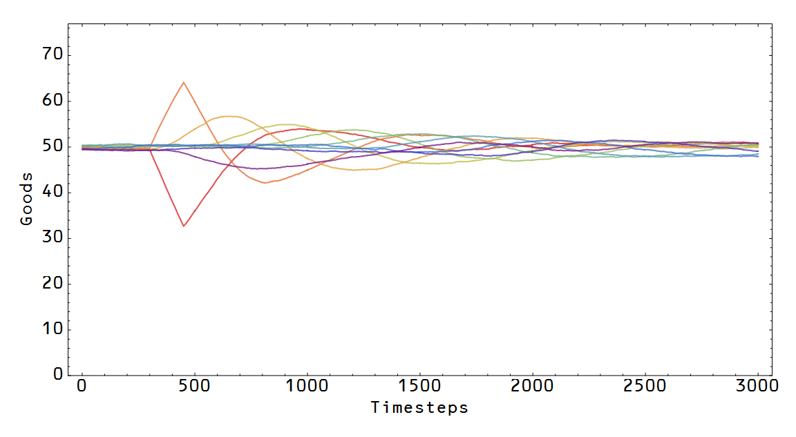
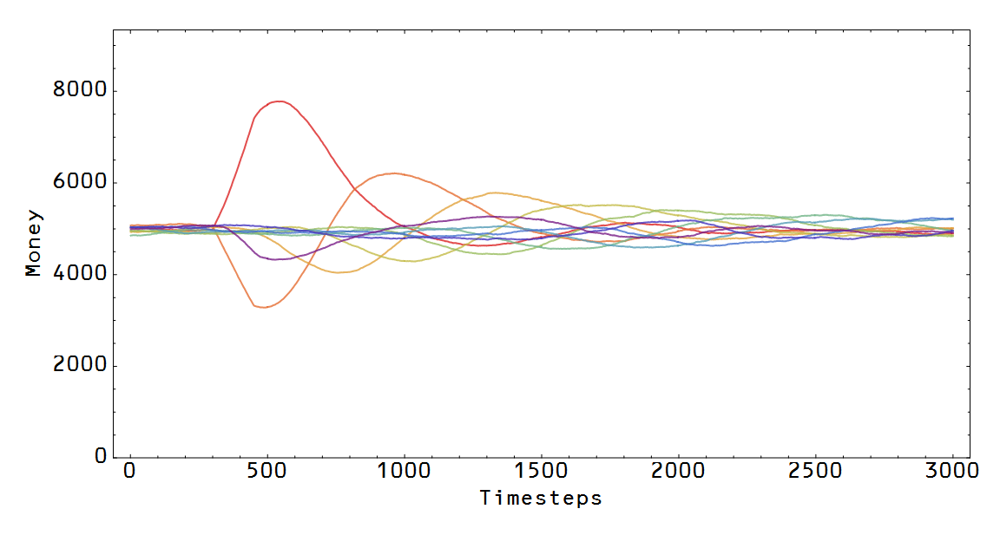
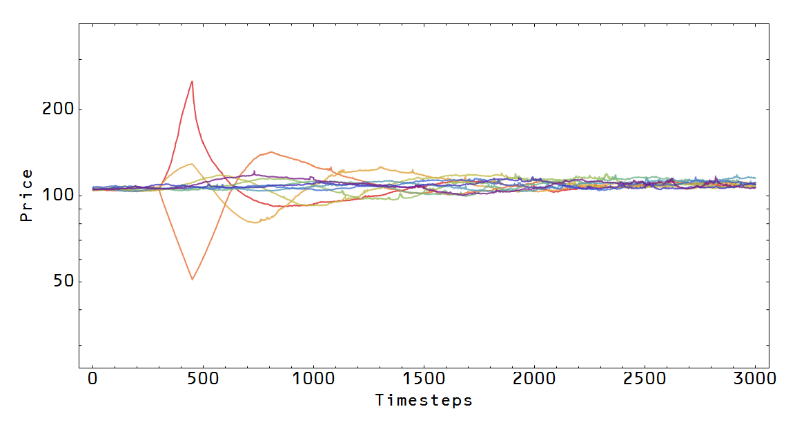
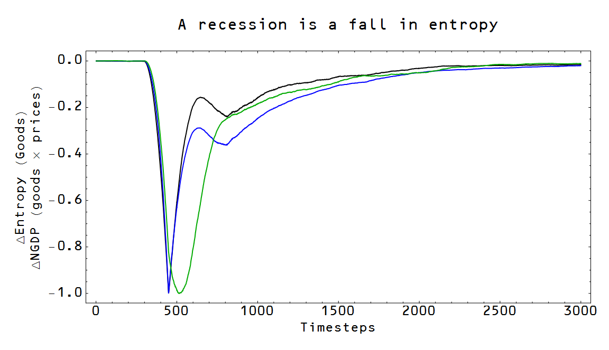

I guess I was a little over-zealous in the results [in the previous post](http://informationtransfereconomics.blogspot.com/2015/03/entropy-and-ngdp.html). I discovered an error in the programming -- effectively the price at which items were being bought and sold was constant, not fluctuating with the market.

In correcting the behavior and the error, I've discovered that it's not the entropy of the money distribution, but rather the goods distribution that is (approximately) proportional to NGDP. The reason I write "approximately" is that I've also turned up a bias in NGDP  that isn't the result of an immediately obvious programming error. It could be a real effect (the entropy changing impact of the shock has some effect) or it could be some error I haven't discovered (my initial intuition was that it had something to do with rounding errors in using whole numbers of money units, but it doesn't seem to go away with increased money resolution).

Anyway, here are the graphs again (each line is one of the 10 sectors on the Wicksellian roundabout, with the red line being the first sector). Here are the goods and money graphs:

You can see the effect that an increase demand for money by the first sector and the consequent fall in goods held. You can also see the "cyclic" fluctuations brought on by the initial shock as the excess supply of money makes its way back around the roundabout. Here are the prices:

As the first sector decides to hold more money, the price for its goods (now more scarce) shoots up. And finally is the problematic graph:

There is some discrepancy between the goods entropy (black) and the goods NGDP (blue). The entropy of money (green) is shown not to be the same as NGDP.
