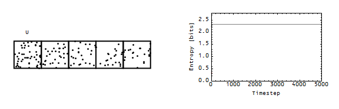

Here's the [same model from this post](http://informationtransfereconomics.blogspot.com/2015/03/the-wicksellian-roundabout-and-entropy.html), except without the periodic boundary conditions and transitions can happen from any cell to any cell. In this case, I called the first cell the "unemployed sector" and during the recession a point (i.e. a member of the labor force) in the first cell can't leave the unemployment sector. The results are basically identical to the previous post, except now the fraction of people in the cell gives us the unemployment rate. It falls at a fairly linear rate (which [I noted in this post](http://informationtransfereconomics.blogspot.com/2014/07/remarkable-recovery-regularity-and.html) from awhile ago), whereas output rises faster immediately after the recession and slower later. Here are the results:

The fraction of points in the first cell (the unemployment rate) is given in red. Here is the animation as well:

