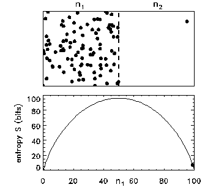

[Simon Wren-Lewis has a post](http://mainlymacro.blogspot.com/2015/03/is-walrasian-auctioneer-microfounded.html) about the microfoundations (or lack thereof) for the so-called Walrasian auctioneer. It was actually his footnote that captured my attention:

> _\[2\] As Stephen Williamson points out, these microfoundations would do a pretty poor job at explaining the behaviour of any particular individual, but instead model common tendencies that emerge within large groups of individuals._

I don't think there is a more perfect way of summing up the concept of entropic forces ([here](http://informationtransfereconomics.blogspot.com/2014/10/wage-stickiness-is-entropic-force.html), [here](http://informationtransfereconomics.blogspot.com/2015/03/the-hot-potato-effect-is-entropic-force.html), [here](http://informationtransfereconomics.blogspot.com/2015/03/utility-in-information-equilibrium-model.html) and [here](http://informationtransfereconomics.blogspot.com/2015/03/nominal-rigidity-is-entropic-force.html), for a few this blog's references).

The Walrasian auctioneer was essentially designed such that no single agent can affect prices in perfect competition. The auctioneer surveys every agent's supply and demand schedules, runs the calculations, and outputs a price such that there is no excess supply or demand. On Wikipedia, it is suggested that Walras envisioned a search process that finds the equilibrium (tâtonnement, not unlike [Jaynes' dither](http://informationtransfereconomics.blogspot.com/2015/02/jaynes-on-entropy-in-economics.html)). The picture at that link is this:

You can imagine Walras' tâtonnement as the entropy climbs to the maximum and the number of particles on left and right side equalize (imagine excess supply and demand going to zero). No single point moving from the left to right side or vice versa strongly affects the result, but the collectively they find the maximum entropy solution.

The macroeconomic picture (in a single good economy) we'd have is in the following graph. Each box represents a price change "state", with the vertical line representing zero change. Wren-Lewis refers to interest rate targets, but I'll use an inflation target to simplify the picture. The central bank sets the mean of this distribution of price changes at the inflation rate:

Moving any single box (red arrow) has zero -- well, _o(1/N)_ where _N_ is the number of boxes -- effect on the distribution. In the limit where all the boxes are the same and _N → ∞_, no single agent has an impact on prices ... the desired effect of imposing a Walrasian auctioneer.

The equilibrium price is an emergent quantity in this picture, made from millions of price changes.
