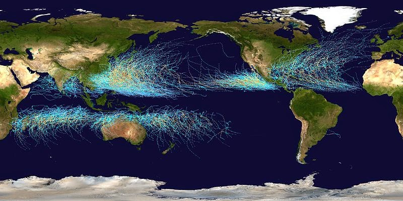
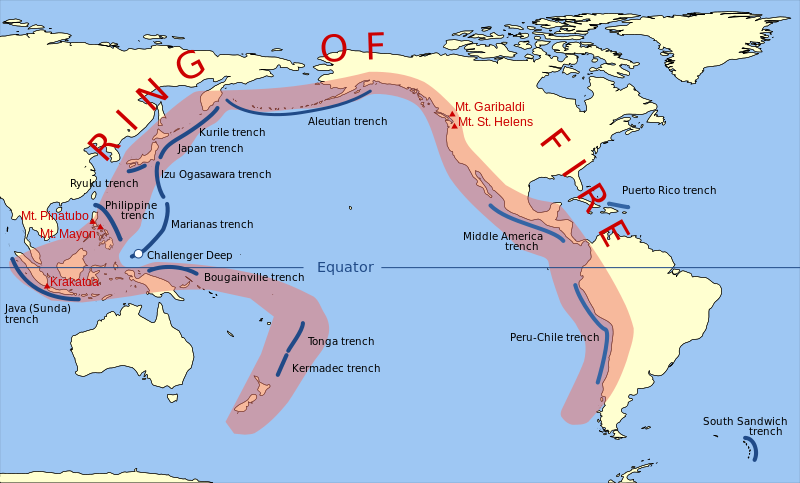

Noah Smith [is back](http://www.bloombergview.com/articles/2015-03-05/economics-can-t-predict-the-big-things-like-recessions) to criticizing macroeconomics \[1\], telling us that empirical accuracy isn't very highly regarded. As evidenced by [Nick Rowe's comments on this post of mine](http://informationtransfereconomics.blogspot.com/2014/11/because-empirical-success.html), we can see how empirical accuracy works as a line of argument. Noah also says that novelty is prized by macroeconomists, but I haven't seen any of that in my attempts to get any to look at the information transfer model.

One thing I want to discuss, however, is this:

> _Economists will respond that seismologists can’t forecast earthquakes, and meteorologists can’t forecast hurricanes ..._

I am so tired of this analogy. The reason? These two pictures (from wikimedia commons):

[Robert Waldmann](http://rjwaldmann.blogspot.com/2015/02/why-do-macroeconomists-think-they-know.html)

> _In any case, there is an overwhelming consensus -- when there is an earthquake seismologists publicly agree about things that happened under the earth._

The ring of fire -- where earthquakes and volcanos are much more likely -- is part of a general theory that is consistent with geology (plate tectonics) paleontology (the fossil record). Seismologists can predict where earthquakes are likely to occur and meterologists can predict where various weather events are likely to occur. Tornado watches and warnings are useful.

> _I think the problem here is that the analogy is much too kind to macroeconomists. It is true that macroeconomists can't predict recessions. It is also true that macroecomists almost all admit this. However, macroeconomists don't agree on the explanation of what happened. Also macroeconomic models have lots of implications which can be confronted with the data. However they don't fit the data as the implications of models of plate tectonics do._

There is no analogous macroeconomic theory of plate tectonics that shows where earthquakes (i.e. recessions) are likely.

Or is there? I've started to see some [possibilities for predicting when recessions may be likely](http://informationtransfereconomics.blogspot.com/2014/08/are-interest-rates-good-indicator-of.html) including a [model of recessions as avalanches](http://informationtransfereconomics.blogspot.com/2014/03/the-monetary-base-as-sand-pile.html) that could be the 'plate tectonics' of macroeconomics.

Noah Smith also discusses two major themes to major scientific theories -- unification and broad applicability:

> _Other times, a theory will predict things we have seen before, but will describe them in terms of other things that we thought were totally separate, unrelated phenomena._
>
>
>
> __... \[and\] can predict more than just the phenomena that inspired the theory.__

The information transfer model has both of these qualities ... it creates a [unified framework for describing several economic models](http://informationtransfereconomics.blogspot.com/2015/02/information-equilibrium-paper-draft_23.html) and [unifies the quantity theory of money and the liquidity trap](http://informationtransfereconomics.blogspot.com/2014/11/the-information-transfer-model-and.html). And [the theory](http://arxiv.org/abs/0905.0610) wasn't even designed to work for economics at all.

**Footnotes:**

\[1\] Noah Smith is also [back to mis-representing physics](http://informationtransfereconomics.blogspot.com/2015/02/why-do-macroeconomists-think-they-know.html):

> _... quantum mechanics has gained a lot of support from predicting the strange new things like quantum tunneling or quantum teleportation._

Quantum mechanics gained a lot of support for being able to explain atoms in the 1920s and 1930s, and a few years later (1947) for being freakishly accurate. Tunneling was important in the description of the fusion reactions in the sun.

It was the fact that quantum mechanics was accepted for being empirically accurate and making qualitative sense of many phenomenon that people took it seriously enough to try teleportation. The idea for teleportation comes in the 1990s -- a time when quantum mechanics was well established.

If you want something new that was predicted by a theory and only later discovered the prime example would be antimatter, in particular the positron, predicted by Dirac's quantum theory of the electron. But again, Dirac's treatment of spin-1/2 particles was accepted because it was accurate.
