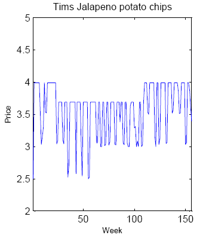
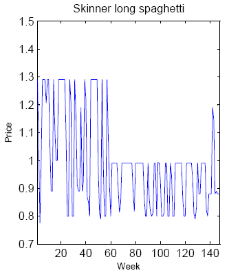

Commenter pjz brings up transaction costs as a source of nominal rigidity on [this post from a couple months ago](http://informationtransfereconomics.blogspot.com/2014/10/wage-stickiness-is-entropic-force.html). In responding, I found a great [old post by Mark Thoma](http://economistsview.typepad.com/economistsview/2008/03/the-evidence-on.html) about some issues with macro modeling of nominal rigidity.

Basically there are two major mainstream micro approaches to achieve macro nominal rigidity that have observational consequences:

-   **Transaction (menu) costs**: there is a cost to change the price. Price changes should be observed to infrequent and biased towards large changes (frequent small changes would be penalized).
-   **Calvo pricing**: only a sample of firms can change their prices in any one period. Price changes would be observed to be infrequent.

What does the data show? \[Pictures from Thoma's post\]

_Oh ..._

Nothing seems to be stopping those prices from changing. Essentially among the 60,000 prices observed, **prices are sticky in aggregate but not individually**. The two mainstream approaches above imply that prices are sticky both individually and in aggregate, something that is flatly contradicted by data.

How do you get sticky aggregate prices with flexible individual prices? Well, one way is entropy as I show in the [post from a couple of months ago linked above](http://informationtransfereconomics.blogspot.com/2014/10/wage-stickiness-is-entropic-force.html). The picture in your head should be much like this one (it shows something different, but the concept is the same):

... thousands of prices fluctuating wildly, with the aggregate level barely moving.

One consequence of this would be that there is _no microeconomic explanation of nominal rigidity_ ... flying in the face of the microfoundations approach to the Lucas critique.
