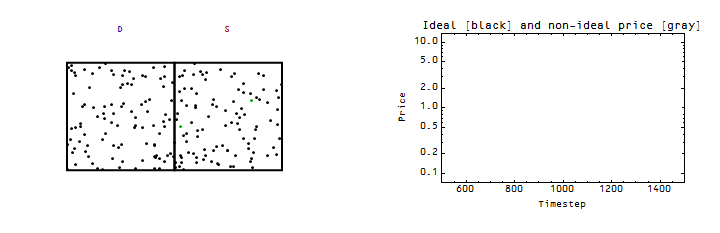
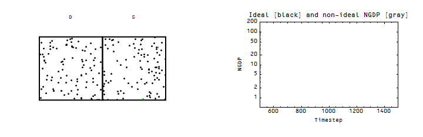
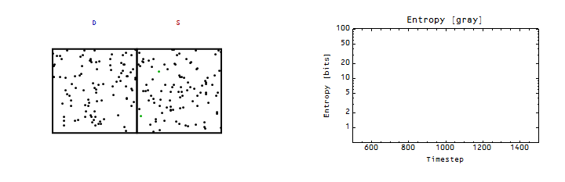

I'm still looking at how shocks behave in the ideal information transfer model, but I'd like to discuss non-ideal information transfer for a minute.

The information transfer model of supply $S$ and demand $D$ essentially has the 'invisible hand' operating as an entropic force -- I have some animations [here](http://informationtransfereconomics.blogspot.com/2015/03/supply-and-demand-as-entropy.html) (and [here is the underlying model](http://informationtransfereconomics.blogspot.com/2013/04/supply-and-demand-from-information.html)). In the ideal case we have the price $P$ of a good given by:

and we call this case non-ideal information transfer. What does this look like? Well here is a demand shock, sending the price lower:

The ideal price is black and an example non-ideal price satisfying equation (1) is in gray ... it falls below the ideal price. The information transfer model doesn't tell us what that non-ideal price is -- it is the result of any number of effects: expectations of agents, confidence, 'frictions', network effects, asymmetric information, etc. As a physics analogy, one of the sources of non-ideal behavior are interactions between molecules like [attractive forces](http://informationtransfereconomics.blogspot.com/2014/09/insights-from-non-ideal-information.html).

The loss in ideal NGDP (_total supply × ideal price_) is [proportional to the loss in entropy](http://informationtransfereconomics.blogspot.com/2014/10/coordination-costs-money-causes.html) \[1\] as can be seen in the next pair of graphs:

When the fall in the number of points occurs on one side (the fall in demand), there are temporarily unequal numbers of points on each side representing a coordinated state with lower entropy (an uncoordinated state would have equal numbers of points on each side, the highest entropy state \[2\]). This is the sense in which I mean coordination causes recessions (and is equivalent to entropy loss). Once the coordination is over -- in the model, points aren't being taken away from the demand side -- the situation returns to an uncoordinated state with equal numbers on each side. That is the maximum entropy state (although at lower absolute entropy since there are fewer points).

The fall in the non-ideal price leads to a larger fall in NGDP than the ideal price -- so there could be a component of a recession, for example, that is due to other factors beyond the operation of an ideal market. So in general we can say that:

This brings me to two recent voxeu.org articles, a paper (H/T [John Cochrane](http://johnhcochrane.blogspot.com/2015/03/arezki-ramey-and-sheng-on-news-shocks.html) and [Mark Thoma](http://economistsview.typepad.com/economistsview/2015/03/microeconomic-origins-of-macroeconomic-tail-risks.html)) and an old post from Scott Sumner:

Item 1:

> **[Confidence, aggregate demand, and the business cycle: A new framework](http://www.voxeu.org/article/confidence-aggregate-demand-and-business-cycle-new-framework)** 

> George-Marios Angeletos, Fabrice Collard, Harris Dellas 16 March 2015 

> The authors propose that confidence shocks could impact the macroeconomy without seeming changes in the "fundamentals". As the authors put it: _The appealing feature of \[confidence-based\] models was that they could accommodate coordination failures and movements in economic confidence without any commensurate movements in ‘hard’ fundamentals, such as peoples’ abilities and tastes or the economy’s know-how, or expectations of such fundamentals_.

Item 2:

> [**News Shocks in Open Economies:Evidence from Giant Oil Discoveries**](http://econweb.ucsd.edu/~vramey/research/ARS_2015Jan.pdf) \[pdf\] 

> Rabah Arezki, Valerie A. Ramey and Liugang Sheng 5 Jan 2015 

> This paper shows that news shocks seem to describe one particular market pretty well without any bells and whistles (see John Cochrane for a partial, but extensive, list of mechanisms this leaves out). [Noah Smith](http://noahpinionblog.blogspot.com/2015/03/a-case-where-rbc-works.html) refers to the paper as an existence proof of cases where real business cycle (RBC) theory works.

We could interpret this as saying in specific markets we have:

and that the reason RBC theories like the one in the paper get e.g. unemployment going the wrong way is that elevated unemployment arises chiefly from the non-ideal component.

Item 3:

> **[Microeconomic origins of macroeconomic tail risks](http://www.voxeu.org/article/microeconomic-origins-macroeconomic-tail-risks)** 

> Daron Acemoglu, Asuman Ozdaglar, Alireza Tahbaz-Salehi 27 March 2015 

> This paper shows that large macroeconomic deviations could be the result of small fluctuations combined with network effects. As put by the authors: _In this sense, our results provide a novel solution to what Bernanke et al. (1996) refer to as the ‘small shocks, large cycles puzzle’_.

We could interpret this as saying that because of network effects in macro situations we again have:

$$ 
\Delta NGDP_{ideal}&nbsp;&lt; \Delta NGDP_{nonideal} 
$$

There is a problem with this particular mechanism, though -- _a priori_ we should assume the network amplification factors are distributed evenly (or logarithmically equally) between large and small. That is to say for a set of small shocks, these should result in small, medium and large cycles. But as we see in the next item, we don't see medium effects.

One way to rescue this is something like the [thresholds in random graph theory](http://en.wikipedia.org/wiki/Random_graph#Properties_of_random_graphs). In adding random links to a graph, above a certain threshold number, there is almost surely a giant connected component. Basically in this sense, there are either large connected networks or small pieces disconnected from most of the network -- leading to either large cycles from small shocks when the shocks hit the giant connected component, or small cycles from small shocks when they don't. The linked paper doesn't have anything to say about this (at least not in a language I understand as as a mathematician or physicist).

Item 4:

> **[The mystery of mini-recessions: The dog that didn’t bark](http://www.themoneyillusion.com/?p=12362)** 

> Scott Sumner 20 Dec 2011 

> Sumner put forward the puzzle of the lack of what he termed mini-recessions. As he describes it: _It’s often said that nature abhors a vacuum. I’d add that nature abhors a huge donut hole in the distribution of “shocks.” Suppose there were lots of earthquakes of zero to six magnitude. And occasional earthquakes of more than seven. ...  But nothing between 6 and 7. Wouldn’t that be very odd?_

From the previous item, we could understand this as shocks being amplified by network effects when they hit the giant connected component of the random input-output graph. We could interpret this as saying in macro situations we again have:

$$ 
\Delta NGDP_{ideal}&nbsp;&lt; \Delta NGDP_{nonideal} 
$$

while additionally positing that $\Delta NGDP_{nonideal} \simeq 0 $ when the shock behind $\Delta NGDP_{ideal}$ is in a disconnected market.

However there is an additional way we could interpret this observation. When shocks randomly rise above the noise, a different non-market amplification effect takes over though e.g. the news that coordinates group behavior. What I have in mind is something like [this paper \[pdf\]](http://www.princeton.edu/~mjs3/salganik_dodds_watts06_full.pdf) from Salganik, Dodds and Watts (2006) where they set up multiple online music sites that differed in whether other people could see which songs were downloaded or not. In that scenario, when social interaction was allowed, the songs that went to the top not only went a lot farther relative to the second or third place, but it was also more unpredictable which songs would go to the top. In a sense, what I'm describing here would be something like which "shocks" unpredictably become the most "popular" through media like CNBC or Bloomberg (or even market indices like the Dow or S&P500). That bad economic news cycle triggers $\Delta NGDP_{nonideal}$ to become large, resulting in a much bigger impact than the fundamentals would suggest. 

Overall, these four items paint a picture where $\Delta NGDP_{nonideal}$ may be the most important effect in macroeconomic fluctuations -- but not during "normal times". In recessions, complicated economic models dominate, but the situation simplifies to a simple model with a few variables outside of recessions.

**Footnotes:**

\[1\] This is one thing that makes statistical economics different from statistical mechanics -- the second law of thermodynamics _ΔS > 0_ does not always apply. Most of the time there is economic growth and  _ΔS > 0_ and  _ΔN > 0_, but during recessions there is a spontaneous fall in entropy (_ΔS < 0_) and _ΔN < 0_.

\[2\] Imagine throwing balls into the two buckets at random -- you'd end up with approximately equal numbers in each side. In order to get unequal numbers, you'd need to coordinate your throws.
