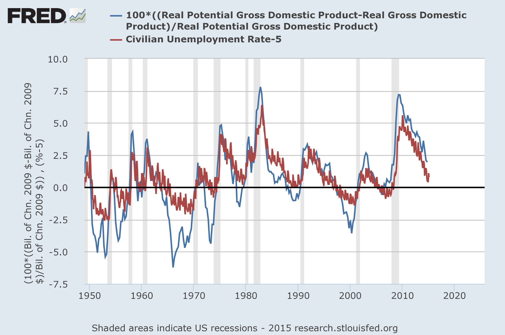

Brad DeLong had [a post up a month ago](http://www.bradford-delong.com/2015/02/over-at-equitable-growth-long-run-real-gdp-forecasts-the-hopeless-task-of-trying-to-pierce-the-veil-of-time-and-ignorance-w.html) on a study (well, blog post) of the various forecasts of potential RGDP and their changes over time. He quotes the study's (well, blog post's) authors Cecchetti and Schoenholtz:

> _We should all be wary of anyone who claims to be able to forecast trend growth accurately and reliably. Even after the fact, it takes some time to discern the underlying trend._

I (sort of) reproduce the authors' chart 2 (shown at DeLong's link), and add [the information transfer model (ITM) trend](http://informationtransfereconomics.blogspot.com/2015/01/ngdp-predictions-and-new-normal.html) in gray [derived from the partition function approach](http://informationtransfereconomics.blogspot.com/2014/06/the-macroeconomic-partition-function.html):

Note that potential RGDP isn't [some sort of speed limit](http://econbrowser.com/archives/2014/12/different-views-of-potential-gdp), although there are some interpretations that are more like one. Like the Fed's estimate of potential RGDP, the ITM trend isn't a speed limit -- it's more of an equilibrium level above which [there is a greater tendency to fall](http://informationtransfereconomics.blogspot.com/2014/09/recessions-and-avalanches.html).

With the exception of 2000-2015 \[1\], the ITM lines up relatively well with the Fed's estimate. Of course, both of these measures are looking at trends in the roughly the same data so this overlap is not surprising. It's the differences that are interesting.

One way to interpret these two measures over the past 30 or so years in the graph is that both the ITM and the Fed say the 1990s dot-com boom was sustainable (it was recovery from low performance after the financial crises of the late 1980s and early 90s), but they differ on the housing boom of the 2000s. The ITM effectively says that boom was unsustainable \[2\], while the Fed's estimate shows potential RGDP decaying away -- as if something could have been done in the aftermath of the 2008 financial crisis.

One useful feature of the Fed's estimate is that the differences between potential and measured RGDP [match up with the unemployment rate](http://research.stlouisfed.org/fred2/graph/?g=15G9) (modified by the "natural rate"):

This is not true in the ITM. However this is not much more than Okun's law (already [a part of the ITM](http://informationtransfereconomics.blogspot.com/2015/02/information-equilibrium-paper-draft_23.html)) -- changes of RGDP relative to any smooth baseline will result in a pattern that looks like the unemployment rate because changes in RGDP and changes in employment are correlated (i.e. Okun's law). The Fed's version does this without a derivative -- the absolute difference between potential RGDP and actual RGDP is proportional to the unemployment rate. Mathematically we have the Fed's

where we've used the smoothness of potential RGDP to reduce it to a constant $c$.

**Footnotes:**

\[1\] And in the longer view, there's a discrepancy between the Fed's estimate and the ITM for 1960-1980. Here is the longer view:

\[2\] Actually, the ITM hints that the boom (and its inevitable bust) [was caused by Fed policy](http://informationtransfereconomics.blogspot.com/2014/09/the-emerging-story-of-great-recession.html).

**Update 4/8/15:** For the comments below, the Fed effectively begins raising interest rates in 2004 or 2005 (both long term and short term interest rates) relative to where they would have been if monetary policy had followed a linear trend. The relevant posts are [here](http://informationtransfereconomics.blogspot.com/2014/02/the-fed-caused-great-recession.html) and [here](http://informationtransfereconomics.blogspot.com/2014/09/the-emerging-story-of-great-recession.html) and here are the two relevant graphs:

