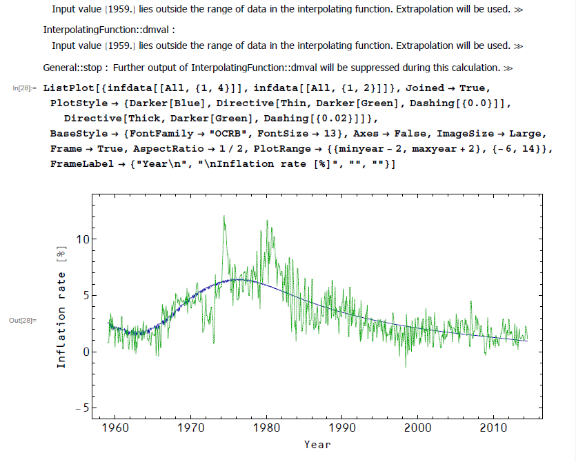

One other thing that came out of my interaction with econjobrumors forum is that I should release the code I use (I had previously just put an email contact on the sidebar for requests for the code). There really isn't that much to it. I fit a function to some smoothed data. The majority of the real programming is actually the LOESS filter.

Here is [a link to a PDF of the price level model code](https://drive.google.com/file/d/0B6qAxdK1gOgwSGZCTW5STjNKVDA/view?usp=sharing) itself (runs in _Mathematica 8_). \[I hope this works -- I've never used a public link to my Google Drive before.\]

Here is what passes for the documentation

The first two parameters indicate the smoothing done with the LOESS filter, and the next piece of the code is the filter itself.

The next few lines import the xls files that were exported from FRED (I cut out my username from the file paths). In particular, for the monetary base, I use the full base and subtracted out the reserves. I show what the smoothing does to the monetary base data. Additionally I use the convention that a given measurement comes at the end of the measurement period: monthly base numbers come from the end of the the month ... effectively the beginning of the next month (all approximately equal in length). The same with quarterly data. I plan on dealing with the minor issues introduced by this at some point, but really neither the accuracy of the data nor the accuracy of the model calls for it.

[AMBSL](http://research.stlouisfed.org/fred2/series/AMBSL)
[RESBALNS](http://research.stlouisfed.org/fred2/series/RESBALNS)
[GDP](http://research.stlouisfed.org/fred2/series/GDP)
[PCEPILFE](http://research.stlouisfed.org/fred2/series/PCEPILFE)

The next piece sets the limits for the data to be used, and after that is the curve fitting that is solved as a minimization problem. You can see an error that pops up because **minyear = 1959.** and the first data point is actually from January 1959, or 1959 + 1/12 ~ 1959.08.

The next piece plots the function with the fitted parameters and then I generate a set of points for inflation by taking the instantaneous derivative of the log (the is the continuously compounded annual rate of change). Then I plot the inflation points.

You may see that the curve looks a little different on some of the posts. That's because 1) there is a little bit of sensitivity to the initial point of the minimization and 2) there is another version that fits to the inflation points instead of the price level points, only using the price level fit to fix the constant **ΔUS**. I'll put that code up too.
