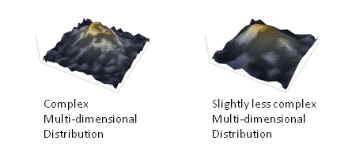

I mentioned this in an [update to a post from a few months ago](http://informationtransfereconomics.blogspot.com/2014/12/the-information-transfer-solow-growth.html) on the Solow growth model, but one thing I've noticed in the information transfer model is that adjusting for inflation tends to make the models not work as well. That is to say the models work really well for nominal quantities, but fail for real quantities.

_I don't know_

However, I have some ideas that I'd like to discuss in the original spirit of this blog -- thinking out loud. The picture that is forming in my head is that the economy functions based on nominal values -- nominal dollars are the "fundamental particles" of macroeconomics -- while real dollars are more relevant to welfare economics. \[1\]

This would make sense of [money illusion](http://en.wikipedia.org/wiki/Money_illusion): when humans interface with the economy, they logically do so with nominal values. Humans aren't foolish for not thinking in terms of "real" quantities.

A loaf of bread might cost a few dollars today as opposed to less than a dollar many years ago. It makes a lot of sense to say that our subjective experience (i.e. derived utility) of the same loaf of bread would be the same regardless of how much it costs or when we experience it \[2\]. That's one way to arrive at the intuition behind real vs nominal values.

Since we ignore utility maximizing behavior in the information transfer model, we don't need the real value of a quantity to build a causal relationship with another quantity. In the Solow growth model linked above we don't need to relate real capital to real output. Nominal dollars are the fundamental particles, so we look at nominal output and nominal capital (along with the "nominal" labor force).

The information theory at the heart of the information transfer model is mostly about counting the arrangements of objects -- naturally the objects at any given time would seem to be nominal objects.

The information transfer model still has something called "inflation" in it. What is it doing if not adjusting for those relative costs of a loaf of bread above? Well, it is counting the greater and greater amount of information that has to flow back and forth to keep two growing distributions in information equilibrium \[3\].

This view is similar to my rather odd speculative view of why economists are paid more than sociologists in a [footnote here](http://informationtransfereconomics.blogspot.com/2014/12/the-information-transfer-solow-growth.html). Things in general get more expensive over time because there are more ways to choose a particular basket of goods from a larger economy with more and more varied goods. It takes more information to specify a loaf of bread to be in your basket, so its nominal cost is greater relative to its nominal cost from many years ago \[4\]. 

Note that the price level is directly related to how much the economy would expand if it found itself in a state with a larger money supply [in the absence of shocks or frictions](http://informationtransfereconomics.blogspot.com/2014/11/expectations-rational-or-otherwise-and.html). I called this measure _ideal NGDP_. That means the price level is more directly measuring this abstract counting argument for the price of all goods. However there is some information loss and the nominal economy does not register this full increase in the "value" of goods -- measured NGDP is lower than ideal NGDP.

When you divide measured NGDP by the price level, you are dividing the realized value of all goods and services by the ideal price. That would essentially represent the realized growth of the economy without the growth in the combinatorial factors. If you think human experience of value/utility shouldn't be affected by simple combinatorial factors (just because there is more stuff around, it doesn't mean we should experience it differently), then this may well be a useful concept.

**Footnotes:**

\[1\] In physics, there is usually a difference between the fundamental particle content of a quantum field theory and the effective particle content of a theory. For example, quantum chromodynamics operates on quarks and gluons (the fundamental content), but at low energies you never see either, only baryons and mesons. However, one interesting thing is that when you look at mass or charge renormalization for an electron in quantum electrodynamics, you can make a pretty good theory from ignoring the loop diagrams and just using the experimentally observed values of the mass and charge in the tree level theory.

\[2\] However people enjoy wine more when they think it costs more, and bread is probably tastier when you're hungry than when you're not. But ignore these complications for right now.

\[3\] This is from an answer to a question on [this post](http://informationtransfereconomics.blogspot.com/2015/03/the-price-system-as-communication.html):

> The additional information comes from the increased number of bits required to describe the allocation of an increased number of goods sold/demanded. If there are 3 widgets and two agents, there are 4 ways to allocate the widgets (3 + 0, 2 + 1, 1 + 2 and 0 + 3). If there are 4 widgets and 2 agents, there are 5 ways. That's an increase in the information content of an allocation of about 1/3 of a bit: log\_2(5) - log\_2(4) = 0.32.

\[4\] Certain rarer goods reveal a lot more information when they are discovered in your basket (think here of [flipping a fair coin](http://en.wikipedia.org/wiki/Entropy_%28information_theory%29) vs rolling a [fair 20-sided die](http://en.wikipedia.org/wiki/Icosahedron)), so they are more expensive. This wouldn't be the only mechanism at work, but I think this argument represents the information equilibrium answer to the [paradox of value](http://en.wikipedia.org/wiki/Paradox_of_value). Why are diamonds so much more valuable than water when we need water to survive, grow food, etc? The 19th century solution (that is still with us) was marginal utility. Information equilibrium says that diamonds are more valuable because if they appear in a basket of goods, they reveal a lot more information than a gallon of water. I should probably do a whole post on this.

Note that this may be the same explanation behind the values of [Scrabble tiles](http://en.wikipedia.org/wiki/Scrabble). The Q's and Z's are the diamonds of Scrabble tiles -- they more strongly specify which words in the English language you can spell than the A's and E's (or _blank_ tiles).
