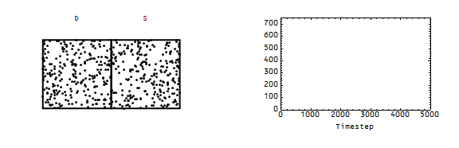
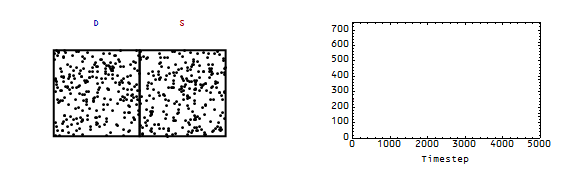
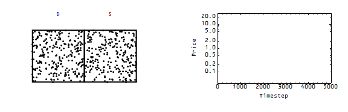
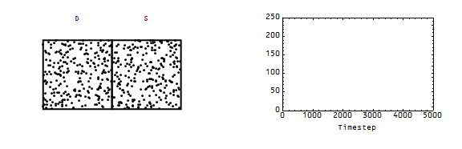
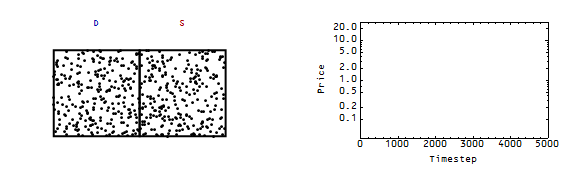
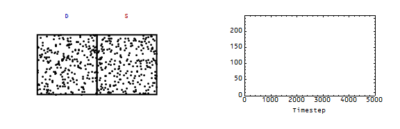
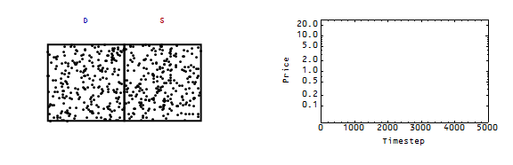

Continuing in [a series with the previous posts](http://informationtransfereconomics.blogspot.com/2015/03/entropy-and-unemployment.html), here I'd like to show the forces of supply and demand as entropy. At the moment of the shock, we either add or remove points from the supply or demand. This produces shifts in the supply and demand curves (shocks), and the system returns to equilibrium. I used the differential equation:

to determine the price. The [model for partial equilibrium](http://informationtransfereconomics.blogspot.com/2013/04/supply-and-demand-from-information.html) (i.e. supply and demand curves) is here for reference. Here are the four cases ... (demand is in blue on the left, supply in red on the right)

Increase in demand, leading to an increase in price:

Increase in supply, leading to a fall in price:

Fall in demand, leading to a fall in price:

Fall in supply, leading to an increase in price:

