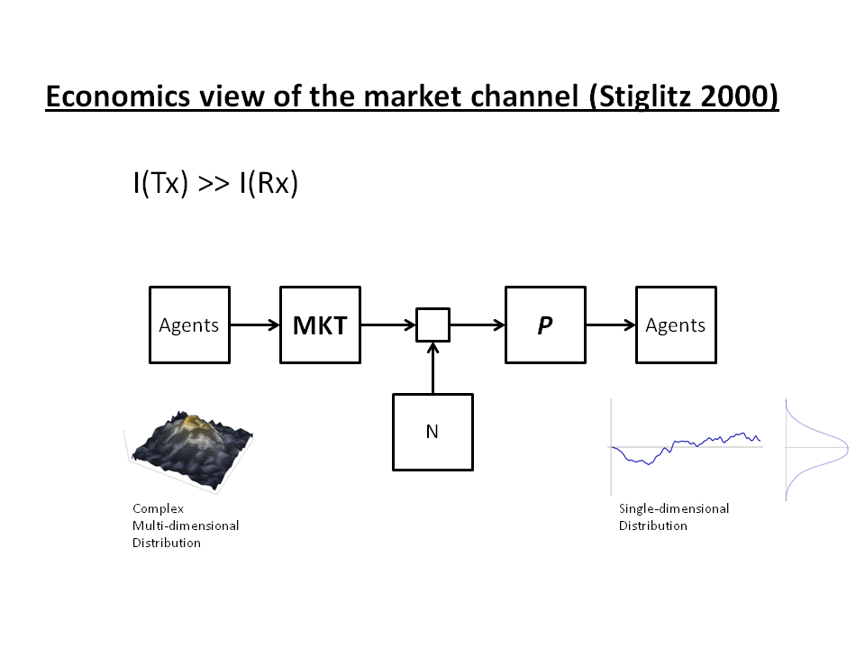
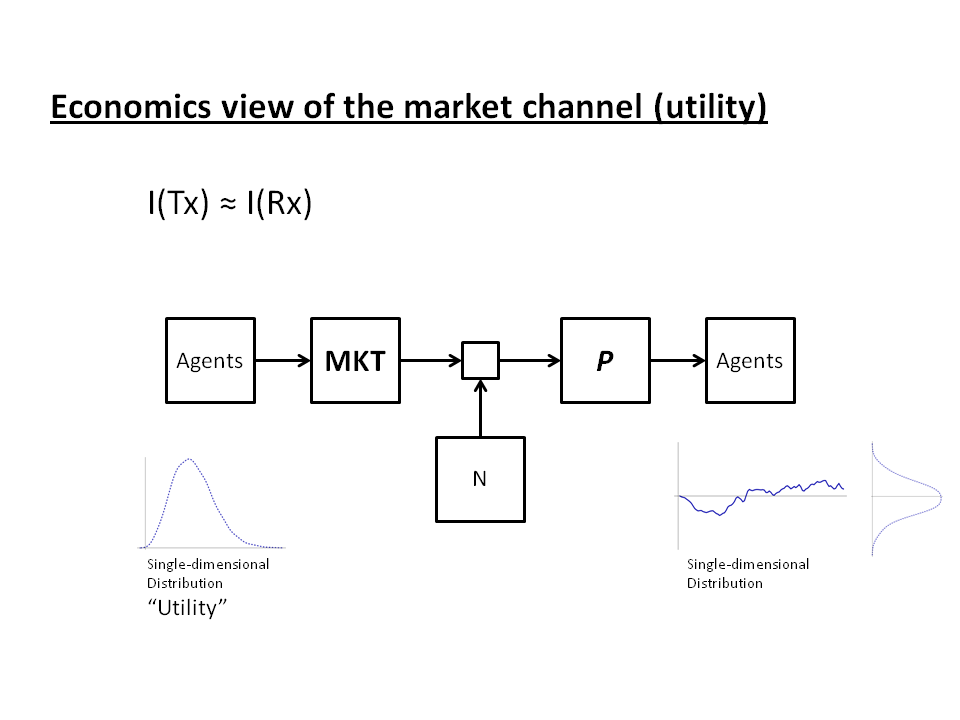
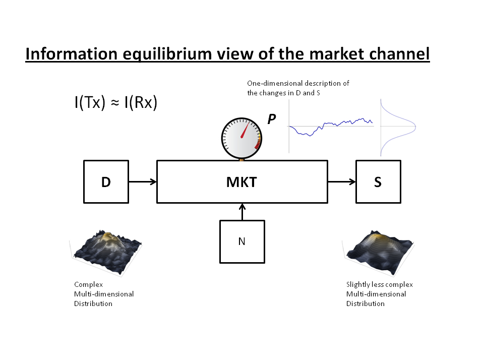
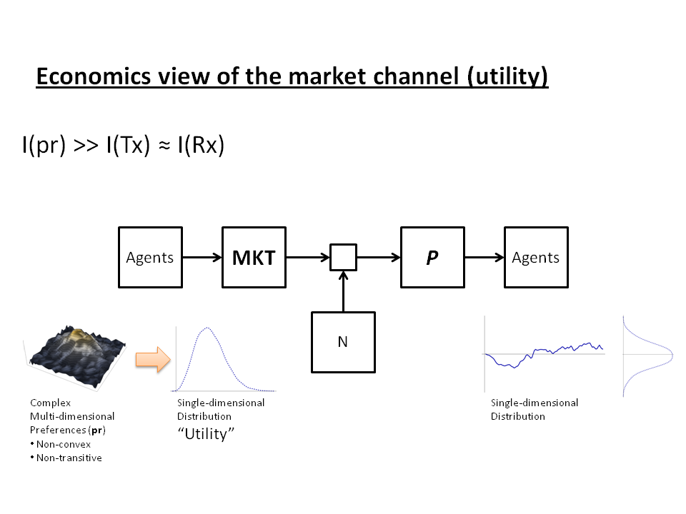

I may have gotten into an argument with an anonymous commenter on the Economics Job Market Rumors forum whose entire argument seems to be on the order of "info theory is wrong LOL". Sometimes even this kind of arguing can be useful, though; it makes you look at the big picture.

See, the thing is, even if the information equilibrium model is not useful for economics, economists must have _**some**_ view of the price mechanism as a communication channel. If there is information flowing in markets it has to originate somewhere, move through a channel and finally end up somewhere.

I tried to think of what that communication channel could be -- maybe this is wrong (LOL), but it's a start. So let's start with Shannon's _[A Mathematical Theory of Communication](http://en.wikipedia.org/wiki/A_Mathematical_Theory_of_Communication)_ and his famous diagram:

What we have is an information source on the left that is encoded and transmitted through a channel (where some noise can be added), to be received and decoded at the destination on the right side. A faithful reconstruction on the right side essentially requires getting the distribution of possible messages on the left side to equal the distribution of possible messages on the right side. For example, at a bare minimum, the distribution of letters in English words must be equal on both sides of the channel for communication (information transfer) to occur. In that case the transmitted information is equal to the received information, or _I(Tx) = I(Rx)_.

In economics, the typical description of the price mechanism is as an information aggregator. All of the many details of e.g. weather patterns, the governments that have dominion over the available arable land, seed genetics and crop yields are compressed into a single number and its movements, e.g. the price of wheat. Agents buying and selling wheat are the source of information that is transmitted by the market and received by the market price.

Even if we had a multidimensional normal distribution (made up of independent distributions) on one side and a normal distribution of price movements (all with the same variance _V_) on the other we'd still have

_(k/2) log 2 π e V - (1/2) log 2 π e V = ((k-1)/2) log 2 π e V_

of information loss. A more concrete example: imagine the set of outcomes you can get from rolling 5 dice and trying to encode those outcomes with the set of outcomes you can get from rolling a single die -- you basically lose 4 dice of information.

_I(Tx) >> I(Rx)_

> _"The exchange process is intertwined with the process of selection over hidden characteristics and the process of providing incentives for hidden behaviors."_

The realized real-world distribution over those characteristics and behaviors is the "complex multidimensional distribution" in the diagram above. The lost four dice of information in the example are these "hidden characteristics". Basically, you lose something going from the distribution on the left side to the single-dimensional distribution of price movements on the right side.

Economics had been working with a rather good solution to this problem for the previous 200 or so years: _utility_. Instead of a complex multidimensional distribution on the left side, economic agents have a single-dimensional distribution of utility for e.g. wheat. When the price of wheat is high relative to a given agent's utility, the agent doesn't buy it. We replace the previous diagram with this one:

and the information on the right side is approximately equal to the left side: _I(Tx) ≈ I(Rx)_.

\[Note that this diagram is an information transfer model and effectively says that utility of a good is in information equilibrium with the price of that good.\]

Of course, markets aren't perfect and this description doesn't empirically match up with what happens in the real world (the impetus for the work of Stiglitz to show that the real picture is more like Figure 2). Let's look at the information equilibrium diagram:

How does the information equilibrium view differ from Figures 2 and 3? First, we have complex multidimensional distributions on both sides. Supplies and demand for wheat is different in different locations around the world. Different countries use different amounts of wheat (in some places e.g. rice is the dominant carbohydrate source), and different uses of wheat are more valuable than others (ethanol, bread). Wheat is subsidized in some countries (and states within those countries). Some people aren't able to afford as much as others. In a functioning price system, the spatial and temporal distribution of demands for wheat is equal to the distribution of supplies of wheat. There is a loaf of bread for you to buy at the price you want at the store in your neighborhood.

Second, we've moved the price from being the receiver (aggregator) of information to simply being a detector of information flow. Prices are high when small changes in the distribution on the right cause (or are caused by) large changes in the distribution on the left. Prices are low when large changes in the distribution on the right cause (or are caused by) small changes in the distribution on the left. When the distributions change the same amount, we say the price is in equilibrium \[2\]. The price is still not a perfect detector of information, but over time as the distributions on the left and right evolve, the price will reach an equilibrium.

In this picture _I(Tx) ≈ I(Rx)_ for an ideal market. However, all we can really guarantee is that _I(Tx) ≥ I(Rx)_, so there may well be times when the market isn't ideal and _I(Tx) > I(Rx)_.

Just because it is different, doesn't mean it is right. And if it is right, that doesn't mean it is useful. Maybe in the real world _I(Tx) >> I(Rx)_ most of the time. However, economists must have some picture in their head of the price system as a communication channel if it moves information around, and you can't violate mathematical theorems.

_econ is wrong LOL_

**Update 3/23/2015**

In looking again at the utility solution, there is still a massive loss in information going from preferences to utility. Well-behaved preferences (essentially ensuring transitivity so that preferences represent a well-ordered set and therefore roughly equivalent to a real-number representation like utility) wouldn't have as much of an issue, but are empirically false.

The mathematical space of preferences cannot be mapped one-to-one to the manifold of utility -- many different sets of preferences will map to the same utility.

What we have is a water balloon of information. If we try to squeeze it down into utility, it bulges out on another side.

**Footnotes:**

\[1\] "THE CONTRIBUTIONS OF THE ECONOMICS OF INFORMATION TO TWENTIETH CENTURY ECONOMICS" JOSEPH E. STIGLITZ (2000). (H/T to [afinetheorem](https://afinetheorem.wordpress.com/2015/03/06/the-contributions-of-the-economics-of-information-to-twentieth-century-economics-j-stiglitz-2000/) for linking to it recently.)

\[2\] One can measure the information difference between two distributions with the [Kullback-Liebler divergence](http://en.wikipedia.org/wiki/Kullback%E2%80%93Leibler_divergence). When one distribution changes, that represents a change in information. That information flows through the market an is registered as the commensurate change in the other distribution.
