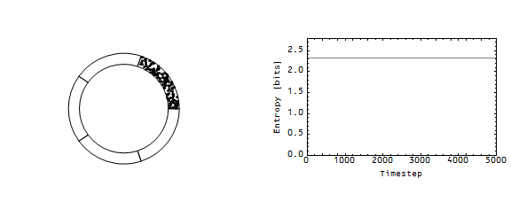
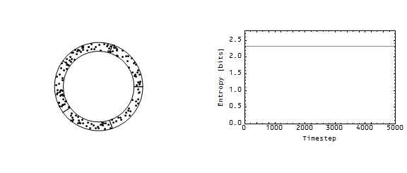

Nick Rowe wrote [a post a year ago](http://worthwhile.typepad.com/worthwhile_canadian_initi/2014/03/liquidity-pile-ups-on-the-wicksellian-roundabout.html) about a model of an economy as a "Wicksellian roundabout":

> _Imagine a large number of cars forever circling around a very large roundabout. Initially they are all going the same speed, and are evenly spaced. What happens if one car slows down temporarily?_

This morning I remembered the post (mostly because of [this](http://worthwhile.typepad.com/worthwhile_canadian_initi/2015/03/david-levines-accidental-monetarism.html) and related discussion) and was inspired to look at the story as an entropy problem. I considered 5 cells where points (think of them as money) were randomly allowed to move counterclockwise one cell -- also, the fifth cell is next to both the fourth and first cell (i.e. periodic boundary conditions). **Update 3:50pm:** here is a picture of the 5-cell roundabout ...

If we start with all the money in the first cell (above the 3 o'clock position), the average configuration moves toward the maximum entropy distribution (equal amounts of money in each cell):

Note that the blue paths represent the entropy of a particular configuration (in the Monte Carlo simulation), while the black line represents the entropy of the average configuration. You can watch this in the following animation:

Rowe wanted to consider a pile-up (traffic jam) on this Wicksellian roundabout. I started with a maximum entropy configuration and added a period where the first cell (the one that starts with all the points in the picture above) increased its demand for money. During that period, that cell doesn't let a point leave its cell. Here is the entropy of the average configuration in that case:

The entropy takes a hit, and then starts heading back towards the maximum entropy distribution. Here is an animation for that case:

What does a loss in entropy mean for an economy? [A fall in entropy is a fall in output](http://informationtransfereconomics.blogspot.com/2014/10/coordination-costs-money-causes.html). What the picture above shows is _a recession_.

What is interesting is that a _decrease_ in the demand for money in the first cell _also causes_ a recession. I modeled this by making it more likely that the first cell gives up one of its points. The result is similar:

And here is the animation:

The effect is less pronounced because in this case the first cell only affects the distribution using points that are in its own cell. In the first recession case, the first cell is interrupting the flow from all five cells. What a decrease in the demand for money in the first cell does is create an effective increase in demand in the second cell (it ends up with more money than maximum entropy would indicate).
