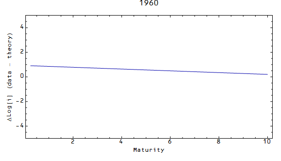

Not to be outdone [by the NYT](http://www.nytimes.com/interactive/2015/03/19/upshot/3d-yield-curve-economic-growth.html), here's a 3D picture of the [theoretical yield curve](http://informationtransfereconomics.blogspot.com/2015/02/information-equilibrium-paper-draft_23.html). Actually, just a yield line since I only have long (10 year) and short term (3-month) interest rates in the model:

Effectively, the difference between the two sides is entirely due to central bank reserves. Short interest rates are lower because reserves are non-zero.

The points where the short term rate (near side) data are above the theoretical surface are [signs that a recession is coming](http://informationtransfereconomics.blogspot.com/2014/08/are-interest-rates-good-indicator-of.html). The periods when the data for the short rates are above the blue surface is also when the [yield curves tends to invert](http://informationtransfereconomics.blogspot.com/2014/09/the-emerging-story-of-great-recession.html) (short rates are higher than long rates).

One could imagine this figure as a string fixed at the far side (long term interest rate) and flapping around in the wind at the near side. Like this (this shows data minus theory for log of the interest rate):

Ok, that is probably less exciting than the 3D graphs.
