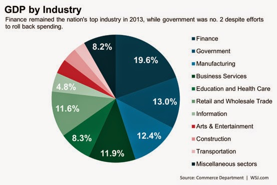
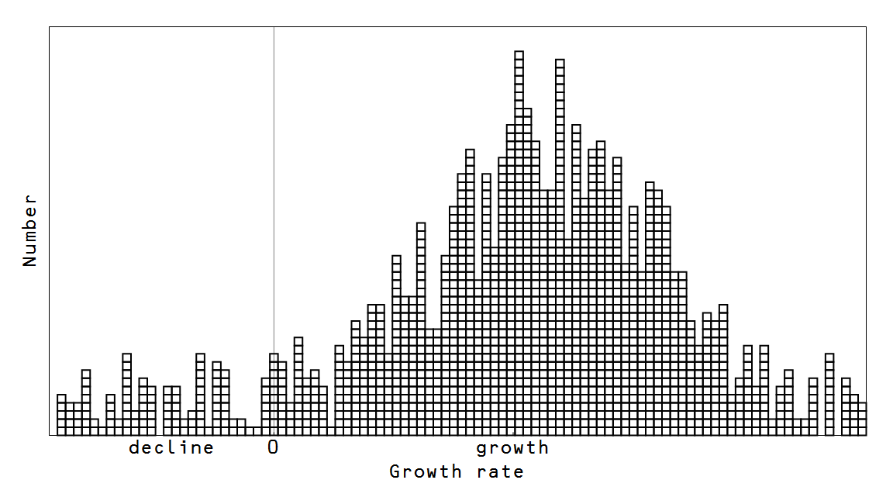
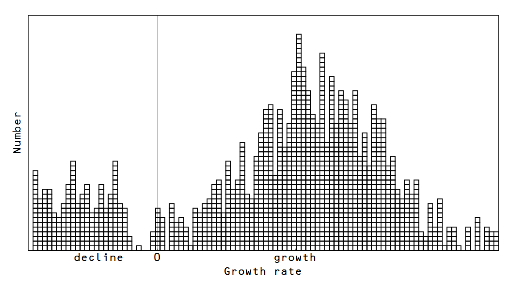

[Dan Davies](https://twitter.com/dsquareddigest/status/589576969123139584) had this analogy on twitter for macro without a financial sector:

> _@dsquareddigest: @Frances\_Coppola @ericlonners it's as if there was an epidemic of hepatitis and half the doctors had to look up what the liver was for._

And if we look at e.g. the data presented in [this blog post](http://blogs.wsj.com/economics/2014/04/25/five-takeaways-from-new-gdp-by-industry-report/), we can see that the financial sector is indeed a sizable chunk of NGDP at 19.6% in 2013.

Let's try to build a picture of what such a "financialized" economy looks like starting from the [maximum entropy view of the information equilibrium model](http://informationtransfereconomics.blogspot.com/2014/10/coordination-costs-money-causes.html). Borrowing pictures from that post, a snapshot of an ordinary economy looks something like this:

Each box represents a business or industry, and at any time they might find themselves on the decline or growing, with most growing near the average rate of economic growth for the whole economy.

As we can see in the pie chart, though, there should be at least one very large box that moves in concert: the government. Generally, due to coordination by the legislative branch, government spending can move as a single unit -- e.g. across the board spending or tax cuts.

Now inside a single industry, the individual units won't necessarily be coordinated -- in fact, e.g. Ford and GM might be anti-correlated with one surging in profits while the other loses market share. Domestic manufacturing in general can rise or decline (crowded out by imports), but overall the result will be a lot less coordinated than government spending (except e.g. in a recession when all growth slows).

But what if the other big slice in the pie chart is coordinated? The financial sector could be as coordinated as government spending with markets effectively acting as the legislative branch. If we put government and the financial sector (to scale) in our snapshot, we get something that looks like this:

I've put government (in blue) growing at roughly the modal rate and the financial sector (in gray) outperforming it.

Now I've already [looked at](http://informationtransfereconomics.blogspot.com/2015/01/keynesian-economics-in-three-graphs.html) what happens when the government sector moves around; what we're concerned with today is the financial sector. If the financial sector is coordinated (through market exchanges or inter-dependencies), a big financial crisis can make the entire sector enter a low growth (or declining) state like this:

This is a far more serious loss of entropy than an uncoordinated sector of the same size with 50% (coordinated fraction = 0.5) of the states going from growth states to declining states, pictured here:

A calculation using the [Kullback-Liebler divergence](http://en.wikipedia.org/wiki/Kullback%E2%80%93Leibler_divergence) has the former version resulting in a loss of entropy of 4%, while the latter loses only 1%. In general, it looks like this:

One way to visualize the uncoordinated case is the dot-com bust where there were many different actors in the sector as opposed to the relatively smaller number of  financial companies (q.v. "contagion") in the highly coordinated case.

Simply because it represents a large fraction of the US economy and is highly coordinated by exchanges (a significant bad day on the S&P500 is usually a significant bad day on other exchanges -- even around the world), it is plausible to posit the financial sector can move as a single unit, much like the government sector (coordinated instead by political parties).

We can think of the financial sector _F_ as analogous of a second "government" sector and write:

_NGDP = C + I + F + G + NX_

(This is a heuristic designation -- _F_ would specifically be carved out of _C, I, G_ and _NX_ as appropriate, and the exact definition would take some econometrics work.)

Financial crises would be much like government austerity, except they would be **_by definition_** procyclical -- being more likely when a recession happens, being the cause of a recession \[1\], or even being synonymous with a recession. A surging market is not very different from a surge in government spending; a collapsing market is not very different from a fall in government spending. That is to say a good model of the financial sector would simply be to dust off those old models of the government sector.

**Footnotes:**

\[1\] I still think of recessions as [avalanche events](http://informationtransfereconomics.blogspot.com/2014/03/the-monetary-base-as-sand-pile.html), but the financial sector can be the large rock that precipitates the cascade.
