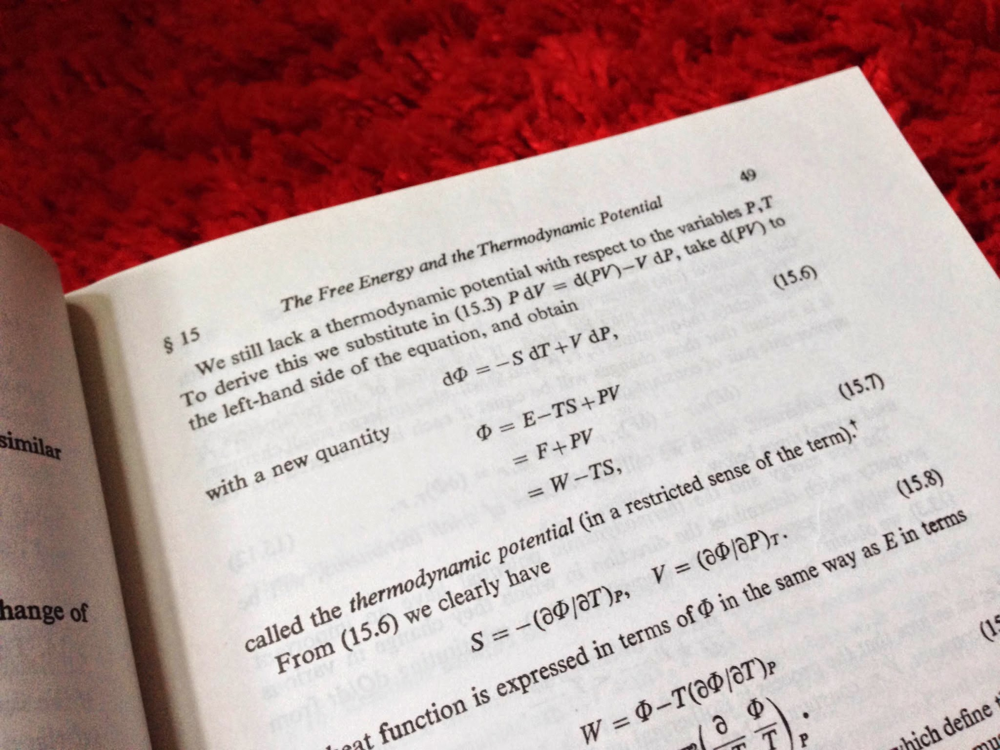

I'm attempting to construct the [thermodynamic potential](http://en.wikipedia.org/wiki/Thermodynamic_potential) for an economy by [elaborate analogy](http://informationtransfereconomics.blogspot.com/2013/04/are-thermodynamic-analogies-useful.html) -- demand/output is analogous to energy, price to pressure and supply to volume. What does this help with? For one thing, it leads toward a way to introduce a [chemical potential](http://informationtransfereconomics.blogspot.com/2015/04/towards-information-equilibrium-take-on.html) (which after writing this post, I realize might not be necessary). However, it also allows for a way to organize thought around microeconomic and macroeconomic forces (see e.g. [here](http://informationtransfereconomics.blogspot.com/2015/04/micro-stickiness-versus-macro-stickiness.html) or [here](http://informationtransfereconomics.blogspot.com/2015/04/do-macro-models-need-financial-sector.html)).

Using the definitions [here](http://informationtransfereconomics.blogspot.com/2014/09/the-economic-combinatorial-problem.html) and [here](http://informationtransfereconomics.blogspot.com/2014/10/coordination-costs-money-causes.html) (and writing $N$ for nominal output, $X$ for goods with price $p$ -- which could be taken to be  the price level $P$ but we'll leave separate for now, $T$ for the 'economic temperature' and $S$ for the 'economic entropy' -- the latter two being defined at the links), we have for a monetary economy:

where we use [Stirling's approximation](http://en.wikipedia.org/wiki/Stirling%27s_approximation) (with large $N$, but small changes) and the definitions

with $M$ being the money supply (empirically, base money minus reserves) and $\kappa = \kappa (N, M)$ being the information transfer index for the money market. Note that $\kappa \sim 1/T$ so that high $\kappa$ represents a low temperature economy and vice versa.

where the sum is over the individual market "[generalized forces](http://en.wikipedia.org/wiki/Generalized_forces)" (microeconomic forces). For example, we can look at a simple model of an aggregate goods market $A$ and a [labor market](http://informationtransfereconomics.blogspot.com/2013/08/scott-sumners-model-part-2_30.html) $L$:

... all prices for labor and goods are taken to be proportional to the price level. This allows us to organize microeconomic and macroeconomic forces

In truth, the $P M$ component should probably be considered a microeconomic force (since it behaves like one for the most part) and only $TS$ -- the entropic forces -- should be considered macroeconomic forces. However, since $P M$ is a large component of the economy (and would likely be for a commodity money system as well, see footnote \[1\]) and policy-relevant, I'll keep it in. Understanding this distinction would point towards (using the separation from this earlier post about a financial and government sectors $F$ and $G$):

where $i$ is a general market index (e.g. the S&P500 could be used). This approach can be compared with the older approaches that use the definition of nominal output:

where we'd instead write (for example, assuming the prices are all proportional to the price level $P$):

The $a_{i}$ are all constants. Comparing equations (1) and (2) we can see that they mostly just represent different partitions of nominal output. Equation (2) lacks an explicit monetary component, but the biggest difference is that it lacks an 'entropic' component $T S$. I'd visualize $T S$ as the additional gains in welfare from exchange -- exchange makes both parties better off and increases the value of whatever it is that is exchanged.

Another [topic that becomes clearer](http://informationtransfereconomics.blogspot.com/2014/07/beware-implicit-modeling.html) with the construction (1) is that of monetary vs Keynesian takes on macroeconomic stabilization. In (1), it becomes clear that a change in $G$ could be offset by a change in the $\kappa P M$ term or even the $T S$ term in general. In practice it depends on the details of the model ([specifically the value of](http://informationtransfereconomics.blogspot.com/2014/06/krugman-keynes-and-liquidity-trap.html) $\kappa$ -- if it is near 1 changes in $M$ have limited impact, and if it is near 1/2 you have an almost ideal quantity theory of money).

Additionally, the conditions that allow monetary offset of fiscal stimulus to occur also allow _the monetary offset of the effects of a financial crisis_. At least if (1) is a valid way to build an economy.

This last piece is interesting -- it implies that financial crises cause bigger problems in [a liquidity trap economy](http://informationtransfereconomics.blogspot.com/2014/06/krugman-keynes-and-liquidity-trap.html) ($\kappa \sim 1$). Assuming the model is correct, the reason the global financial crisis was so bad was because it struck when $\kappa \sim 1$ for a large portion of the world economy: the EU, US, and Japan. Other financial crises (e.g. 1987 in the US or even the dot-com boom) struck at a time when $\kappa &lt; 1$ and were better able to be offset by monetary policy.

**Footnotes:**

\[1\] Actually, the $\kappa P M$ component is like one of the goods markets and in e.g. a commodity money economy, it would be one (and entropy should be defined in terms of that good). However it may be more useful to separate it as a macroeconomic force as is done later in the post.
