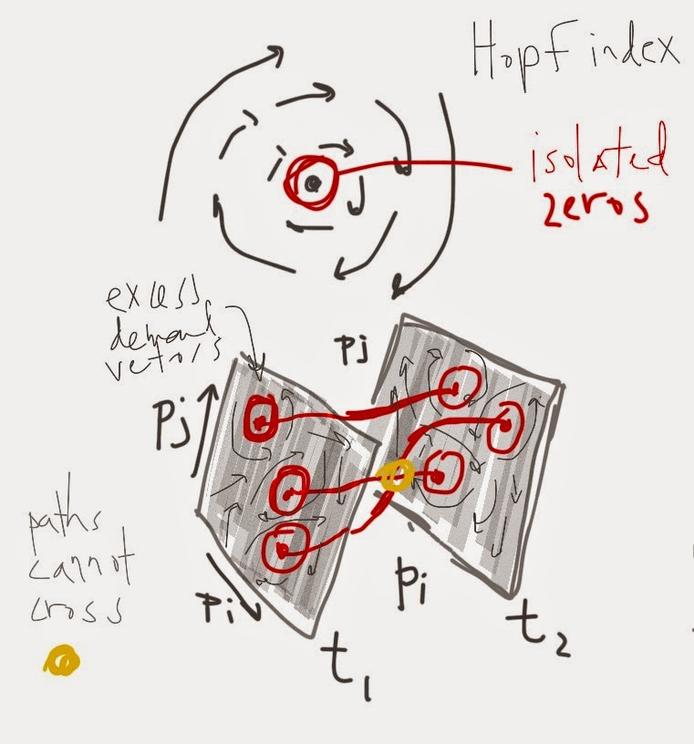

This is a somewhat rambling post about equilibria; it has been sitting around for a few days. I thought I'd publish it even though I'm still thinking about the issues at hand.

Anyway ... there has been a diffuse thread about nonlinear models and multiple equilibria in the econoblogosphere over the past few weeks. I was mostly confused about Farmer's comments on a post of David Glasner's (summarized [here](http://rogerfarmerblog.blogspot.com/2015/04/beyond-1950s-economic-theory.html)) where he said there was a continuum of equilibria:

> _I like Lucas’ insistence on equilibrium at every point in time as long as we recognize two facts. 1. There is a continuum of equilibria, both dynamic and steady state and 2. Almost all of them are Pareto suboptimal._

Glasner responded in part:

> _I think equilibrium at every point in time is ok if we distinguish between temporary and full equilibrium_

Farmer later says:

> _A linear model can have a unique indeterminate steady state associated with an infinite dimensional continuum of locally stable rational expectations equilibria. A linear model can also have a continuum of attracting points, each of which is an equilibrium._

We must realize here that Farmer is throwing away Arrow-Debreu. The Hopf index theorem shows that the Arrow-Debreu equilibria (in the case where there isn't a unique equilibrium) are locally unique (isolated zeros of the excess demands vector field).

I asked Farmer on his blog about that ... and he says indeed he is:

> Yes. I'm abandoning Arrow Debreu and replacing it with [competitive search](http://rogerfarmer.com/NewWeb/PdfFiles/fa-con-cra.pdf) \[pdf\] (with a Keynesian twist).

I did consider that maybe it was possible to interpret this as Arrow-Debreu isolated zeros (zero excess demand vectors) in the _n_\-dimensional price vector space that are part of a dynamic continuum in the time dimension -- even going so far as to draw this diagram in my notes:

At first I thought that those temporal paths (red) couldn't cross each other as it would violate the Hopf theorem (non-isolated zeros) ... however, the zeros can have multiplicity -- it would be much like how the quadratic equation _(x - 2)^2_ has two solutions at _x = 2_. That crossing path would be modeled something like the solution to this quadratic equation:

_(x - 2 - ɛ) (x - 2 + ɛ) = 0_

with _ɛ_ → 0. However, neither the crossing of the paths nor the Arrow-Debreu equilibria are important given Farmer's response.

Overall, I was confused more by this. It seems Farmer is saying most every state we observe the economy in is an "equilibrium" ... that it is a solution to a set of equations. And now I think Noah Smith might (snarkily) have been subconsciously subtweeting Farmer when [he wrote](https://twitter.com/delong/status/591991812371288064):

> _Economists have re-defined "equilibrium" to mean "the solution of a system of equations". Those criticizing econ should realize this fact._

Brad DeLong responded Noah Smith with essentially my sentiment towards Farmer's new definition of equilibrium ...

> _@noahpinion (1/2) why not use “solution to a system of equations” to mean “solution to a system of equations”, and reserve “equilibrium”_ 

> _(2/2) for “the matching of transactors to transactions” leaves few and roughly balanced unsatisfied buyers and sellers?_

[Krugman](http://krugman.blogs.nytimes.com/2015/04/25/choose-your-heterodoxy-wonkish/?_r=0)

> _In part, I think, Farmer is trying to explain an empirical regularity [he thinks he sees](http://rogerfarmerblog.blogspot.com/2015/04/there-is-no-evidence-that-economy-is.html), but nobody else does — a complete absence of any tendency of the unemployment rate to come down when it’s historically high. I’m with [John Cochrane](http://johnhcochrane.blogspot.com/2015/04/unit-roots-redux.html) here: you must be kidding._

I think you can make this even stronger (and snarkier) as I do [here](http://informationtransfereconomics.blogspot.com/2014/07/in-defense-of-equilibrium.html):

> _Another (snarky) way to put it is that a naive ..._ \[ADM\] _equilibrium employment rate_ \[note: not unemployment\] _is predicted to be 100%. The current value? 93.7%. Here is a graph of the naive equilibrium model and the slightly improved natural rate model:_
>
>
>
>  

> _Economists don't tend trot this plot out (maybe they should?) because they're more interested in the deviations from equilibrium. It's actually rather amazing that the_ \[ADM equilibrium\] _model should work this well!_

But then I also [speculated](http://informationtransfereconomics.blogspot.com/2014/03/macroeconomic-predictions-for-2016.html) that one could see multiple equilibria in the unemployment data:

However most of the equilibria are near the "natural rate" defined by the information transfer model _P : N → U_ and the metastable red and green patches are more of an epi-phenomenon. In fact, there was no pause in the fall in the unemployment rate just below 8% in the recent recovery (there was no red patch in mid-2012), so maybe these states aren't real at all.

Basically, I see information equilibria as the proper equilibria -- maximum entropy configurations of two macroeconomic aggregates in information equilibrium with each other. In the labor market we have _P : N → U_, i.e. _P ~ N/U_ (or _log N ~ k log U_) is an equilibrium condition. But that is only approximate and there is a slight drift towards higher unemployment rates:

I think this drift (unit root) is not real, though ... in fact, I think it is a [missing piece of the model](http://informationtransfereconomics.blogspot.com/2013/11/the-labour-supply-part-2.html) that I don't have a good explanation for but affects both markets _P : N → U_ and _P : N → L_ (L is the total employed). That is to say we are seeing either more output or fewer people employed than we expect as time passes.

Is this the long lost total factor productivity? Is it just capital in the [Solow production function](http://informationtransfereconomics.blogspot.com/2014/12/the-information-transfer-solow-growth.html)?

At this point I am just rambling on. See the note at the top of this post ...

**Update (+1 hr):** It seems David Glasner had some of the same questions I had -- and more interesting different ones:

[http://uneasymoney.com/2015/04/29/roger-and-me/](http://uneasymoney.com/2015/04/29/roger-and-me/)
