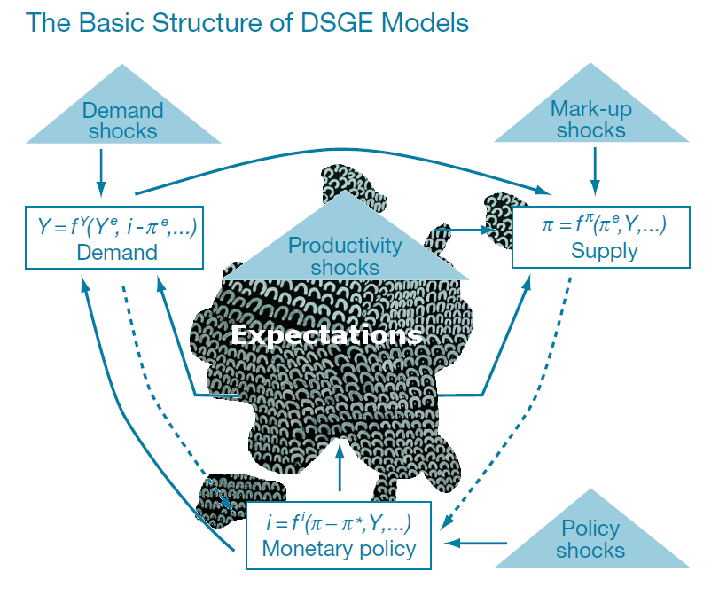
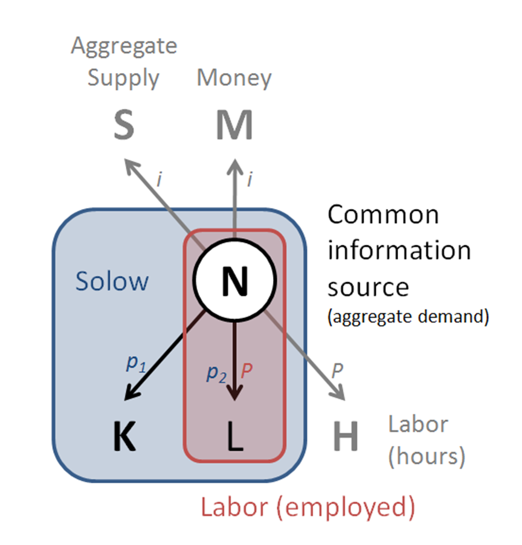

This blog is now 2 years old and is heading towards 500 posts. I thought I'd celebrate with a countdown listicle of some of the _least_ viewed posts here.

> [**What does E\_t π\_t+1 mean?**](http://informationtransfereconomics.blogspot.com/2014/12/what-does-et-pit1-mean.html)
> This post was actually pretty weird (with a weird graphic) -- mostly me thinking out loud about the possible meaning and consequences of expectations terms in DSGE-type models as they essentially couple the future to the past.

> [**Do the different market models work simultaneously?**](http://informationtransfereconomics.blogspot.com/2015/02/do-different-market-models-work.html)
> This was a response to LAL who has become a frequent commenter since that time about whether the models of the labor market, interest rates, capital, etc worked simultaneously. It has a cool diagram.

> [**Powerful evidence for the information transfer model**](http://informationtransfereconomics.blogspot.com/2015/01/powerful-evidence-for-information.html)
> The data appear to rather unambiguously support the model _log N ~ k log M_ with _k_ falling.

> [**Below target inflation**](http://informationtransfereconomics.blogspot.com/2015/01/below-target-inflation.html)
> This is a paper that can be interpreted as confirming the slowing of inflation over time.
