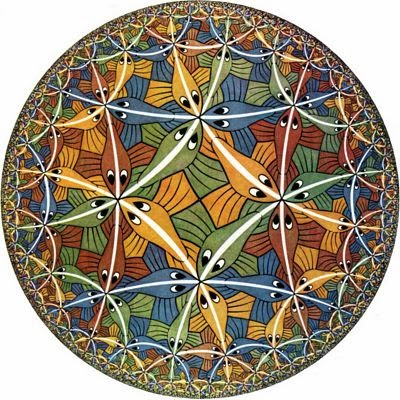

I started following the Real World Economics Review (RWER) blog -- a capital-H Heterodox outlet -- in order to branch out and see if anyone might be interested in my information theory take. I continue to follow it because it is a source of great entertainment. Take [Asad Zaman](https://rwer.wordpress.com/2015/04/23/godels-theorems-the-limits-of-reason/):

> _This essay \[on Godel's Theorem\] shows that logic is limited in its ability to arrive at a definite conclusion even in the heartland of mathematics. Pluralism is required to cater for the possibility that both Euclidean and non-Euclidean geometries represent valid ways of looking at the world. The world of human affairs is far more complex. In order to study and understand societies, one must learn to deal with a multiplicity of truths. ... These ideas form part of the background for supporting the drive for pluralism in our approaches to economic problems._

Godel's theorem applied to axiomatic systems of comparable power to the Peano axioms and proves the existence of theorems about natural numbers that cannot be proven true or false given the axioms.

-   Physically relevant models (to a given level of approximation) of the universe (economics included) are among those theorems
-   You cannot empirically validate a 'theorem' about a physical (or economic) system
-   There exists other forms of reasoning that can reach these true or false but unprovable theorems

Actually, what's funny is that what Godel essentially proves is that there exists a statement in mathematics that is roughly equivalent to "This sentence is false." in English. The existence fo that statement in English (and most if not all other languages) would then mean, by Zaman's logic, that language is limited in its ability to solve economic problems. Interpretive dance comes to mind. But it may be possible to construct a dance move that is its own negation ...

Then there is that nonsense about geometry. Euclidean and non-Euclidean geometries are not different ways of looking at the world; they are subsets of one way of looking at the world called "geometry". They actually both exist simultaneously in General Relativity -- space is both flat (Euclidean geometry) and curved near massive objects (non-Euclidean geometry). Another way to put it: Euclidean geometry is an approximation to non-Euclidean geometry for small values of curvature.

Also, the parallel postulate is not an "unprovable" statement in the Godel sense, it is actually just something that is true in Euclidean geometry -- i.e. not true in the general case.

In fact, the "unprovable" statements out there that could be taken as examples of Godel's undecidable propositions are very abstract ... like the continuum hypothesis or the axiom of choice. As I was never one for formal logic (my math degree concentrated on group theory and topology), I'm not sure these really count as undecidable propositions in the Godel sense. Wikipedia says they do, but I'm not inclined to believe that. Both of these are independent of the Peano axioms -- a bit like saying "my hair is brown" is independent of the Peano axioms.

I also learned of Nicolas Georgescu-Roegen and his book "The Entropy Law and the Economic Process" [from RWER](https://rwer.wordpress.com/2015/04/17/on-dogmatism-in-economics/). I was intrigued, but soon learned that Georgescu-Roegen posited the idea of the "arithmomorphic fallacy", which is not a fallacy but in fact an assertion of the sort that I tend to file under the "failure of imagination fallacy". Just because you can't think of the way of describing something with mathematics doesn't mean there isn't a way. That is a genuine fallacy. It is even entirely plausible that our entire universe is the product of computations with the bits on a [holographic screen](http://en.wikipedia.org/wiki/Holographic_principle) at the cosmological horizon -- and is therefore entirely made of math.

Georgescu-Roegen did have an interesting contribution to ecological economics in recognizing the fact of  a finite entropy production between the current state of the solar system and its eventual "heat death". Besides free energy (or enthalpy) being the more relevant functions, the scale of entropy production is so immense (the largest contributions are from sunlight warming the planet and the water and carbon cycles) that the human impact -- stemming almost entirely from global warming (impacting the carbon cycle) -- amounts to only a tiny fraction. From the perspective of the empirical values of entropy production, global warming would be the only ecological problem you would worry about. 

This is not a reason to not care about the environment ... it's just a unnecessarily general and abstract reason. Graham's number comes to mind (possibly the worst upper bound for a result ever constructed). It would probably be better to say that the surface area of the Earth is finite, therefore let's not cover it all with trash and cities.
