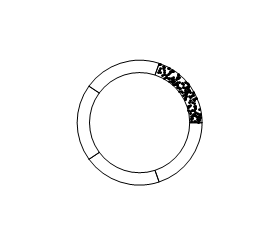

The latest in my series of _X is an entropic force_, I'd like to propose the idea, meeting the mainstream of economics halfway, that incentives are an attempt at a microscopic description of an entropic force.

I recently re-read my [post/discussion](http://informationtransfereconomics.blogspot.com/2015/02/why-focus-on-supply-and-demand.html) with commenter Jamie -- we both have qualms with the mainstream economic view that a fall in price causally leads to ("incentivizes") a rise in consumption. Jamie put it as an analogy with gasoline:

> _Which of the following statements is more accurate?_
>
>
>
> __1) An increase in fuel \[supplied\] causes the car to travel further__
>
> __2) An increase in the use of the car for travel causes an increase in the fuel \[used\].__

> _\[The mainstream economic\] view also says that an increase in the fuel supply (1) lowers its price and that makes more people buy more fuel. Now this idea is not only that more people can afford fuel at a lower price, or finally afford as much as they need, but that lowering the price incentivizes additional consumption ... like a moth to flame. **Jamie and I both have a problem with this view.** Lowering the gas price doesn't make me want to drive more. ... Despite my problem with this microeconomic view, I still think it gets the result correct, just not for the right reasons. The problem with the micro viewpoint in the previous paragraph is that is tries to assign a microeconomic explanation for an entropic force._

By "gets the result correct" I effectively mean incentives _save the phenomena_ of supply and demand, like how [Calvo pricing saves the phenomena of nominal rigidity](http://informationtransfereconomics.blogspot.com/2015/03/nominal-rigidity-is-entropic-force.html). Saving the phenomena is a phrase used to contrast with models that offer explanations. Calvo pricing and incentives do no explain economic behavior, they save the observed economic phenomena.

We observe the fact that lowering the price on e.g. bacon generally tends to increase its consumption. Economics does not teach that this effect is dominated by people who are now able to afford the bacon -- in the model, everyone is able to afford the bacon -- their utility is maximized by doing something else with the money.

That makes it weird for people like Jamie and me. At the very least it should be weird for Jews and Muslims who don't eat bacon on religious grounds -- economists are telling them that they would consume more bacon if the price is reduced, ceteris paribus.

It's weird on the supply side too. Shannon may want to be a doctor, but if the price of bacon rises, economists are telling her she now wants to go into pig farming or pork belly futures a little bit more than she did before.

All of this strikes most ordinary people who don't think of life in terms of the pecuniary incentives as freaky ([here's a good example](http://induecourse.ca/why-people-hate-economics-in-one-lesson/)). Economists and _homo economicus_ seem like rational aliens. I'm sure that's where the particular non-intuitive explanations in the Freakonomics vein derive their pageviews. It's also behind a phrase I've seen: "thinking like an economist". It's also probably why there are so many heterodox views out there.

Instead of individuals feeling drawn to buying more bacon because the price fell, on average the total amount of bacon consumed per person rises through millions of individual decisions because that is the most likely state among millions of people. In the entropic force view, this consumption increase doesn't even have to happen! It just happens on average -- if you reset and re-ran the world (like a [Monte Carlo simulation](http://en.wikipedia.org/wiki/Monte_Carlo_method)), you'd get a different result each time. On average, you get an increase, but fluctuations for _N_ agents are on the order of _~ 1/√N_. Jamie and I can't feel compelled to consume more gas at a lower price in the realized world because we in fact aren't compelled to consume more gas in most realizations of the world.

Shannon can't feel pulled into pig farming because she doesn't go into pig farming in most re-runs of the world economy. Someone may consume more gas or go into pig farming (or more likely current pig farmers will produce more bacon), but a story can't be told for a representative agent because it doesn't apply to everyone.

No single atom is compelled to diffuse to a region of lower density. They move around randomly, occasionally colliding with the walls of the container or each other. Collectively, there is an entropic force driving the atoms in a gas to an equal (maximum entropy) distribution over the container. And since there are ~ 10^23 atoms in a macroscopic gas sample, the fluctuations around an equal density are ~ 0.0000000003 %.

Economic systems have fewer agents so have much larger fluctuations than a typical macroscopic atomic system. In physics, we'd probably call a macro-economy a [meso](http://en.wikipedia.org/wiki/Mesoscopic_physics)\-economy instead.

Economists came up with the idea of incentives to figure out why people would be pulled into pig farming or driving further ... or how supply can create its own demand \[1\] ... at the microeconomic level. When the price falls (or a good is subsidized), people are "incentivized" to consume more than they would have otherwise in order to maximize their utility. We're all [greedy algorithms](http://en.wikipedia.org/wiki/Greedy_algorithm) sucking up utility however we can.

And to a great extent, models of incentives work at effectively describing the situation after a price drop or a subsidy. Some people really must be buying less bacon when the price rises because overall consumption is observed to decrease when the price rises. Averaging that decrease in consumption across everyone, you have everyone decreasing their consumption a little bit -- incentivized by the price rise.

But it also leads to the weird idea that subsidized health care will lead to people to have more surgeries even if they could have afforded the extra surgeries before the subsidy. Or that lower gas prices make people drive more (I can assure you I do not want to drive around my hometown any more than I have to). Some budget constrained people do drive more because they can afford it when the price falls; some people do get surgeries because they can afford them after the subsidy.

In economics, these would be treated as an exception to incentives (i.e. a more detailed model of incentives) with an _ad hoc_ model for some goods \[2\].

The entropic approach unifies these the successes and failures of incentives into a single model -- surgeries and driving may be more like a [Fermi-Dirac distribution](http://en.wikipedia.org/wiki/Fermi%E2%80%93Dirac_statistics) (lower maximum occupation numbers) than a Maxwell-Boltzman distribution. You have people getting the surgeries deemed medically necessary (and no more) or driving as far as they can given the constraints of work and vacation ... and you still have people rushing into the malls on "Black Friday" for the sales. They're all maximum entropy solutions, just over different sets of available states.

**Footnotes:**

\[1\] Say's law in mainstream macroeconomics isn't considered true (partially because of the existence of money), but one description of the role of a central bank is to make Say's law true in practice via monetary policy.

\[2\] **Footnote added 4/16/2015:** Per LAL in comments below, this would be the inclusion of satiation points. However, that breaks the fundamental theorem of welfare economics -- that market outcomes (Walrasian equilibrium) are Pareto efficient -- which requires local non-satiation. This is interesting because it kicks out one of the legs in favor of utility in the first place: to have something that can be maximized defining a Pareto efficient allocation. If we're not maximizing utility, then why worry about the utility maximizing solution? Why not work with the [entropy maximizing solution](http://informationtransfereconomics.blogspot.com/2015/03/utility-in-information-equilibrium-model.html)?
