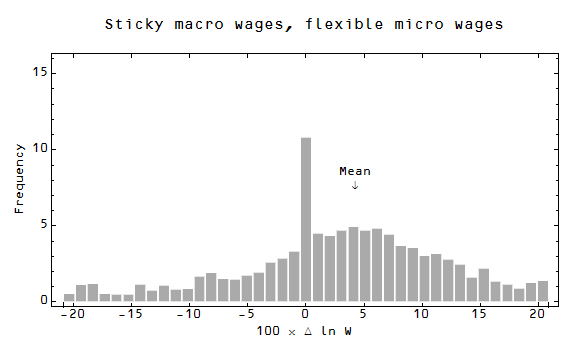
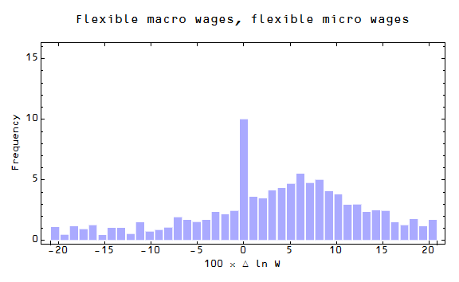
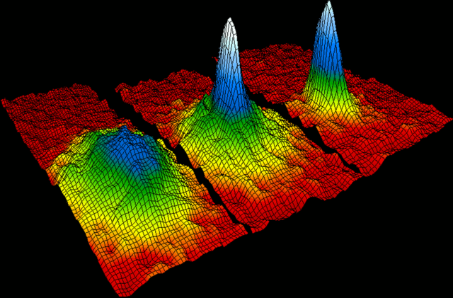

The hot topic in the econoblogosphere appears to be nominal rigidity. Here's [Scott Sumner](http://econlog.econlib.org/archives/2015/04/there_is_no_sti.html). Here's [David Glasner](http://uneasymoney.com/2015/04/17/price-stickiness-and-macroeconomics/). Here's [my take on Glasner](http://informationtransfereconomics.blogspot.com/2015/04/macro-prices-are-sticky-not-micro-prices.html). Here are some [other](http://informationtransfereconomics.blogspot.com/2015/03/entropy-and-walrasian-auctioneer.html) [bits](http://informationtransfereconomics.blogspot.com/2015/03/nominal-rigidity-is-entropic-force.html) from me.

Anyway, I think it would be worthwhile to discuss what is meant by "sticky wages".

One way to see sticky wages is as individual wages that don't change: total microeconomic stickiness. This position is approximately represented by a paper from the SF Fed Sumner discusses at the link above. However the model they present not only doesn't look like the data at all, but is better representative of completely sticky wages than just sticky downward wages. It's so bad, I actually made a mistake looking at the model -- I didn't read the axes correctly as the central spike is plotted against the right axis. Here is a cartoon of what that graph should look like if the spike and the rest of the distribution were plotted on the same axes:

The light gray bars represents the distribution of wage changes at a time before the recession, the dark bars represent the same thing after a recession. Basically a big spike at zero wage change in both cases.

Another way to see sticky wages is as being sticky downward. This is how I originally looked at the model from the SF Fed. The picture you have is very few wage decreases -- mostly wage increases and zero changes -- and it represents individual sticky-downward wages (at the micro level):

These are the two sticky microeconomic cases.

Now what would **sticky macroeconomic wages** look like? There are two possibilities here: 1) wages are individually sticky and 2) wages are collectively sticky, but individually flexible. Case 1 looks like the SF model above -- a spike at zero -- or the downward rigidity in the second graph. 

Case 2 looks like a distribution with constant mean -- total nominal wages keep the same average growth before and after the recession. Individual wage changes fluctuate around from positive to negative. Case 2 is a bit harder to visualize with a single graph, so here is an animation:

The mean I am showing is the mean of the flexible individual wages, not the ones dumped into the zero wage change bin at the onset of the recession (I also exaggerated the change in the normalization at the onset of the recession so it is more obvious what is happening).

Here is what that case looks like in the same style as the previous graphs:

You may be curious as to why, even with the spike at zero wage change, I still consider wages to be "flexible" individually. In the case of the SF model, ~ 60-90% of wages are in the zero change bin; that's sticky. In all of the others, only ~10% of wages are in the zero change bin -- ~90% of wages are changing by amounts up to 20% or more. I wouldn't call that individually sticky at all. Additionally, before and after a recession, the fraction in the zero bin only goes up by a few percentage points.

And that is really what is happening! Here is the data from the SF Fed paper:

That looks like **sticky macro, flexible micro wages** (no change in the mean, individual changes of up to 20%).

Note also that this data looks nothing like the model presented in the paper (the first graph from the top above) or sticky downward individual wages (second graph from the top above).

There remains the question of whether there is any macro wage flexibility -- let's look at the case of **flexible macro, flexible micro wages**, again best seen as an animation. In this case the mean of the flexible piece of the distribution goes up and down:

How does this look if there's a recession and wage growth slows in the style of the graphs above?

This actually qualitatively looks a bit more like the data than the sticky macro, flexible micro case -- there are some light gray bars sticking out above the distribution on the right side as they do in the data. However that effect is pretty small; to a good approximation we have _sticky macro, flexible micro wages_.

The animation of the flexible macro, flexible micro case illustrates the theoretical problem brought up in Glasner's post:

> _This doesn’t mean that an economy out of equilibrium has no stabilizing tendencies; it does mean that those stabilizing tendencies are not very well understood, and we have almost no formal theory with which to describe how such an adjustment process leading from disequilibrium to equilibrium actually works. We just assume that such a process exists._

In a sense, he is saying we have no idea how the wages collectively move to restore equilibrium through individual changes. Nothing is guiding the changing location of the mean in the animation -- there is no Walrasian auctioneer steering the economy.

The sticky macro, flexible micro case solves this problem -- but only if the equilibrium price vector is an entropy maximizing state and not _e.g._ a utility maximizing state (see [here](http://informationtransfereconomics.blogspot.com/2015/03/utility-in-information-equilibrium-model.html) for a comparison). Since the distribution doesn't change, there is no change requiring coordination of a Walrasian auctioneer. The process of returning to an equilibrium from disequilibrium is simply the process of going from an unlikely state to a more likely state.

Let me use an analogy from physics. Consider a box of gas molecules, initially in equilibrium at constant density across the box (figure on the left). If we give the box a jolt, you can set up a density oscillation such that more molecules (higher pressure) are on one side than the other (figure on the right):

Eventually the molecules return to the equilibrium (maximum entropy) state on the right left guided only by the macro properties (temperature, volume, number of molecules). The velocity distribution doesn't change very much (i.e. the temperature doesn't change very much). We simply lose the information imparted by the shock as entropy increases.

The disequilibrium state with higher pressure on one side of the box is analogous to the disequilibrium price vector described by Glasner. The macro properties are NGDP and its growth rate. The velocity distribution is analogous to the wage change distribution. And the process of entropy increasing to its maximum is the process of tâtonnement.

The key idea to remember here is that there is nothing that violates the microscopic laws of physics in the box on the right -- that state can be achieved by chance alone! It's just very very unlikely and you need the coordination of the jolt to the box to induce it.

You may have noticed that I didn't discuss the spike at zero wage change very much \[1\]. I think it is something of a red herring and the description of wage stickiness would be qualitatively the same without it. In [this old blog post of mine](http://informationtransfereconomics.blogspot.com/2014/10/coordination-costs-money-causes.html), I argue that the spike at zero (micro wage stickiness) and involuntary unemployment are two of the most efficient ways for an economy to shed entropy (i.e. NGDP) during an adverse shock/recession.

In the end, the process looks like this:

1.  An economic shock hits, reducing NGDP
2.  The economy must shed this 'excess' NGDP though the options open to it
3.  There are sticky macro prices, so the shock can't manifest as a significant change in the distribution of wage changes
4.  Therefore some of the NGDP is shed through microeconomic stickiness (spike at zero) and involuntary unemployment (effectively reducing the normalization of the distribution of wage changes)
5.  As the economy grows (entropy increases), the information in the economic shock fades away until the maximum entropy state consistent with NGDP and other macro parameters is restored

Footnotes:

\[1\] The spike at zero makes me think of a [Bose-Einstein condensate](http://en.wikipedia.org/wiki/Bose%E2%80%93Einstein_condensate) ...

