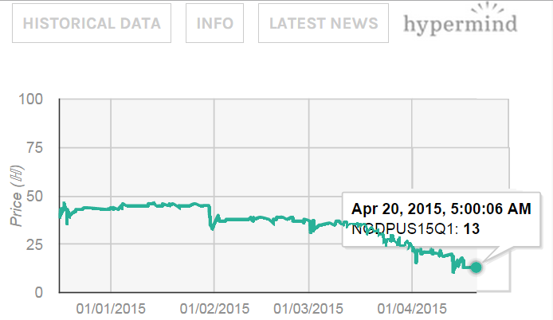

[Nine days](http://www.bea.gov/newsreleases/news_release_sort_national.htm) until the BEA releases its first estimate of Q1 NGDP. I've been updating the prediction graph with the predictions from hypermind [linked at Scott Sumner's blog](http://www.themoneyillusion.com/) (see [here](http://informationtransfereconomics.blogspot.com/2015/04/prediction-markets-trends-and-models.html), [here](http://informationtransfereconomics.blogspot.com/2015/04/spring-break-15.html)) -- the Q1 prediction has been falling towards the advance estimates. And the advance estimates appear to be low ... in the area of 1.2% growth (see e.g. [here](http://www.pragcap.com/three-things-i-think-i-think-36)).

The information equilibrium model doesn't get so detailed ... all of these estimates are within the error probability. Here's [the original prediction](http://informationtransfereconomics.blogspot.com/2015/01/ngdp-predictions-and-new-normal.html). And here's the updated graph:

You can clearly see the "update" that happens as 2014Q4 data is released at the end of January, as well as smaller "updates" around CPI inflation data releases at the beginning of each month.
