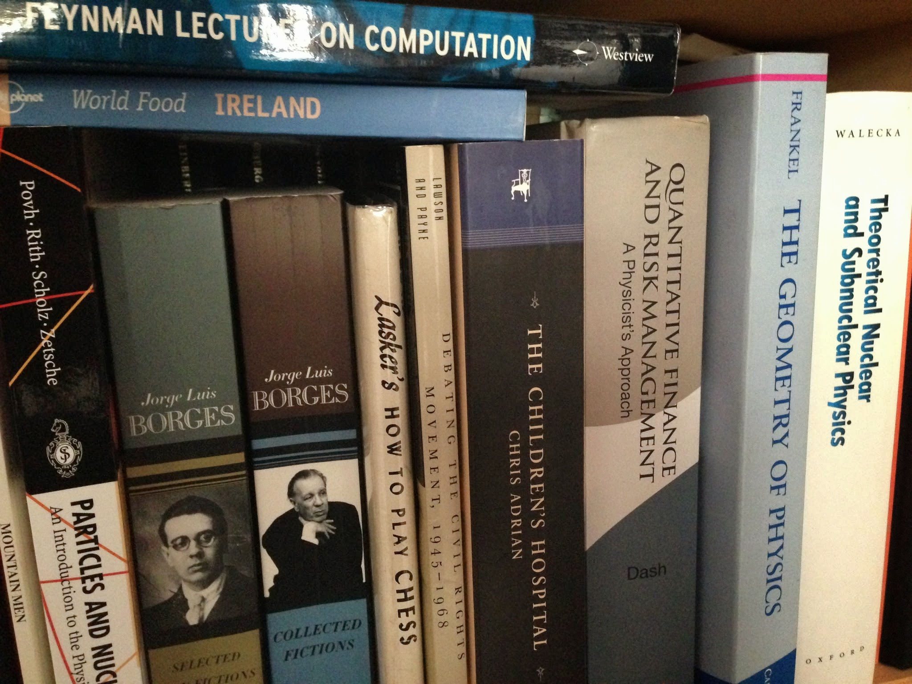

In writing the previous post, I looked up an old blog post I'd read by Cosma Shalizi about econophysics that I found very influential (listed below). That got me to thinking about the foundation of this blog along with what inspired my thinking and approach.

Aside from the thermodynamics I learned in school (from [Reif](http://www.amazon.com/Fundamentals-Statistical-Thermal-Physics-Frederick/dp/1577666127) and [Landau and Lifshitz](http://www.amazon.com/Statistical-Physics-Third-Edition-Part/dp/0750633727)), my economics and information theory mostly comes from the internet (and some work-related stuff ... [Terry Tao is pretty awesome](https://terrytao.wordpress.com/2009/05/25/reflections-on-compressed-sensing/)). The [_Feynman Lectures on Computation_](http://www.amazon.com/Feynman-Lectures-On-Computation-Richard/dp/0738202967) are good too. This [article](http://www.cs.virginia.edu/~robins/Breaking_Intractability.pdf) \[pdf\] and the related paper cited in it are swimming around in the background, too. When I was in graduate school I considered going to into finance, as did many physicists in the late 90s and early 2000s and [this book](http://www.amazon.com/Quantitative-Finance-Risk-Management-Physicists/dp/9812387129) was my reference before my emails and interviews.

These links alone don't necessarily cover all of the technical details, but they do at least point to (or give some important search terms for) the resources and therefore were my starting points.

Here is the list:

**[A mathematical theory of communication](http://www.mast.queensu.ca/~math474/shannon1948.pdf)** \[pdf\]

Claude Shannon

You really don't need much more than this in terms of information theory to understand the next paper or this blog ...

****[Information transfer model of natural processes: from the ideal gas law to the distance dependent redshift](http://arxiv.org/abs/0905.0610v2)****

Peter Fielitz and Guenter Borchardt

This paper is the basis of the information equilibrium model available at the time; the latest version (with a different title) is [here](http://arxiv.org/abs/0905.0610).

****[The reason macroeconomics doesn't work very well](http://noahpinionblog.blogspot.com/2013/04/the-reason-macroeconomics-doesnt-work.html)****

Noah Smith

I started my blog a week after that post.

**[What I learned in econ grad school](http://noahpinionblog.blogspot.com/2011/04/what-i-learned-in-econ-grad-school.html)** (as well as [Part 2](http://noahpinionblog.blogspot.com/2011/05/what-i-learned-in-econ-grad-school-part.html))

Noah Smith

This let me know the list of things I needed to learn before making a fool of myself, but presented in Noah's snarky style.

**[Why Oh Why Can't We Have Better Econophysics?](http://bactra.org/weblog/517.html)**

Cosma Shalizi

This forms the basis for the history of physicists attempting to point out how economists are wrong and largely being incorrect or ignored.

****[In Soviet Union, Optimization Problem Solves _You_](http://crookedtimber.org/2012/05/30/in-soviet-union-optimization-problem-solves-you/)****

Cosma Shalizi

The greatest blog post ever written; also an excellent way to think about markets as human-created algorithms solving an optimization problem.

**[Short intro course on money](http://www.themoneyillusion.com/?p=20599)**

Scott Sumner

This came out two weeks before I started my blog. See also [here](http://informationtransfereconomics.blogspot.com/2015/02/market-monetarism-quicker-easier-more.html) (especially the footnote).

**[It's Baaack: Japan's Slump and the Return of the Liquidity Trap](http://www.brookings.edu/~/media/projects/bpea/1998%202/1998b_bpea_krugman_dominquez_rogoff.pdf)** \[pdf\]

Paul Krugman

The macro of Paul Krugman and a good history lesson. The following few links as well ...

**[IS-LMentary](http://krugman.blogs.nytimes.com/2011/10/09/is-lmentary/)**

Paul Krugman

**[How complicated does the model have to be?](http://www.princeton.edu/~pkrugman/oxrep.pdf)** \[pdf\]

Paul Krugman

**[There's something about macro](http://web.mit.edu/krugman/www/islm.html)**

Paul Krugman

****[The Changing Multiplier Since 1925...](http://delong.typepad.com/sdj/2012/03/the-changing-multiplier-since-1925.html)****

Brad DeLong

I don't link to this very much, but it is behind much of the presentation of the information equilibrium model in terms of changing curves (e.g. [here](http://informationtransfereconomics.blogspot.com/2013/08/the-interest-rate-in-information.html) and [here](http://informationtransfereconomics.blogspot.com/2014/06/krugman-keynes-and-liquidity-trap.html)).
