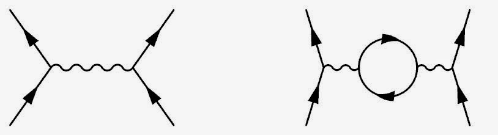
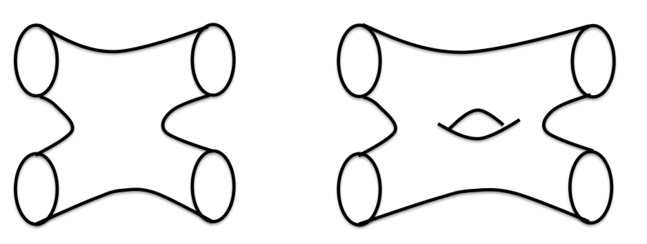

[Simon Wren-Lewis](http://mainlymacro.blogspot.com/2015/04/do-not-underestimate-power-of.html) quotes [Brad DeLong asking](http://equitablegrowth.org/2015/03/30/hegemony-new-keynesian-model/):

> _why models that are microfounded in ways we know to be wrong are preferable in the discourse to models that try to get the aggregate emergent properties right._

and continues

> _Why are microfounded models so dominant? From my perspective this is a methodological question, about the relative importance of ‘internal’ (theoretical) versus ‘external’ (empirical) consistency. ... So, for example, you will be told that internal consistency is clearly an essential feature of any model, even if it is achieved by abandoning external consistency._

Every time I hear these complaints about the hegemony of microfoundations, my jaw just drops. Here is [David Glasner](http://uneasymoney.com/2014/09/30/explaining-the-hegemony-of-new-classical-economics/):

> _A macroeconomic model was inadmissible unless it could be explicitly and formally derived from the optimizing choices of fully rational agents._

The classes of theories that are eliminated by making such assumptions or following such a methodology is staggering. It would be as if physicists declared upon discovering various quantum or relativistic effects that went against classical mechanics that everything must now be described in terms of different kinds of "Newtonian gravities" acting on atoms.

That is not some exaggerated claim -- it is isomorphic to Glasner's description of the microfounded methodology. The atoms are agents, the optimizing choices (utility maximization) is the principle of least action and the Lagrangian formulation of classical mechanics. The quantum effects are things like the changing Phillips curve. There would have been some limited success -- electromagnetism looks a bit like Newtonian gravity with positive and negative charges. But the list of things it would have precluded is long ...

_And many, many more ..._

And as I've said [before](http://informationtransfereconomics.blogspot.com/2015/03/nominal-rigidity-is-entropic-force.html) \[link added\], things like sticky prices sound like entropic forces for which there are no correct microfoundations. Just as there is no microscopic force that causes diffusion, there may be no microscopic force that causes prices to become resistant to macroscopic change (clearly there is no resistance to microscopic change).

That may be why the microfoundations, and hence economics, have lost touch with empirical reality (or Wren-Lewis's euphemism _external consistency_).

As a side note, in physics there is something that actually seems like the methodological hegemony of microfoundations. I'd call it the hegemony of effective field theory. Basically everything taught beyond undergraduate physics is taught as a field theory ... Feynman's path integral looks like a thermodynamic partition function, all of solid state physics is taught in terms of electrons, holes, phonons, and other quasiparticles. String theory is actually just a generalization of field theory -- replacing Feynman diagrams with a topological expansion of string amplitudes (a phonon-electron diagram can be see e.g. [here](https://simpliphy.wordpress.com/2012/05/06/superconductivity/)):

However, this hegemony is born of [astounding empirical success](http://en.wikipedia.org/wiki/Anomalous_magnetic_dipole_moment).

Modern macroeconomics is a bit like someone making all kinds of strong claims about the true state of the world. There are two typical futures of such a person: being hailed as a genius, or being placed in a straitjacket.
