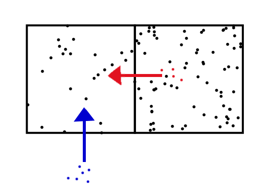

Commenter LAL asked if I could take a look at the [Lucas Islands model](http://en.wikipedia.org/wiki/Lucas_islands_model) in the information equilibrium framework. This post is basically just a set-up of that model and some initial observations. We'll start with a series of markets:

These two markets set up the model where the price $p_{i}$ depends on both on supply ($s_{i}$) and demand for the individual goods (first market) as well as the growth of the aggregate money supply $m$ (i.e. trend inflation, second market). If there are a large number of markets, we can make an immediate simplification where

The second market is a simple quantity theory of money and we can immediately solve the resulting differential equation (much like is done in the development of [the partition function approach](http://informationtransfereconomics.blogspot.com/2014/06/the-macroeconomic-partition-function.html)):

We can define real output $n_{i} \equiv P y_{i}$ with the average price level $P$ over the $I$ islands

**Equilibrium**

From the first market, and using the simplification from a large number of markets, we can say that:

Now, let's make a simplifying assumption that all the $I$ islands are identical so that $a_{i} = a_{0}$, $k_{i} = k_{0}$ and $c_{i} = c_{0}$. This leaves us with the equations (in equilibrium):

**Disequilibrium (shocks)**

The Lucas Islands model adds in two kinds of shocks (or fluctuations): monetary policy $\sigma_{m}$ and idiosyncratic market shocks $\sigma_{i}$. We can add these to the model's general differential equations from the two markets at the top of this post:

In this model, agents won't be able to tell the difference between $\sigma_{m}$ and $\sigma_{i}$ (the signal extraction problem). If we use the identical market simplification and solve the differential equations, we obtain (assuming I've done my math right):

or in a log-linear form:

The Lucas model stipulates that each island will change production based on the the price signal they see (and compare it to their inflation expectations based on monetary policy). This creates two ways that equilibrium can be restored (for example the maximum entropy/equilibrium state where all prices are equal) given a rise in price:

1.  Production (rise in supply)
2.  Fall in demand

The agents use option 2 when the price rise is in line with their expectations based on monetary shocks and option 1 when it is not. Using the gas in a box visualization of the forces from e.g. [this post](http://informationtransfereconomics.blogspot.com/2015/03/supply-and-demand-as-entropy.html), we would see an imbalance of the number of particles between two boxes being rectified by both particles moving from one box to another (red, fall in demand) and the addition of new particles (blue, production):

There is no _a priori_ reason for one adjustment over the other, so both adjustments should happen if they are in the model. We'd need to define a "[chemical potential](http://en.wikipedia.org/wiki/Chemical_potential)" for the supply units which would make it bigger or smaller component of the adjustment depending on the magnitude of the price difference from the equilibrium price (both boxes have equal numbers of particles).

Monetary shifts increase (or decrease) the numbers of points across all the boxes (the islands) and if the system was otherwise in equilibrium, there would be no production needed to offset cases of disequilibrium -- money is neutral in that case.

That is all for now. I will continue this approach in a future post.
