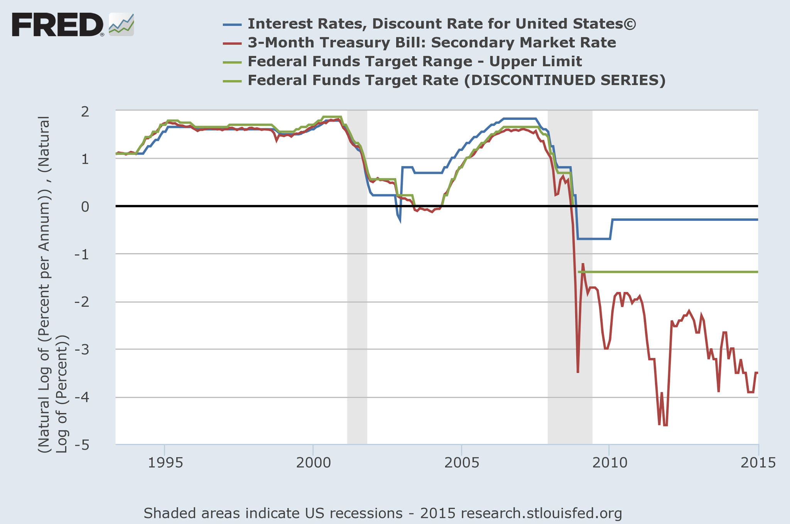

Just behind Japan, the UK was at the leading edge of improved industrial output coming out of the Great Depression. Is the UK about to stage a repeat performance?

I have been [thinking about](http://informationtransfereconomics.blogspot.com/2015/04/monetary-regime-change-in-uk.html) why the UK appears to have undergone a monetary regime change since the onset of the Great Recession whereas other countries have not. I think the Great Depression may give us a clue and points to the speculative idea that the UK might be the first country to leave the Great Recession \[1\].

[Paul Krugman attributes](http://krugman.blogs.nytimes.com/2009/10/09/modified-goldbugism-at-the-wsj/) the improved industrial output after the Great Depression to leaving the gold standard, but I actually think it has more to do with [pegged (or effectively pegged) interest rates](http://informationtransfereconomics.blogspot.com/2015/01/gold-was-irrelevant.html). If we look at the bank rate in the UK, we can clearly see two regions where the interest rate was fixed for an extended period:

The previous one was associated with a monetary regime change, much like the current one:

If we look at US short term interest rates, we can see the difference between the exit from the Great Depression (shaded region) and the lack of a monetary regime change associated with the current Great Recession -- the interest rate peg is glaringly obvious:

The current US monetary policy regime has an upper bound for the Fed target interest rate, and rates have fallen to near-zero.

Now you may say this is apples to oranges -- the bank rate in the UK is more like the target or discount rate in the US than the 3-month secondary market rate. And that's true; the only reason I show that data because I don't have a source for the explicit Fed target rate or the US discount rate from that period -- however they would have both been [fixed at 0.375%](http://www.federalreservehistory.org/Events/DetailView/30) during that period. I can show the difference in an apples to apples comparison using more recent data. Here are the Fed target rate, the discount rate and the 3-month rate alongside the UK bank rate and the 3-month rate:

You can see that the US rate falls well below either measure, while the UK rate follows the target fairly closely. It seems more like an "operationally effective" peg in the UK than the US.

Maintaining an interest rate peg seems to be associated with hyperinflation. This isn't hyperinflation in the [Weimar sense](http://en.wikipedia.org/wiki/Hyperinflation_in_the_Weimar_Republic), but rather a tendency for inflation to accelerate. An inflation target of 2% will start to produce inflation of 3% or 4% over time even if the central bank prints currency at the same rate. What would likely happen is that the Bank of England would see this increased inflation and raise interest rates (effectively removing the peg) -- leading right back into a similar stagnation as e.g. Switzerland \[1\]. If the BoE could hold on to this accelerating inflation ~10 years, similar to the the UK and [US after WWII](http://informationtransfereconomics.blogspot.com/2013/09/exit-through-hyperinflation.html), it could [reset the information transfer index](http://informationtransfereconomics.blogspot.com/2013/08/the-liquidity-trap-and-information.html) ([NGDP would be much larger than the monetary base](http://informationtransfereconomics.blogspot.com/2014/06/reconciling-expectation-and-information.html)) \[2\] and usher in a new era of growth much like the post-war period in both countries. 

I've previously referred to this as "exit through hyperinflation". Maybe we are seeing it in the UK?

This may seem odd in light of the [recent inflation](http://www.theguardian.com/business/2015/mar/24/uk-inflation-expected-to-hit-new-low) (or more precisely 'lack of inflation') data from the UK. And if the monetary regime change reflects just a shift from one stagnant path to a new stagnant path, then the constant information transfer index model of [this post predicts](http://informationtransfereconomics.blogspot.com/2015/04/monetary-regime-change-in-uk.html) a slow decline in the inflation rate (I don't currently have seasonally adjusted data for the UK CPI, so there is a bit of fluctuation in the LOESS smoothed version):

So maybe the proper interpretation is that pegged interest rates are associated with monetary regime change, but not necessarily a change to a hyperinflation path \[3\].

I like the optimistic view that the UK could break out of the Great Recession, but the evidence in the information transfer model isn't strong enough to choose one particular conclusion (a new prosperity) over the other (going from stagnation to stagnation).

**Footnotes:**

\[1\] I imagine this will be taken as vindication of the Cameron government's fiscal policies and the subsequent "hyperinflation" (more likely just high inflation) to be vindication of the 'hard money' proponents' claims of e.g. QE leading to out of control inflation. There is another possibility that the UK will go from a stagnant path to a different stagnant path, much like appears [to have happened in Switzerland](http://informationtransfereconomics.blogspot.com/2014/08/monetary-regime-change.html). On the left is the Swiss information transfer index, on the right is the UK one:

Switzerland jumped from _k ~ 0.5_ to _k ~ 0.8_ in the 1990s, while the UK seems to have gone from _k ~ 0.5_ to _k ~ 0.7_ in 2008-2009.

\[2\] What happens is that **accelerating** exponential growth of NGDP coupled with normal exponential growth of M0 leads to NGDP growing much faster than M0 and thus _k ~ log M0/log NGDP_ falling.

\[3\] It is possible that the UK imported its high inflation from the US (by having post-war US dollar denominated debts) and the only real source of hyperinflation was the post-war [lack of central bank independence](http://www.federalreservehistory.org/Events/DetailView/30) in the US. This would lend itself to the drifting from stagnation to stagnation hypothesis.
