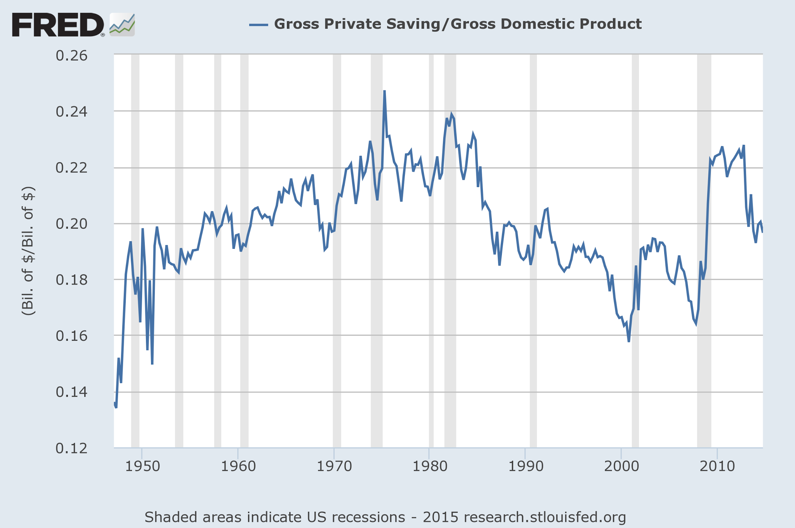

Hello! I'm back from a short vacation and slowly getting to the comments.

As I mentioned [here](http://informationtransfereconomics.blogspot.com/2015/05/the-rest-of-solow-model.html), there might be a bit more to the information equilibrium picture of the Solow model than just the basic mechanics -- in particular I pointed out we might be able to figure out some dynamics of the savings rate relative to demand shocks.

In the [previous post](http://informationtransfereconomics.blogspot.com/2015/05/the-rest-of-solow-model.html), we built the model:

Where $Y$ is output, $K$ is capital and $I$ is investment. Since information equilibrium (IE) is an [equivalence relation](http://informationtransfereconomics.blogspot.com/2015/03/information-equilibrium-is-equivalence.html), we have the model:

with abstract price $p$ which was described [here](http://informationtransfereconomics.blogspot.com/2014/03/the-islm-model-again.html) (except using the symbol $N$ instead of $Y$) in the context of the IS-LM model. If we write down the differential equation resulting from that IE model

There are a few of things we can glean from this ...

**I. General equilibrium**

We can solve equation (1) under general equilibrium giving us $Y \sim I^{1/\eta}$. Empirically, we have $\eta \simeq 1$:

Combining that with the results from the Solow model, we have

which tells us that $\alpha \simeq 1/\sigma$ -- one of the conditions that gave us the original Solow model.

**II. Partial equilibrium**

Since $Y \rightarrow I$ we have a supply and demand relationship between output and investment in partial equilibrium. We can use equation (1) and $\eta = 1$ to write

Where we have defined the saving rate as $s \equiv 1/(p \eta)$ to be (the inverse of) the abstract price $p$ in the investment market. The supply and demand diagram (including an aggregate demand shock) looks like this:

A shock to aggregate demand would be associated in a fall in the abstract price and thus a rise in the savings rate. There is some evidence of this in the empirical data:

Overall, you don't always have pure supply or demand shocks, so there might be some deviations from a pure demand shock view. In particular, a "supply shock" (investment shock) should lead to a fall in the savings rate.

**III. Interest rates**

If we update the model [here](http://informationtransfereconomics.blogspot.com/2014/03/the-islm-model-again.html) (i.e. the IS-LM model mentioned above) to include the [more recent interest rate](http://informationtransfereconomics.blogspot.com/2015/02/information-equilibrium-paper-draft_23.html) ($r$) model written in terms of investment and the money supply/base money:

where $p_{m}$ is the abstract price of money (which is in IE with the interest rate), we have a pretty complete model of economic growth that combines the Solow model with the IS-LM model. The interest rate joins the already empirically accurate production function:

Since I inevitably get questions about [causality](http://informationtransfereconomics.blogspot.com/2014/05/causality-in-information-transfer.html), it is important to note that these are all IE relationships therefore all relationships are effectively causal in either direction. However it is also important to note that the direct impact of $M$ on $Y$ is neglected in the above treatment (including the interest rates) -- and the direct impact changes depending on the information transfer index in the price level model.

**Summary**

A full summary of the Solow + IS-LM model in terms of IE relationships is:

**Update 5/27/2015:**
