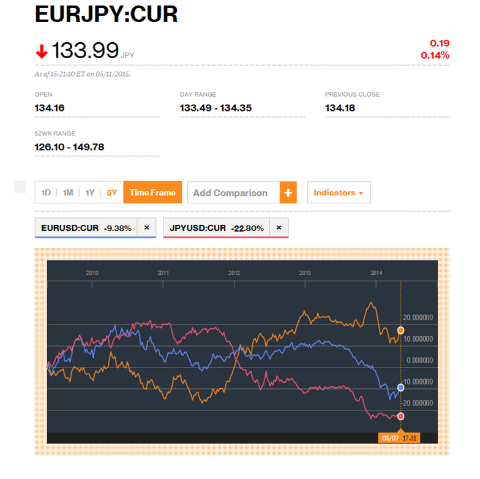
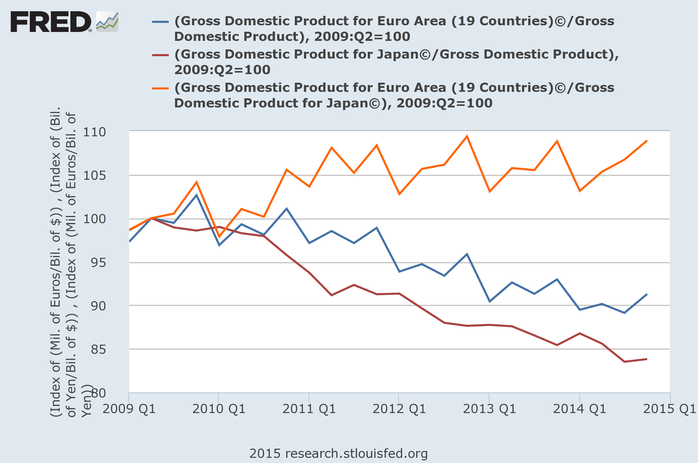

I think one of the more practical things to come out of the information equilibrium model is the [description of exchange rates](http://informationtransfereconomics.blogspot.com/2014/09/what-do-exchange-rates-measure.html). It is an incredibly simple model that effectively says that exchange rates have little to do with inflation or monetary policy, but are rather about aggregate demand in the two countries you are comparing. If my country's economy is booming and yours is flagging relative to long term trends, your currency is going to be cheap for me.

In the macro world, the fact that the US economy is doing better than Japan or the EU since the 2008 financial crisis means that both currencies are going to look depreciated. The QE undertaken by each country is going to be irrelevant except in the sense that it affects NGDP ... which [it doesn't](http://informationtransfereconomics.blogspot.com/2014/11/quantitative-easing-cleanest-experiment.html).

[Scott Sumner](http://www.themoneyillusion.com/?p=29393)

> _You thought Japanese QE depreciated the yen?  That’s just your imagination.  You think QE recently caused the euro to depreciate?  You are hallucinating.  The dollar fell 6 cents on the day QE1 was announced, in March 2009?  That’s a coincidence._

It is your imagination -- or at least an interpretation of data based on a specific model. And the dollar falling is [a market failure](http://informationtransfereconomics.blogspot.com/2014/11/is-market-monetarism-wrong-because.html), not a coincidence.

The trend in exchange rates follows the relative trends in NGDP:

Today the Yen is 20% below the Dollar, the Euro is 10% below the Dollar and the Euro is almost 20% above the Yen compared to 2009.

Today Japan's NGDP is a little over 15% below US NGDP, EU NGDP is 10% below US NGDP and EU NGDP is about 10% above Japan's NGDP compared to 2009.

... basically in line with the simple information equilibrium exchange rate model.

[FRED](https://research.stlouisfed.org/fred2/)[Bloomberg](http://www.bloomberg.com/markets/currencies/)
