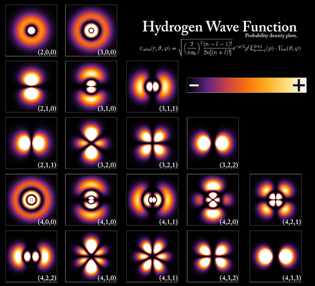

I said I wouldn't do this, but here's another post inspired by Paul Romer. Romer, in [this post](http://paulromer.net/physics-versus-math/), says this:

> _If you are an undergraduate thinking about studying economics in graduate school, I’d strongly recommend a physics degree, or at least lots of physics courses. Math is a tool, but math courses do not teach judgment about how to use this tool to make good abstract mental maps of real world terrain. Learning about models in physics–e.g. the Bohr model of the atom–exposes you to time-tested models that found a good balance between simplicity and insight about observables._

In physics we don't actually learn the Bohr model except maybe as part of a survey of the history of quantum theory. We re-derive the Bohr formula for the energy levels of the Hydrogen atom (only because it turned out to be correct at a given level of approximation). And the Bohr radius constant simplifies writing out the wavefunctions derived from the Schrodinger equation. But we don't really learn so-called "[old quantum theory](http://en.wikipedia.org/wiki/Old_quantum_theory)" ... we learn quantum mechanics.

It's not in any sense a "time-tested" model "that found a good balance between simplicity and insight about observables". It is an interesting middle stage in the history of quantum mechanics (i.e. it is relevant data in history of science research), but I can't imagine any insight you might glean from it. The Bohr model leads no further than its original formulation.

However, I think the way Romer sees the Bohr model really sheds some light on something that is truly missing in economics. That's because Romer sees the Bohr model with his economist's eyes.

Economics, [as described by Romer](http://paulromer.net/ed-prescott-is-no-robert-solow-no-gary-becker/), is a collection of maps:

> _There is no such thing as the perfect map. This does not mean that the incoherent scribbling of McGrattan and Prescott are on a par with the coherent, low-resolution Solow map that is so simple that all economists have memorized it. Nor with the Becker map that has become part of the everyday mental model of people inside and outside of economics. ..._ 

> _For specific purposes, some maps are better than others. Sometimes a subway map is better than a topographical map. Sometimes it is the other way around._

For Romer, the Solow model is analogous to his perception of the Bohr model -- it's some older map that's still useful. It's like a subway map that simplifies the geography of New York.

But the Bohr model is more like a [_mappa mundi_](http://en.wikipedia.org/wiki/Mappa_mundi) -- an old map that gets right the idea of the three continents surrounding the Mediterranean, but is largely outdated both in technical accuracy, but more importantly in the methods it was made with. These methods are what form a framework of map-making. A _mappa mundi_ was created from an old framework where religion dominated (so e.g. Jerusalem is at the center). Today's maps are made via a modern framework: surveying (for physical maps) or the nodes and links of network mapping (for things like subway maps).

The Bohr model appears as part of a transition from a classical mechanics framework (where atoms explode in a burst of ultraviolet radiation) to a quantum mechanical framework that includes Schrodinger equations, operators and Hilbert spaces. Attempting to use a model of quantum phenomena made without the quantum mechanics framework would be odd to say the least. Making a reference to Bohr-Sommerfeld quantization in a physics seminar would be more like making reference to the aether (wrong) than to Newton's law of gravitation (accurate in specific limits).

As far as I can tell, there are no frameworks for economic models. Sure, there are [some principles](http://informationtransfereconomics.blogspot.com/2015/05/information-equilibrium-as-economic.html), but no frameworks. That is to say all economic models are effectively part of the same default framework that I'll call **_mathematical philosophy_**. Mathematical philosophy is basically making arguments with math. Physics was part of this "default" framework from about the time of Galileo to about the time of Newton. Newton created the first true framework of physics. Analogously, Darwin created the first framework for biology.

Now it is arguable that economics does have a framework. Utility, game theory, search/matching theory and DSGE are the best candidates I've seen. Supply and demand diagrams are actually a really good framework, but modern economists (except Paul Krugman) unfortunately tend to eschew them. And remember, the existence of a framework doesn't mean it's the correct way to think about problems (remember, _old quantum theory_ was wrong). From what is [written out there](http://noahpinionblog.blogspot.com/2013/03/the-swamp-of-dsge-despair.html), if DSGE is a framework for a large segment of economics, it doesn't seem to be a particularly _successful_ framework. 

How can you figure out what a framework is? Imagine you're given an economic question. Now ask yourself if there is something you immediately write down to start solving it. Is there something? That's your framework.

Given a problem in physics, I will write down a Hamiltonian or Lagrangian (or any of the several things that are immediately derivable from them like equations of motion or path integrals). There are two flavors -- classical and quantum. The Schrodinger equation is a specific Hamiltonian (quantum mechanics) and Feynman diagrams are ways to solve the equations of motion implied by a Lagrangian (quantum field theory). Einstein's general relativity has the rather beautiful Lagrangian (density) _R√-g_.

Now given a problem in economics (and this is just me), I would write down an [information equilibrium relationship](http://informationtransfereconomics.blogspot.com/2015/04/information-theory-and-economics-primer.html).

Except for papers about DSGE models (which do tend to start with a definition of the DSGE system of equations, equilibrium conditions, etc), economists don't seem to start with anything other than some specific model. _We'll start with a neoclassical growth model ... the Solow model ... monopolistic competition ... Diamond -Dybvig ..._ etc.

It would be like starting an atomic physics problem with the Bohr model (n.b. Romer doesn't think this is weird, but most physicists would). Even when physicists use "the Standard Model", they're actually referencing a specific Lagrangian.

And in the end, the reason physicists can easily ignore certain models as garbage is that they ignore the main frameworks: classical Newtonian mechanics, relativistic mechanics, quantum mechanics (nonrelativistic quantum theory) or quantum field theory (relativistic quantum theory). String theory is the most recently developed framework (it's not a specific model). If the model is working in a framework, you have to resort to empirical data to call it garbage.

Economists are still in the mathematical philosophy stage, so the only way you can eliminate garbage is empirical data. [Romer is trying to set up some new framework](http://paulromer.net/protecting-the-norms-of-science-in-economics/) that divides economics into "mathiness" and "science", but that's really just more mathematical philosophy! It's not going to work. [Stephen Williamson](http://newmonetarism.blogspot.com/2015/05/dont-get-mathy-with-me-or-ill-give-you.html) has some good retorts (_"What if the people disagreeing with us are idiots?"_), but the gist is that you are arguing philosophy. You can only purge garbage with either empirical data or an empirically successful framework (which really is just a shortcut to comparing with all the data the framework succeeds in describing). Romer seems to believe that framework should be whatever the recognized experts/majority think they are. But that's not how science works.

PS

Here are some examples from physics

> Model = MIT bag model 

> Framework = Quantum mechanics 

>
> Model = Chiral perturbation theory 

> Framework = Quantum field theory 

>
> Model = Solar system 

> Framework = Newtonian mechanics (some relativistic corrections) 

>
> Model = Hydrogen atom 

> Framework = Quantum mechanics (some relativistic corrections) 

>
> Model = Bohr model 

> Framework = "Old quantum theory" -- n.b. model works, but framework wrong

From economics, some candidates are ... (this gets hard because as I mentioned, there don't seem to be any real frameworks)

> Model(s) = Various DSGE models  

> Framework = DSGE 

>
> Model = Diamond-Dybvig 

> Framework = Utility maximization, game theory (?) 

>
> Model = IS-LM, AD-AS 

> Framework = Supply and demand 

>
> Model = Dornbusch overshooting 

> Framework = Supply and demand (?)

Note that "sticky prices" or "expectations" are specific effects -- they are not models or frameworks -- they are included in models and frameworks.

I put in these economics "examples" more as a starting point for discussion. I'm not particularly sure about them.
