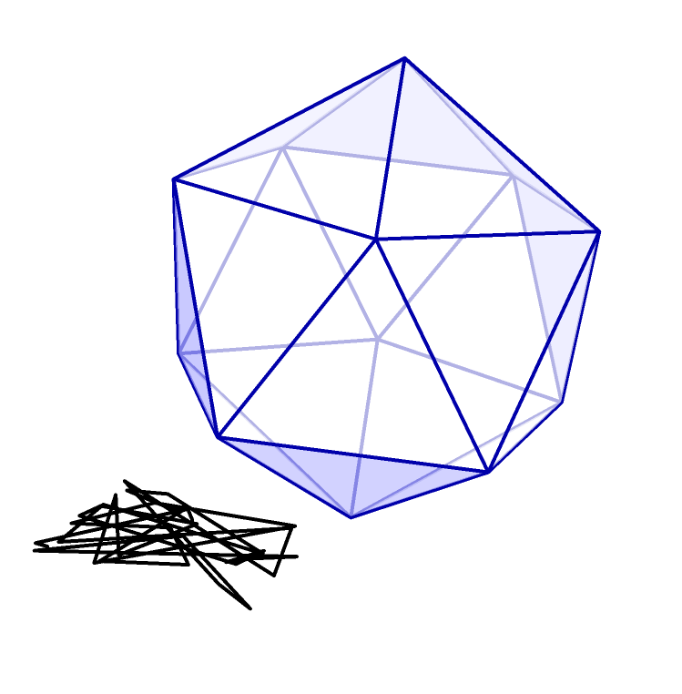

Richard Thaler has a new book out called _Misbehaving: The Making of Behavioral Economics_. He has [a piece at The Upshot](http://www.nytimes.com/2015/05/10/upshot/unless-you-are-spock-irrelevant-things-matter-in-economic-behavior.html) (NYT) where he describes how agents behave like Spock in most economic theories:

> _This illustrates an important problem with traditional economic theory. Economists discount any factors that would not influence the thinking of a rational person. ..._ 

> _Economists create this problem with their insistence on studying mythical creatures often known as Homo economicus. I prefer to call them “Econs” ..._ 

> _... economists are often happy to admit that most of the people they know are clueless about economic matters. But for decades, this realization did not affect the way most economists did their work. They had a justification: markets. To defenders of economics orthodoxy, markets are thought to have magic powers._ 

> _There is a version of this magic market argument that I call the invisible hand wave. It goes something like this. “Yes, it is true that my spouse and my students and members of Congress don’t understand anything about economics, but when they have to interact with markets. ...” It is at this point that the hand waving comes in. Words and phrases such as high stakes, learning and arbitrage are thrown around to suggest some of the ways that markets can do their magic, but it is my claim that no one has ever finished making the argument with both hands remaining still._ 

> _Hand waving is required because there is nothing in the workings of markets that turns otherwise normal human beings into Econs._

All good stuff! Very observational. You come away from this thinking how silly of those economists who don't use behavioral effects! At the end Thaler leaves us with this thought:

> _The field of behavioral economics has been around for more than three decades, but the application of its findings to societal problems has only recently been catching on. Fortunately, economists open to new ways of thinking are finding novel ways to use supposedly irrelevant factors to make the world a better place._

Wait ... it's been around for 30+ years and it's only _recently_ catching on? Obviously this approach hasn't lead to quite as resounding a victory over _Homo economicus_ as we've been lead to believe.

Also, because of things like the SMD theorem, the main way individual behavior can have an impact at the macro level is as a representative agent. _Homo sapiens_ only has an effect if we all behave the same way.

What I think is happening here is that in most functioning markets humans appear to behave like mathematical constructs, but that is only because functioning markets behave like mathematical constructs. I wrote about the human-independent Platonic ideal shining through [a month ago](http://informationtransfereconomics.blogspot.com/2015/04/information-theory-and-economics-primer.html):

> I think this actually solves a really tough philosophical problem. If humans have free will and don't behave perfectly rationally all the time, why does it seem that when markets are functioning properly, the mathematics of economics work so well -- as if they were atoms in an ideal gas? 

> The physicist Eugene Wigner once referred to the "[unreasonable effectiveness of mathematics in the natural sciences](https://www.dartmouth.edu/~matc/MathDrama/reading/Wigner.html)" ... functioning markets represent a common Platonic ideal -- something that can be described by mathematics.

This is not to say that behavioral economics doesn't have its place -- it definitely does! But the reason it's taken 30 years for behavioral effects to catch on is because the Platonic ideal does a good job in most situations. But at other times when our behavior is highly correlated -- by evolution or culture or cognitive biases -- the Platonic ideal disappears in the dark of the cave.
