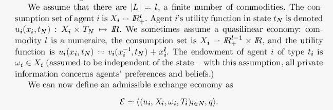

Noah Smith starts [his post](http://noahpinionblog.blogspot.com/2015/05/economists-dont-have-physics-envy.html) on physics envy with:

> _I hear all the time that economists have "physics envy". This doesn't seem even remotely true. I'm not sure whether "physics envy" means that economists envy physicists, or that economists want to make physics-style theories, or that economists wish their theories worked as well as those of physicists. But none of these are true._

I don't think this captures what people mean by "physics envy" as applied to economists. The second one comes close, but the real charge that is being made is that macroeconomic theories are way too abstract and complicated given both the available data and how well the theories work at empirically describing the data.

The context of "physics envy" is evident in Noah's [charge](http://noahpinionblog.blogspot.com/2013/04/the-reason-macroeconomics-doesnt-work.html) that macro data is uninformative. Yes, the macro data is uninformative ... if your theory is really complicated (as I've talked about [before](http://informationtransfereconomics.blogspot.com/2015/04/all-models-are-wrong-but-some-are.html)). You don't need graduate level mathematics (like the fixed point theorems used in proving the existence of Arrow-Debreu equilibria) when you can't really describe NGDP. Physics envy is one way to put it ... polishing a turd is another.

I think [this post](http://www.eschatonblog.com/2014/02/life-among-econ.html) from Duncan Black aka Atrios nails it (Black has a PhD in economics himself). There is quite literally no reason for an economist to refer to the real numbers as _ℝ_ or even refer to real numbers at all. To say _x ϵ ℝ+_ is pretentiousness compared to _x > 0_. That is physics envy. Orwell comes to mind \[1\] as well. In physics, there are reasons to refer to the set of real numbers ... the one loop correction to the anomalous electron magnetic dipole moment is _~ α/π_. There is _π_, a transcendental number, right there in the formula. If an economist came out with an interest rate being _~ 1/π_ I would be suspicious.

That is what I think is meant by the phrase physics envy.

To be fair -- Noah himself doesn't appear to exhibit physics envy. He has two papers on his CV that are devoid of unnecessary mathematical abstraction for what they are attempting to describe. See [here](http://www-personal.umich.edu/~nquixote/bubble_experiment.pdf) \[pdf\] (with some lovely long descriptive variable names) and [here](http://www-personal.umich.edu/~nquixote/affectandexpectations.pdf) \[pdf\]. Maybe that is why he doesn't recognize it.

...

PS. There were two great developments in the history of mathematics: _algebra_ and _calculus_. Algebra comes from commerce (the math of money and transactions happening in an abstract space of numbers, brought to Europe, especially Italy, via the Arabs -- hence the name from _al jabr_) and calculus comes from agriculture (the areas of land, the motion of the sun and planets). So I'm not sure [this from XKCD](https://xkcd.com/435/) that Noah links really gets these right. There should be two pyramids with physics and economics at the top of each and mathematics in the intersection. Money and physical reality are the two major drivers of mathematics and the mathematics that is actually developed tends to be constrained by this.

**Footnotes:**

\[1\] I am thinking of _Politics and the English Language_: _"Bad writers, and especially scientific, political and sociological writers, are nearly always haunted by the notion that Latin or Greek words are grander than Saxon ones ..."_. _x > 0_ in the example is the simpler way to say exactly the same thing. Of course am guilty of a lot of things Orwell was fighting against; I have a bad habit of too many e.g.'s, i.e.'s and q.v.'s.
