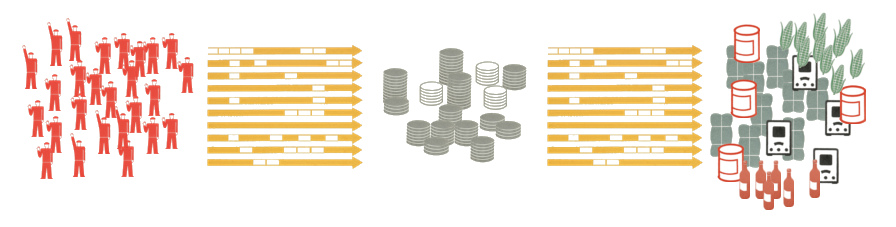

In the [previous post](http://informationtransfereconomics.blogspot.com/2015/05/leeches-rant.html) I wrote that "macroeconomics does not currently know what money is or does". Instead of simply tearing down, I'd like to be constructive. In the information equilibrium framework money has a rather simple and mathematically beautiful explanation.

Let's start with an [AD/AS model](http://informationtransfereconomics.blogspot.com/2015/04/what-does-ad-as-model-mean.html) with aggregate demand (N) in information equilibrium with aggregate supply (S) with the price level (P) as the detector. We write this model in information transfer notation as:

and the information equilibrium condition

In general we can make [this transformation](http://en.wikipedia.org/wiki/Chain_rule) using a new variable M (i.e. money):

If we take N to be in information equilibrium with M, which is in information equilibrium with S, i.e.

Where we've defined $k_{n} \equiv k/k_{s}$. The solution to differential equation (3) defines a quantity theory of money where the price level goes as

In words, we've introduced a new widget that mediates the information transfer from aggregate demand to aggregate supply, which allows us to re-write the entire theory in terms of aggregate demand and the quantity of that widget (i.e. money).

One interesting side note -- if we consider non-ideal information transfer we have to combine the equations:

Since by equation (4a) the derivative $dM/dS$ is less than $k_{s} M/S$, so the replacement of the derivative is with a quantity that is _greater than_ the derivative. Therefore, we don't have the bound and in general we have to allow

That is to say, out of information equilibrium, the price level can be above or below the equilibrium value given by the quantity theory of money (as is observed) -- _with disequilibrium on the supply side being key to above equilibrium inflation_. Supply shocks (supply out of equilibrium with money) tend to lead to inflation (e.g. the [oil shocks of the 1970s](http://informationtransfereconomics.blogspot.com/2013/10/the-1970s.html)) while demand shocks (demand out of equilibrium with money) tend to lead to disinflation.

**Update 5/13/2015:**

A couple more observations:

-   It is interesting that the information transfer index $k_{n}$, which becomes $1/\kappa$ in the [price level model](http://informationtransfereconomics.blogspot.com/2014/06/the-information-transfer-model.html) I use, is a composite of the indices $k/k_{s}$. The index $k$, representing a 'conversion factor' from aggregate supply to aggregate demand and the index $k_{s}$, representing the conversion factor from aggregate supply to money, should in a sense be of the same order -- meaning the index $k_{n}$ should be approximately ~ 1. Which is what we observe ($k_{n}$ seems to range from about 0.9 to 2.5, or $\kappa$ from 0.4 to 1.1).
-   A liquidity trap economy has $k_{s} \approx k$, i.e. $\kappa \approx 1$, while a quantity theory economy has $k &gt; k_{s}$, i.e. $\kappa &lt; 1$.
