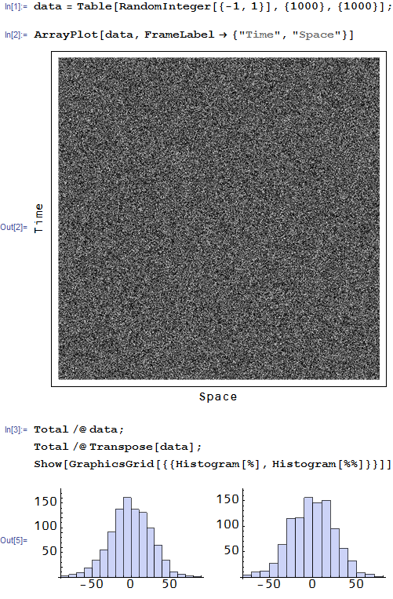

[Lars Syll thinks](https://larspsyll.wordpress.com/2015/05/06/why-the-ergodic-theorem-is-not-applicable-in-economics/) \[1\] that economic systems aren't ergodic, which is a fine statement of a hypothesis (essentially the opposite of the [assumption of ergodicity](http://en.wikipedia.org/wiki/Ergodic_hypothesis) used to build thermodynamics -- and that I use on this blog when I assume ideal information transfer). However there are a few considerations that go into every hypothesis ...

**I. What is the hypothesis?**

I put this in to introduce the definition of ergodicity -- it is the property that time averages are approximately equal to state space averages (the latter sometimes presented as just space averages or ensemble averages). These averages are taken over some period of time _T_ or some set of states _X_ and you'd say that a system is ergodic over a timescale _T_ or systems of size _X_.

One thing here is that Syll doesn't specify (or at least isn't consistent) with the timescale, the state space or what he means by failure -- he just says the ergodic hypothesis fails. He quotes from Paul Davidson in the article linked above:

> _For macroeconomic functions it can be claimed that only a single realization exists since there is only one actual economy; hence there are no cross-sectional data which are relevant. If we do not possess, never have possessed, and conceptually never will possess an ensemble of macroeconomic worlds, then the entire concept of the definition of relevant distribution functions is questionable._

This isn't a statement that the ergodic hypothesis fails -- it is a statement that an ergodic hypothesis is an empty assumption! The ensemble averages (the state space) are over various planetary economies and we only have one planet that is in one economic state.

Well, most people when talking about economics use cross-national comparisons (even [Syll](https://larspsyll.wordpress.com/2012/10/13/the-lessons-of-japans-lost-decades/)), so we should probably take a step back and allow for the possibility that the state space consists of different countries. It's true that there are strong linkages between some national economies -- a worldwide recession is potentially failure of ergodicity (over timescales of quarters to years). But overall the suggestion is that macroeconomies represent the ensemble.

In the article \[1\] linked above we also have this statement from Syll himself:

> _To understand real world “non-routine” decisions and unforeseeable changes in behaviour, ergodic probability distributions are of no avail. In a world full of genuine uncertainty — where real historical time rules the roost — the probabilities that ruled the past are not necessarily those that will rule the future._

This seems to suggest longer time scales than a quarter or a year. However in [this post](https://larspsyll.wordpress.com/2012/03/30/uncertainty-and-ergodicity-the-important-difference-between-keynes-and-knight/) \[2\] Syll looks at asset prices:

> _Let me give an example: Assume we have a market with an asset priced at 100 €. Then imagine the price first goes up by 50% and then later falls by 50%._

This implies Syll takes the state space to consist of different assets and the time scale to be much shorter. He also quotes from a piece that looks at asset prices (random walk models) [here](https://larspsyll.wordpress.com/2013/02/10/ergodicity-the-biggest-mistake-ever-made-in-economics/) \[3\].

Overall, I'm not exactly sure what Syll means by the ergodic hypothesis failing -- what is the state space and what are the scales? Years and macroeconomies or days and assets? Both? There are no timescales or state spaces over which ergodicity is correct? That needs some empirical evidence.

**II. Is the hypothesis correct?**

In the linked pieces \[2\] and \[3\], Syll puts forward the idea that growth processes and random walks are evidence against the ergodic hypothesis. Specifically he uses this example:

> _When you assume the economic processes to be ergodic, ensemble and time averages are identical. Let me give an example: Assume we have a market with an asset priced at 100 €. Then imagine the price first goes up by 50% and then later falls by 50%. The ensemble average for this asset would be 100 €- because we here envision two parallel universes (markets) where the asset-price falls in one universe (market) with 50% to 50 €, and in another universe (market) it goes up with 50% to 150 €, giving an average of 100 € ((150+50)/2). The time average for this asset would be 75 € – because we here envision one universe (market) where the asset-price first rises by 50% to 150 €, and then falls by 50% to 75 € (0.5\*150)._ 

> _From the ensemble perspective nothing really, on average, happens. From the time perspective lots of things really, on average, happen._

> _Assuming ergodicity there would have been no difference at all._

This example is incorrect -- Syll is making several assumptions that are not true in general:

-   The state space is distance from the origin. The state space in a random walk is position. The two final states (75 € and 100 €) are no different from each other.
-   The probability of a +/- 50% change is the same from each location state space. Even assuming the state space is the distance from the origin, using the percentage change makes your random walk steps in that proportional to your state space. Essentially Syll is breaking the assumption of a stationary distribution in the random walk -- i.e. assuming the walk isn't ergodic -- in order to prove non-ergodicity.

The correct way to analyze the problem is to use +/- 50%  (hence is each case, the assets moved by +50% and -50% temporally and 'spatially') or to use movements of +/- 25 €.

Here's a quick example showing the ergodicity of a random walk ... we have an ensemble of 1000 assets undergoing movements of +1, 0 or -1 over 1000 time steps. An easy way to see ergodicity of this process is to look at the matrix of movements in space over the time steps (rows) and ensemble assets i.e. 'space' (columns). It is a matrix of random elements that has identical distributions when summed over rows or columns (it is 'stochastically' symmetric) ...

Now I completely agree there are failures of ergodicity -- e.g. global recessions (or even national recessions) where there is lots of [coordination](http://informationtransfereconomics.blogspot.com/2014/10/coordination-costs-money-causes.html) (highly correlated market moves). It appears empirically that these are specific events (like avalanches) and that ergodicity (a support in the information equilibrium framework) is a good assumption over the long run (the time scale _T_ is 10s of years). The coordination during recessions can be considered a form of _symmetry breaking_ that leads to _ergodicity breaking_.

**III. Is the hypothesis useful?**

What comes out of assuming ergodicity? All of basic thermodynamics and much of basic economics. If we assume economic (or thermodynamic) systems aren't ergodic -- what does that give us?

Essentially, assuming non-ergodicity is analogous to the assumption that _I(A) < I(B)_ in the information transfer framework (ergoditicy is the assumption that  _I(A) ≈ I(B)_ ... the information in the two macro observable is the same, from which you can derive supply and demand).

What can we get from the assumption _I(A) < I(B)_? **Nothing.**

That is to say that while ergodicity is a useful assumption, non-ergodicity is a completely useless assumption. It doesn't prove that economies are quasi-periodic chaotic systems or that they are some other kind of complex system -- you need evidence for that! Show us a model that that is empirically successful. Or at least more empirically successful than [assuming ergodicity](http://informationtransfereconomics.blogspot.com/2014/11/because-empirical-success.html).

**Update 5/12/2015**: An alternative take and some interesting discussion in the comments from [Tom Hickey at Mike Norman Economics](http://mikenormaneconomics.blogspot.com/2015/05/jason-smith-on-use-of-hypotheses-or.html). I think the quote comes across as a bit more strident and/or upset when taken out of context ... my main points above were:

> So you say economics is non-ergodic ... in what sense? And what does this lead to? You can build non-ergodic behaviors out of ergodic framework (take life for example, built on thermodynamics). Additionally, it can take a system on the order of the Poincare recurrence time to fully explore its phase space, so calling a system non-ergodic with only a few hundred data points seems a bit hasty ... especially without some sort of specific empirical result to replace it. The thought experiments are a start, but one needs results to displace a theory ... not another theory. For example, quantum mechanics didn't displace classical mechanics from the world of the very small because it was theoretically more satisfying (it wasn't!) -- it was because it was empirically more satisfying.
