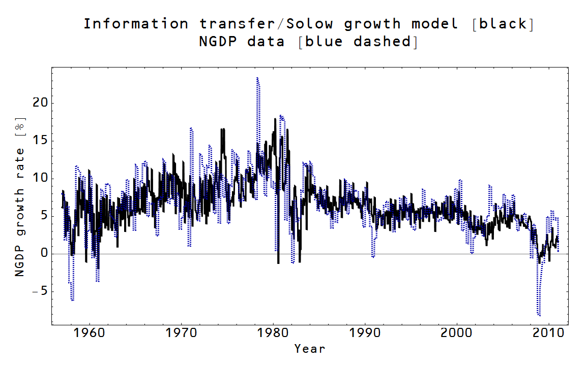

Ok, this is the last post on mathiness -- there's real work to be done!

I'd like to start off by saying I'm overall sympathetic to the complaints Paul Romer is making about his field. I agree! Certain economists seem to obfuscate their political assumptions with a blizzard of math \[0\]. Overall, he seems like a good guy ... and was essentially [a physics major](http://paulromer.net/physics-versus-math/), which is a plus in my book!

[mathiness paper](http://paulromer.net/mathiness/)

> _The style that I am calling mathiness lets academic politics masquerade as science. Like mathematical theory, mathiness uses a mixture of words and symbols, but instead of making tight links, it leaves ample room for slippage between statements in natural versus formal language and between statements with theoretical as opposed to empirical content._

I [cheered](http://informationtransfereconomics.blogspot.com/2015/05/mathiness-and-solow-production-function.html). There was no mention of Solow in Romer's blog post -- I even thought he might be after the neoclassical embrace of the model as evidenced by Marginal Revolution University's whole unit on it (a unit filled with obfuscated political assumptions).

> _\[mathiness\] leaves ample room for slippage ... between statements with theoretical as opposed to empirical content._

Romer seems to be more upset about the lack of "tight links" -- essentially the lack of formal rigor. The key issue I have is that [Romer believes this](http://paulromer.net/ed-prescott-is-no-robert-solow-no-gary-becker/):

> _We assume that the measure of a country’s production locations is proportional to its population, since locations correspond to markets and some measure of people defines a market._

> McGrattan and Prescott (2009)

> _Output is to be understood as net output after making good the depreciation of capital. About production all we will say at the moment is that it shows constant returns to scale. Hence the production function is homogeneous of first degree. This amounts to assuming that there is no scarce nonaugmentable resource like land. Constant returns to scale seems the natural assumption to make in a theory of growth._

> Solow (1956) 

Constant returns to scale are not assumed because they are empirically observed. Solow essentially says he assumes constant returns to scale because it seems to be the just the sort of assumption one makes when defining a theory of growth. (Wait ... did you just say there is no such thing as land?) Why not just say you're assuming constant returns to scale because it makes the math easier and narrows down the possibilities of the production function?

But the worst part of this is that it doesn't even make sense in terms of the economics of growth. I double my factories and my labor force, I double my output? Here is a short list of possible effects that would fight in different directions, but generally away from constant returns to scale:

-   Additional factories mean that the managerial and labor force could be less skilled on average (limited resource, decreasing returns to scale) \[2\]
-   Additional factories allow for more eyes and more possibilities to find tweaks that improve production (increasing returns to scale)
-   Additional capital and labor mean better paying jobs that incentivize the creation of amenities and higher standards of living (increasing returns to scale)
-   Additional captial and labor mean develop more experience, expanding the the source of new ideas and businesses (increasing returns to scale)

However, the assumption of constant returns to scale puts all of these effects into a new piece that gets the name Total Factor Productivity (TFP) ... that becomes a mysterious factor responsible for most of economic growth. If you look at it empirically, the Cobb-Douglas production function [works just great](http://informationtransfereconomics.blogspot.com/2014/12/the-information-transfer-solow-growth.html) if you just [drop the extra theoretical assumptions](http://informationtransfereconomics.blogspot.com/2015/05/mathiness-and-solow-production-function.html).

I'm not saying economists don't know about these things -- Romer is one of the foremost experts on growth economics. I am saying theoretical models and assumptions are trumping empirical analysis. Theoretical assumptions create empirical problems that must be solved with additional assumptions (auxiliary hypotheses) -- a [regressive research program](http://en.wikipedia.org/wiki/Imre_Lakatos#Research_programmes).

Prescott and Lucas aren't Romer's problem. Romer's problem has been around for a lot longer than their recent papers (at least 1956, but really well before then). Connection with empirical data is the purgative growth economics needs. It is the purgative macroeconomics needs. Empirics aren't going to bow down to mathiness regardless of whether it is a lack of rigor or political theoretical assumptions.

...

**PS** Romer's mathiness doesn't just exist in economics -- it exists in theoretical particle physics and string theory. And the reason is similar: a lack of experimental data. There's no real politics in string theory, but that doesn't stop what are essentially alliances from forming around the big figures in the field. The way you get ahead is no longer solving empirical puzzles or predicting new experimental results. You get ahead by impressing a key figure in the field with your genius.

This is to say that it's not because economics has to deal with real world policy that politics dominates -- it's the lack of empirical data that lends itself to a system of alliances. And instead of forming a new type of alliance out of whole cloth, it takes one off the shelf (common everyday left-right politics). That politics is like the cosmic microwave background radiation -- the higher energy density areas lead to galaxies and the lower density to voids. "Saltwater" economics forms on the politically liberal coasts of the US, "Freshwater" in its more conservative interior.

No amount of discussion about methodology or mathiness will dislodge these alliances. Empirical data is the only thing that can. Noah Smith says [macro data is uninformative](http://noahpinionblog.blogspot.com/2013/04/the-reason-macroeconomics-doesnt-work.html). I call bullshit on that. Macro data can only be uninformative if your models are too complex for the data you have. Drop the complex models and show some simple models with lines going through data.

That's why I hope all of you out there reading these economics blogs start asking to see the data. Ask to see lines going through the data. If an econoblogger's model can't produce agreement with empirical data, don't be afraid to call it garbage. Tell that econoblogger they're away with the fairies. I get my stuff called garbage all the time; trust me it doesn't hurt my feelings (but then I like arguments). It's even helpful sometimes! And at least I [disclose the models](http://informationtransfereconomics.blogspot.com/2014/06/the-information-transfer-model.html) and show [how they do with empirical data](http://informationtransfereconomics.blogspot.com/2014/11/because-empirical-success.html).

**Footnotes:**

\[0\] In a sense, that is something that is refreshing about the right-leaning economist/blogger Scott Sumner. Sumner seems to be saying [there is no mathematical theory](http://informationtransfereconomics.blogspot.com/2015/03/there-is-no-theory.html) -- it's all political belief.

\[1\] Paul Romer: "The Solow model is an example of excellent theory."

\[2\] We all see this first hand when a restaurant we like opens another location that is never quite as good as the original. It's also the trend towards mediocrity that comes with ubiquity e.g. Wolfgang Puck canned soups.
