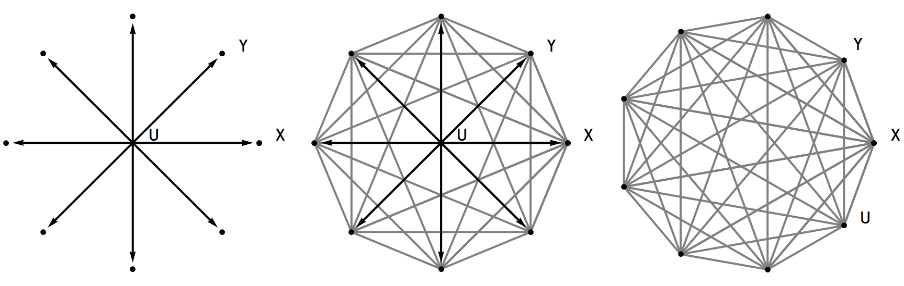

This is mostly a summary of some of the properties I've worked out previously ([here](http://informationtransfereconomics.blogspot.com/2015/03/information-equilibrium-is-equivalence.html) and [here](http://informationtransfereconomics.blogspot.com/2015/05/resolving-cambridge-capital-controvery.html)). I have added some pieces to the group theory and some other notes.

We define real valued functions $A$ and $B$ to be in the binary relationship called _information equilibrium (IE)_, denoted $A \rightarrow B$ -- or sometimes $p : A \rightarrow B$ for an explicit "detector" $p$ -- if

**Equivalence relation**

[equivalence relation:](http://en.wikipedia.org/wiki/Equivalence_relation)

**Group structure**

The set $IE_{K} \equiv \{ A \; | &nbsp;\; A \rightarrow K \; \text{and} \; A &gt; 0 \}$ along with ordinary multiplication $(IE_{K}, \times)$ forms an infinite [Abelian](http://en.wikipedia.org/wiki/Abelian_group) [group](http://en.wikipedia.org/wiki/Group_\(mathematics\)).

Note that $BA = AB$. The inverse of multiplication by $A$ is $1/A$, and the identity element is the constant function $A = c$ because it's in the set:

Essentially, $c A$ and $A$ represent the same element of the set since they obey the exact same IE differential equation. Additionally, IE technically requires that elements $A \gg 1$, hence why zero is excluded from the set.

I haven't explicitly done the proofs here, so these are technically conjectures ... I may add proofs later. The group $IE_{K}$ is isomorphic to the group of real numbers under multiplication without zero (and therefore the logarithm is an isomorphism from this group to the additive group of real numbers). There is one non-trivial automorphism: inversion. This is where $f(A) \rightarrow A^{-1}$ (sorry for the notation collision there, that's a function -- homomorphism -- from $IE_{K}$ to $IE_{K}$ not an IE relationship).

**Category theory**

We can think of $\rightarrow$ representing IE as a [category theory](http://en.wikipedia.org/wiki/Category_theory) morphism that preserves a specific structure of real functions -- that structure being information content.

I may add more here as I think of stuff, but as category theory is also known as [generalized abstract nonsense](http://en.wikipedia.org/wiki/Abstract_nonsense) there might not be much of interest.

**Usefulness?**

You may be asking yourself how this stuff is useful. Short answer: it's probably not. But let's try this on for size ...

Let's assume the existence of a utility function $U$ that may not be directly observable so that we can discuss the set of possible observables $A$ in information equilibrium with utility $IE_{U} = \{ A \; | &nbsp;\; A \rightarrow U \; \text{and} \; A &gt; 0 \}$. Let's say we develop a theory with at least two observables $X$ and $Y$ (among others) that are in IE with $U$. This is the picture on the left in the graphic below.

We can draw in the other IE relationships that follow from IE being an equivalence relation in gray in the graphic above in the center. This means not only are $X$ and $Y$ in IE with each other (IE is an equivalence relation), but that the set $IE_{U}$ is equivalent to the sets $IE_{X}$ and $IE_{Y}$ (it forms a complete graph, shown on the right). Utility doesn't have a privileged position, and you could now write your theory of $X$, $Y$ and $U$ entirely in terms of $X$ and $Y$.

That is to say utility, $U$, is kind of like an unknown in information equilibrium economics -- once you find a few things that are in information equilibrium with utility, you don't need to refer to utility anymore. It's a bit like the $x$ back in algebra class. Once you've solved for $x$, you don't need to use it anymore.

It also says abstract concepts like [capital](http://informationtransfereconomics.blogspot.com/2015/05/the-rest-of-solow-model.html) $K$ may not be necessary components of final economic theories if they don't represent observables. They might be useful in building the theory and relating observables to each other, but if the theory is built out of information equilibrium relationships you can re-write the [entire theory in terms of the observables](http://informationtransfereconomics.blogspot.com/2015/01/lee-smolins-take-on-arrow-debreu.html). The $K$'s and $U$'s might be like wavefunctions in quantum mechanics -- not directly observable, but used to build the theory. But it's a bit more than that -- because you can rewrite everything without referencing utility.

It might be fun to re-read economics papers that refer to utility and substitute the word "unknown" ... :)
