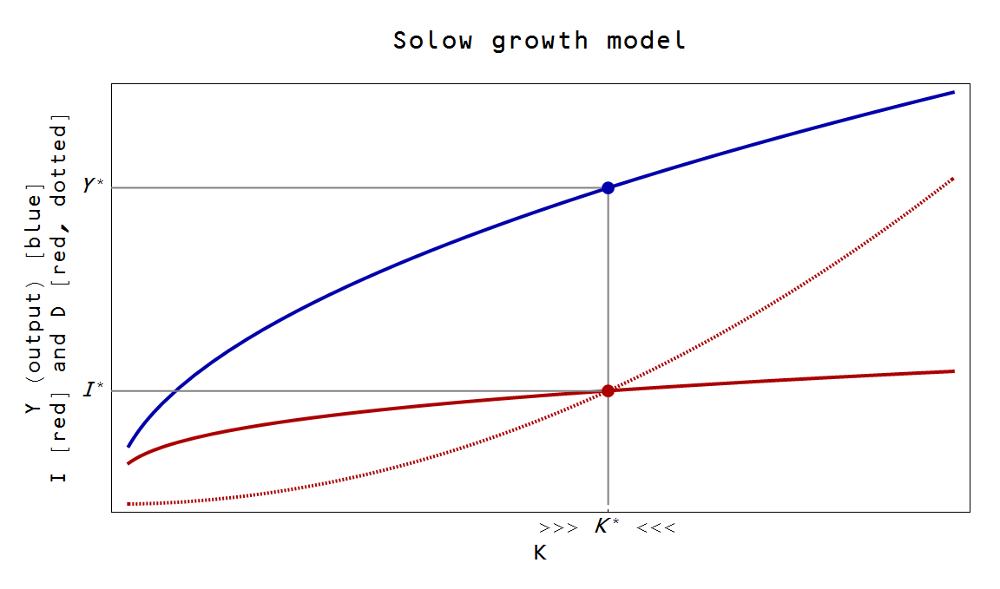

[Here](http://informationtransfereconomics.blogspot.com/2014/12/the-information-transfer-solow-growth.html), I mostly referred to the Cobb-Douglas production function piece, not the piece of the Solow model responsible for creating the equilibrium level of capital. That part is relatively straight-forward. Here we go ...

Let's assume two additional information equilibrium relationships with capital $K$ being the information source and investment $I$ and depreciation $D$ (include population growth in here if you'd like) being information destinations. In the notation I've been using: $K \rightarrow I$ and $K \rightarrow D$.

This immediately leads to the solutions of the [differential equations](http://informationtransfereconomics.blogspot.com/2015/04/information-theory-and-economics-primer.html):

Therefore we have (the first relationship coming from the Cobb-Douglas production function)

If $\sigma = 1/\alpha$ and $\delta = 1$ we recover the original Solow model, but in general $\sigma &gt; \delta$ allows there to be an equilibrium. Here is a generic plot:

Assuming the relationships $K \rightarrow I$ and $K \rightarrow D$ hold simultaneously gives us the equilibrium value of $K = K^{*}$:

As a side note, I left the small $K$ region off on purpose. The information equilibrium model is not valid for small values of $K$ (or any variable). That allows one to choose parameters for investment and depreciation that could be e.g. greater than output for small $K$ -- a nonsense result in the Solow model, but just an invalid region of the model in the information equilibrium framework.

An interesting add-on is that $Y$ and $I$ have a [supply and demand relationship](http://informationtransfereconomics.blogspot.com/2015/04/information-theory-and-economics-primer.html) in partial equilibrium with capital being demand and investment being supply (since $Y \rightarrow K$, by [transitivity](http://informationtransfereconomics.blogspot.com/2015/03/information-equilibrium-is-equivalence.html) they are in information equilibrium). If $s$ is the savings rate (the price in the market $Y \rightarrow I = Y \rightarrow K \rightarrow I$), we should be able to work out how it changes depending on shocks to demand. There should be a direct connection to [the IS-LM model](http://informationtransfereconomics.blogspot.com/2014/03/the-islm-model-again.html) as well.
