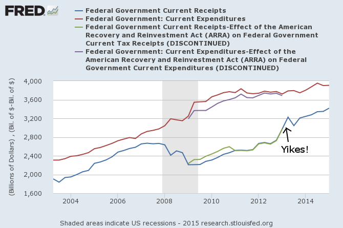
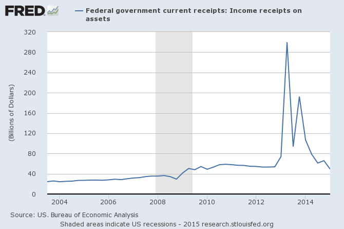
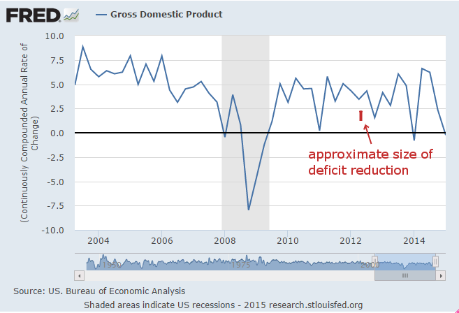

[Scott Sumner says](http://www.themoneyillusion.com/?p=29788) that we had a half a trillion dollars in deficit reduction from 2012 to 2013:

> _At the time, I was under the misapprehension that many Keynesians thought a massive and sudden reduction in the federal budget deficit would constitute “austerity” and hence would slow growth. Now that the dust has settled, we can calmly look at [the data](http://www.davemanuel.com/history-of-deficits-and-surpluses-in-the-united-states.php):_ 

> _Calendar 2012: Budget deficit = $1061 billion_ 

> _Calendar 2013: Budget deficit = $561 billion_ 

> _A reduction of $500 billion in one year. I used to be under the impression that Keynesians thought this would be a disastrous policy that sharply slowed growth._

It's true! That's a huge amount of deficit reduction all at one time. It's sharply visible on [this graph](https://research.stlouisfed.org/fred2/graph/?g=1lps) of Federal receipts and expenditures:

It's nearly as big as the ARRA -- almost a **20% rise in Federal receipts**. It definitely should give Keynesians pause. Or at least a reason to dig into the data ... I mean how do you get nearly a 20% rise in Federal receipts with the economy essentially giving a collective _"meh"_ ... ? Monetary offset is one way. However, it turns out it is nearly entirely due to a single source: [dividends from Fannie Mae and Freddie Mac](http://bea.gov/scb/pdf/2013/09%20September/0913_govt_receipts_and_expenditures.pdf) \[pdf from BEA\]:

**That accounts for over half of the deficit reduction between 2012 and 2013.** You can see things in perspective if we subtract this piece from the graph above (the old receipts line in gray now):

[from the BEA](https://www.bea.gov/scb/pdf/2013/06%20June/0613_govt_receipts_and_expenditures.pdf)

> _Contributions for government social insurance accelerated as the result of an acceleration in social security contributions that reflected the expiration of the “payroll tax holiday” at the end of 2012 and to a lesser extent, the introduction of a hospital insurance tax surcharge of 0.9 percent for certain taxpayers._

Without those two pieces, there would be effectively zero deficit reduction -- there don't seem to have been any significant spending cuts, only a tax increase. And the tax side has a lower multiplier than the spending side (see e.g. [here](https://www.fas.org/sgp/crs/misc/R42700.pdf) \[pdf\]) in the typical Keynesian analysis.

The Keynesian effect of the so-called "austerity" in 2013 would have been relatively small (this is just the deficit reduction divided by NGDP compared with NGDP growth):

It would have been completely lost in the noise.

**Update:**

[Sumner responds](http://www.themoneyillusion.com/?p=29802)
