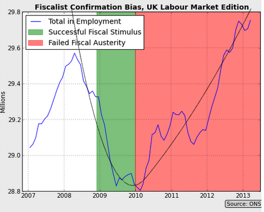

Scott Sumner put up on his blog what I called a [derp](http://noahpinionblog.blogspot.com/2013/06/what-is-derp-answer-is-technical.html) Rorschach test [on teh twitters](https://twitter.com/infotranecon/status/609423084886474752) -- since no counterfactual was presented in the picture, you can invent whatever counterfactual you want to confirm your priors. However, I'd like to point out that it is far from obvious that you can draw Sumner's preferred conclusion for a simple reason: the second derivative.

See, the curvature of total employment in the graph on Sumner's blog is far sharper at the beginning of the dip than at the end -- something consistent with an inertial picture of the economy where "forces" act on employment much like forces act on objects. In that case, we can have an acceleration that is more than normal for awhile (normal is just trend growth) and then becomes less than normal afterwards. Stimulus and austerity. It looks something like this:

Sumner can't show you a counterfactual. In fact, no market monetarist can ever show a counterfactual -- no market monetarist is the market. What the market would have done in an alternate world is completely unobservable. That's probably why Britmouse and Sumner think the graph shows something obvious. Whatever happened is the only thing that could have been observed to have happened!

**Update:**

One thing I wanted to note, but forgot, is that ordinary automatic stabilizers have roughly the same effect of "stimulus + austerity". When a recession hits, a lot of money goes out as unemployment insurance -- but it slows over time.
