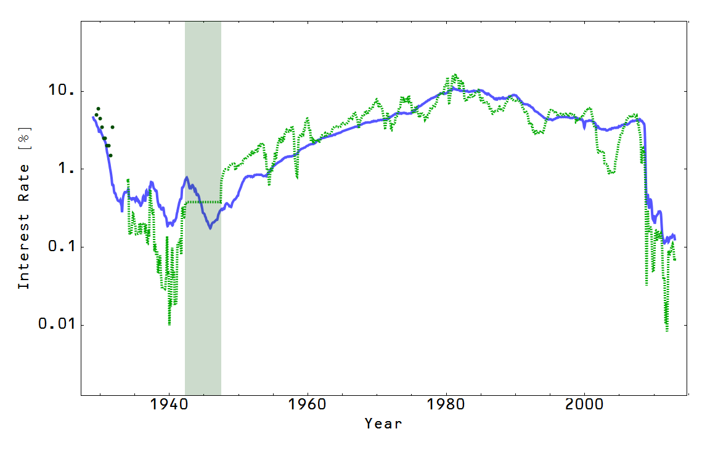

I'm borrowing [Cullen Roche's title](http://www.pragcap.com/does-a-liquidity-trap-ever-end) and his post is a good entry in the latest macro discussion prompted by [Martin Feldstein](http://www.project-syndicate.org/commentary/low-inflation-quantitative-easing-by-martin-feldstein-2015-05). Brad DeLong is curious about why the "omega point" -- i.e. the long run where interest rates and monetary policy return to 'normal' -- still seems so far in the future. DeLong is also [monitoring the discussion](http://www.bradford-delong.com/2015/06/watching-a-discussion-the-omega-point.html). Paul Krugman and Scott Sumner have chimed in, although Sumner's take is so clouded with [derp](http://noahpinionblog.blogspot.com/2013/06/what-is-derp-answer-is-technical.html) that you should probably just read [my take](http://informationtransfereconomics.blogspot.com/2015/06/perfect-storm-or-just-so-story.html) on Sumner's take.

In my post on Sumner's take I go part way toward answering the omega point question, but I thought I'd be more explicit. As always, everything below comes with the caveat that these are model-dependent results based on the information equilibrium (IE) model (generically [here](http://informationtransfereconomics.blogspot.com/2015/04/information-theory-and-economics-primer.html), and here is [the basic macro model](http://informationtransfereconomics.blogspot.com/2014/06/the-information-transfer-model.html) ... see the links in the side bar for more).

**There is no single natural rate of interest**

There is an _equilibrium rate of interest_ where interest rates are in information equilibrium with the price of money and the price of money is a detector of information flowing in order to maintain information equilibrium between nominal output (NGDP) and the monetary base. Symbolically, this model is: _(r → p) : NGDP → MB_, but as an equation it says (in equilibrium):

_log r = c log(k NGDP/MB)_

It's remarkably effective over more than 80 years of data in the US (and in other countries) -- you can see the market fluctuations around this equilibrium path:

Now there is a more [complicated component of the dynamics](http://informationtransfereconomics.blogspot.com/2014/03/the-effects-that-move-interest-rates.html) that derives from the price level (side note: there is no natural rate of inflation either and low inflation is [the natural state of an economy with a large monetary base](http://informationtransfereconomics.blogspot.com/2014/09/the-great-stagnation-information.html) and an unnatural state of an economy with a small one ... "large" and "small" are defined by the ratio of _log NGDP_ to _log MB_). That dynamics gives us the rise in inflation interest rates from WWII until the 1980s and the subsequent fall. Effectively the income/inflation effect diminishes over time and in the 1980s it started to be overcome by the liquidity effect.

**The liquidity trap has no well-defined start**

Liquidity trap conditions [have a slow onset in the IE model](http://informationtransfereconomics.blogspot.com/2014/06/krugman-keynes-and-liquidity-trap.html). We started on the path in the 1980s. However it becomes obvious that conventional monetary policy is ineffective when you're hit with the first shock that it can't handle. Monetary policy was not terribly effective already in the early 2000s, but the early 2000s recession was a relatively light shock. We suddenly noticed how ineffective monetary policy was when the large shock hit in 2008.

**The liquidity trap has no microfoundations**

DeLong and Krugman tell the story that a liquidity trap is brought on by people not seeing a difference between cash that pays 0% interest and short term Treasury bonds that pay 0% interest. In the IE model it is a purely macro effect -- it doesn't even exist for a single market. One way to look at it is as a [macroeconomic temperature](http://informationtransfereconomics.blogspot.com/2014/06/the-macroeconomic-partition-function.html) that goes as _1/log MB_. An economy with a large monetary base is a cold economy. And in the same way temperature doesn't exist for small numbers of atoms, a macroeconomic temperature doesn't exist for a small number of markets.

**So, does a liquidity trap ever end?**

One way to look at US history is as [two monetary regimes](http://informationtransfereconomics.blogspot.com/2014/09/the-us-economy-1798-to-present.html): a gold standard regime and a fiat currency regime. When the gold standard regime hit its eventual liquidity trap (after being around for hundreds of years), there was a Great Depression.

Now we've come to the fiat currency regime's liquidity trap after only 80 or so years. What do we do?

This is where things are a bit uncertain as far as the IE model goes. There were a lot of things happening at the transition. In general, pushing _log NGDP/log M0_ upwards -- where M0 is the monetary base minus reserves -- gets you out of the liquidity trap conditions. How is that achieved?

-   **Redefinition of the currency.** Money left the gold standard and became fiat currency. However, you can't keep doing this over and over again. Electronic money with the potential for truly negative interest rates may be a possibility. This essentially redefines _log M0_.
-   **[Wartime hyperinflation](http://informationtransfereconomics.blogspot.com/2013/09/exit-through-hyperinflation.html)/peacetime hyperinflation.** The US instituted many aspects of a top-down command economy both to fight the depression and then to fight the war. This pushes up _log NGDP_ faster than _log M0_. This would buy you  a few decades, but you'd eventually fall back in the liquidity trap.
-   **Wartime Keynesian government spending.** If you push NGDP up fast while keeping M0 growing at a 'normal' pace, that would push the ratio of _log NGDP/log M0_ up, bringing you out of a liquidity trap. You'd eventually fall back in, however.
-   **[Lack of Fed independence](http://informationtransfereconomics.blogspot.com/2015/01/gold-was-irrelevant.html).** The US had an interest rate peg for awhile during and after WWII. The Fed was also directed by the Treasury to issue those bonds with the pegged interest rates and therefore there was essentially direct political control of monetary policy. This may have just been the mechanism that produced the hyperinflation list above.
-   **[Interest rate peg](http://informationtransfereconomics.blogspot.com/2015/04/will-uk-be-first-to-exit-great-recession.html).** The UK appears to have instituted a monetary regime change twice via an interest rate peg. It is uncertain if the new regime exited the liquidity trap, however. The UK appears to have had a burst of inflation at the onset of the peg.

**Do we really want the liquidity trap to end?**

A liquidity trap world is a world of low interest rates and low inflation. Low inflation makes retirement insurance a cheaper program and infrastructure becomes cheap to build at 0% interest. The major issue seems to be that you've lost monetary policy as a lever on the macroeconomy.

Having an un-elected board of people decide how to deal with recessions doesn't seem like a great solution (they seemed to have mostly bailed out banks!), and fiscal policy -- things like extending unemployment insurance or even a universal basic income -- seems like a much better way to deal with recessions than devaluing the currency and tricking people with money illusion.

Japan has lived with the liquidity trap for decades. Maybe we should get used to it?
