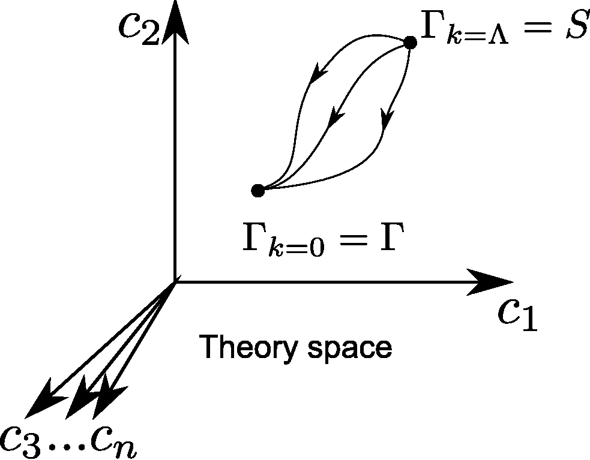
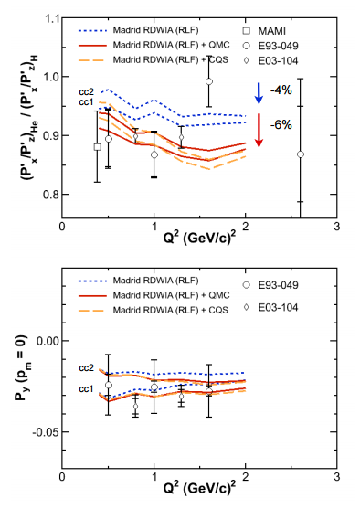

There is nothing quite like the warm glow you get when you read discussions of technical subjects on the internet ... at least if you're a physicist. People attribute magical powers to you and think you comprehend subjects outside of your training and experience; the way you, physicist, approach a technical subject is the prototype for any approach to any subject anywhere. I know for a fact that it sometimes frequently goes to one's head. Anytime I'm feeling that way I go back and read one of these posts ([\[A\]](http://bactra.org/weblog/517.html), [\[B\]](https://orderstatistic.wordpress.com/2014/03/21/why-are-physicists-drawn-to-economics/), [\[C\]](http://noahpinionblog.blogspot.com/2012/09/econotrolls-illustrated-bestiary.html)).

But if I'm ever feeling down, I will probably try to read Dierdre McCloskey's review of Piketty's _Capital in the Twenty-First Century_. Why? Because of [Noah Smith's review](http://noahpinionblog.blogspot.com/2015/06/deirdre-mccloskey-says-things.html) of the first three pages of McCloskey's review.

Noah does a pretty good job of calling out the ridiculousness of what McCloskey says, but I thought I'd defend? ... nah, respond to Noah's characterization a bit more charitably and talk about where the "modern physicist as model of research" paradigm falls down.

My charitable impression is that McCloskey knows one or more experimental physicists at the University of Chicago. And I don't blame her. Experimental physicists are more human preferable as friends than theorists. Of my friends from graduate school that I keep in touch with, all are experimental physicists. And I was a theorist! I'm sure there are sociological reasons for this (experimentalists work in cooperative groups while us theorists are competitive loners; and I'm pretty sure the part of the brain that understands [RG equations](https://en.wikipedia.org/wiki/Renormalization_group) and [BRST quanitization](https://en.wikipedia.org/wiki/BRST_quantization) is the part of the brain most people use for social interactions).

Because McCloskey only knows an experimental physicist or two, she says things like this:

> _Piketty gives a fine example of how to \[be a scientific economist\]. He does not get entangled as so many economists do in the sole empirical tool they are taught, namely, regression analysis on someone else’s “data” .... Therefore he does not commit one of the two sins of modern economics, the use of meaningless “tests” of statistical significance (he occasionally refers to “statistically insignificant” relations between, say, tax rates and growth rates, but I am hoping he doesn’t suppose that a large coefficient imprecisely measured so far as sampling is concerned is “insignificant” because R. A. Fisher in 1925 said it was). Piketty constructs or uses statistics of aggregate capital and of inequality and then plots them out for ... inspection, which is what physicists, for example, also do in dealing with their experiments and observations. Nor does he commit the other sin, which is to waste scientific time on existence theorems. Physicists, again, don’t. If we economists are going to persist in physics envy let’s at least learn what physicists actually do._

As Noah points out, when physicists analyze data they tend to do it exactly as Fisher lays it out. Physicists didn't announce the Higgs discovery until it was significant at the 5-sigma level ... physicists cutoffs are generally higher (but not always) because we can run experiments. And for the theorists, it is almost always is someone else's data.

Noah also points out the many papers with "existence theorem" in the title, but I thought he missed the greatest example: the unsolved problem of [the existence of quantum Yang-Mills theory and the mass gap](https://en.wikipedia.org/wiki/Yang%E2%80%93Mills_existence_and_mass_gap). But I also think we should be more charitable to McCloskey here because there are different types of physicists.

Overall, McCloskey's description is an appropriate one for an _experimental_ physicist. A _phenomenologist_ (a theorist that connects theory to experiments) plots out lines and does check significance -- ruling models out. A _theorist_ sometimes does prove existence theorems, although sometimes that kind of thing is reserved for _mathematical physicists_.

That is to say there are four jobs (not always clear-cut) in modern physics that essentially differ by how closely they deal with data:

-   **Experimental physicists** \[arXiv: hep-ex, nucl-ex, etc\]: create data
-   **Phenomenological physicists** \[arXiv: hep-ph\]: connect theory to data
-   **Theoretical physicists** \[arXiv: hep-th, nucl-th, etc\]: make theory about data
-   **Mathematical physicists** \[arXiv: math-ph\]: analyze theory

I was sort of a phenomenologist, but my papers are all in nucl-th (they haven't broken out nucl-ph yet). Overall, here's an example of how this works together using an accelerator experiment from JLab that tested some theories (one of which I put together):

This graph from Steffen Strauch shows the results of some polarization transfer experiments where they shot polarized high energy electrons at Helium nuclei and looked at the polarization of the protons (Hydrogen nuclei) that got knocked out at different amounts of energy transferred (_Q²_). The data came from the experimentalists. The calculations came from some phenomenologists and theorists (the orange dashed curves are my theoretical nuclear model \[CQS\] plus a piece that accounts for the scattering phenomenology in the experiment \[RDWIA\]). My model was the chiral-quark-soliton \[CQS\] model -- and the topological properties of the soliton solution in my model came from mathematical physicists working on quantum field theory.

And I think this is where we can let McCloskey slide with her comment on existence theorems. It's true she is wrong saying physicists don't prove existence theorems, but she is right that economists shouldn't waste time on them. The reason is that economics doesn't appear to have a [mathematical framework](http://informationtransfereconomics.blogspot.com/2015/05/frameworks-and-bohr-model-analogy.html) for mathematical economists to work with. It has a bunch of models and a couple of general rules (marginalism and optimization) but those are not frameworks.

Optimization is not a framework itself. Even given something to optimize (e.g. utility) doesn't make optimization a framework. In physics you optimize "action" (i.e. the principle of least action ... action is energy times time), energy (e.g. finding the lowest energy configuration), entropy (maximizing it in equilibrium), etc but these happen inside a framework of (classical or quantum) Lagrangian dynamics, Hamiltonian systems or statistical mechanics. These are actually all [related to each other](http://arxiv.org/abs/hep-th/9403084) and form the basic framework of physics. And that framework is what mathematical physicists work on. Without a framework, there shouldn't be proofs of existence theorems.

If economists are out there proving existence theorems it seems to be a bit like natural philosophers proving existence theorems about physics in the 1600s before its first framework (from Newton). It's really important to note that the first framework practically invents the branch of mathematics that Newtonian mathematical physicists would work on! Calculus got a big leg up from Newton creating a practical application for it; it's possible that the entire branch of mathematics that will be associated with the first economic framework doesn't exist yet! I imagine mathematical economists today are proving the equivalent of number theory theorems associated with Aristotle's crystal spheres. It would be quite a coincidence if the mathematics of space and geometry of manifolds stemming from calculus could be adopted wholesale for use in economics. (My opinion, and the raison d'être for this blog, is that the eventual economic framework should come out of information theory.)

In any case, economists should be modeling themselves after physicists from the 1600s! It would be a weird mish-mash of philosophy, religion, invented mathematics, astronomy, and astrology with long rambling treatises by people desperately trying to get at something but not exactly sure what.

That is to say they should keep doing exactly what economists already do. _Zing!_

Don't take this quasi-defense of something McCloskey said as an endorsement of anything else. I agree with Noah:

> _But my main problem with Ms. McCloskey is not the poorly executed flowery baroque writing style, or even the reminder that plenty of people mistake flowery baroque writing for good writing. It's that McCloskey frequently makes declarations that are, to put it politely, in contradiction of the facts. She says these things with utmost confidence but without evidence or support, making it clear that the fact that she has said them is evidence enough. She argues from authority, and the authority is always herself._

_Zing!_

In the end, Noah is puzzled as to why John Cochrane thinks the essay is excellent. I'm not. McCloskey bashes Piketty:

> _... Startling evidence of Piketty’s miseducation occurs as early as page 6.... "If the supply of any good is insufficient, and its price is too high, then_ demand for that good should decrease, which would lead to a decline in its price._” The \[emphasized words\] clearly mix up movement along a demand curve with movement of the entire curve, a first-term error at university. The correct analysis ...is that if the price is “too high” it is not the whole demand curve that “restores equilibrium” ..._

Wait: doesn't it depend on whether supply or demand adjusts faster to the "disequilibrium"? [In the information transfer model, it does](http://informationtransfereconomics.blogspot.com/2015/04/information-theory-and-economics-primer.html). (Generally, both adjust together.) Piketty is saying demand adjusts faster. McCloskey is saying supply adjusts faster. Maybe I am wrong. It would really be nice to have that framework right about now.

[Cochrane](http://johnhcochrane.blogspot.com/2014/12/mccloskey-on-piketty-and-friends.html) basically has praised McCloskey's essay because she comes out defending capitalism -- but not before re-branding it "trade-based betterment". We can't forget there is a lot of politics pervading a field that isn't understood very well. And let's not also forget Newton was a neurotic weirdo into alchemy and a crypto-goldbug as the Master of the Mint in England.
