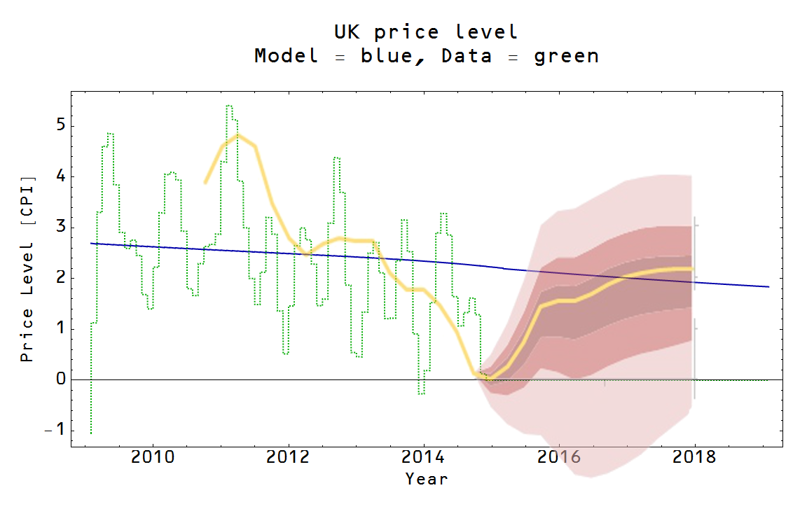

I was excited to see new forecasting from the new Bank of England blog (H/T to [Simon Wren-Lewis](http://mainlymacro.blogspot.com/2015/06/the-bank-of-england-goes-underground.html)), but unfortunately (for me) the result is completely consistent with the information equilibrium model. Since they agree and future data will not help decide between them, I thought it wasn't worth the effort of digitizing the graph and combining the data properly. Therefore I did a cheesy graphical plot overlaid on the results [from here](http://informationtransfereconomics.blogspot.com/2015/04/will-uk-be-first-to-exit-great-recession.html):

I used the second scenario where ELB was set at 0.5%, but it largely doesn't matter which one is used.
