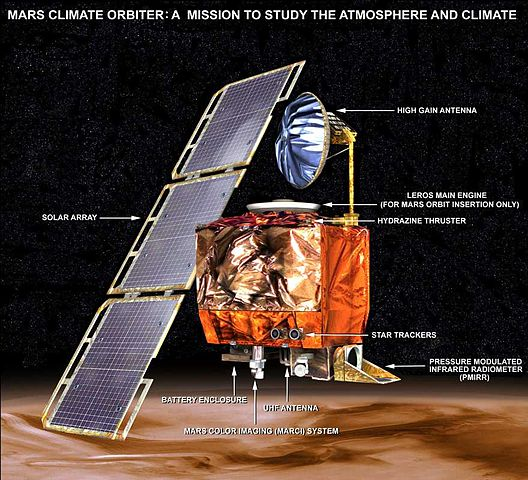

Ok, this is outside the main purview of this blog, but in the general spirit of transferring information from point A to point B, let me take on this common trope about the metric system.

[Vox](http://www.vox.com/2015/6/4/8731637/chafee-jindal-metric) has an article up about the appearance of the metric system as a campaign issue:

> _As [Susannah Locke](http://www.vox.com/2014/5/29/5758542/time-for-the-US-to-use-the-metric-system) explains, the vast majority of the world uses metric, and the existence of two systems is a hindrance for international cooperation, especially on science and medicine. A [$125 million Mars orbiter](http://www.wired.com/2010/11/1110mars-climate-observer-report/) was lost because of a failure to convert from English to metric._

No. The failure can't be blamed on a failure to convert units. This exact same mistake could happen if one piece of software interpreted the units as _µN_ and the other as _kN_. The problem might have beem a mistake on the part of the software engineer but was more likely a bad [Interface Control Document](http://en.wikipedia.org/wiki/Interface_control_document) (ICD). It's not illogical English units; this was bad systems engineering.

This is a particular pet peeve because just yesterday I had to fix a problem where I had coded to the ICD, but the other piece of software hadn't. And it was their ICD! The software engineers working on the Mars Orbiter must have been from MIT, too.

It's also trivial to convert units these days. [Try this](https://www.google.com/search?q=speed%20of%20light%20in%20furlongs%20per%20fortnight)! Data should always be accompanied by metadata that gives its units and there are lots of existing software packages out there that can handle them. We're not living in the 19th century so units don't have to be so rigid anymore.
