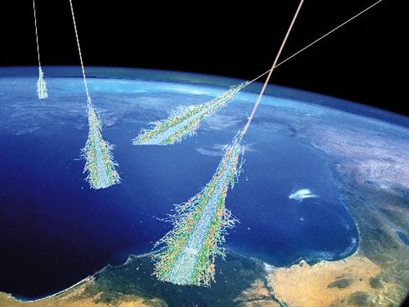

[Mark Thoma](http://economistsview.typepad.com/economistsview/2015/06/a-crisis-at-the-edge-of-physics.html) points us to a [NYTimes article](http://www.nytimes.com/2015/06/07/opinion/a-crisis-at-the-edge-of-physics.html) where the authors claim a crisis in fundamental particle physics. Mark points out that he thinks there's a connection to economics and I'd agree. Actually I think the NYTimes article is **_more_** appropriate for economics than physics.

The authors complain that after the Higgs was found, there's no way to empirically validate theory anymore. They take exception to a couple of physicists who say that isn't exactly a problem.

I'm going to suspend my disbelief in later paragraphs; however, the fact is that they're wrong -- just because they can't think of a way to test string theory doesn't mean there isn't one. Sure, brute force approaches (i.e. accelerator experiments) are probably coming to an end in their usefulness. Super-symmetric partners (sparticles) might be beyond a feasible accelerator. But what about data-mining high energy cosmic rays? [The universe itself is a 10^10 GeV accelerator](http://en.wikipedia.org/wiki/Greisen%E2%80%93Zatsepin%E2%80%93Kuzmin_limit) with a very low luminosity. Lack of imagination of how to empirically test string theory is not a proof of impossibility.

So now let's say they're right and we won't be able to empirically validate high energy particle theory. We still have a foundation of all of the successful theory we've empirically validated. Call that _F_. If you propose new theory _T_ that is far simpler than _F_ that reduces to _F_ in the proper limits I'd call that a major success ... even if _T_ has no additional predictions or only predicts things that can't be empirically tested.

And you know what? We have an example of this! Classical Yang Mills theory \[1\] is based on a beautiful symmetry principle and can give us all of electromagnetism and not much else. I'd rather have _U(1)_ Yang Mills than Biot-Savart + Faraday + Gauss + no magnetic monopoles + topological effects + permittivity + permeability + Lorentz symmetry (those are the various assumptions and equations of electrodynamics). There's a reason physicists refer to electromagnetism as simply _U(1)_.

Even if string theory gives us no testable predictions, the simple Nambu-Goto action \[2\] is better than _U(1) × SU(2) × SU(3)_ + 20 masses and couplings + general relativity. Plus string theory lets you calculate the proper [entropy for a black hole](http://arxiv.org/abs/hep-th/9601029)!

That is to say fundamental research that gives us a new unified theory (_T_) while remaining consistent with the empirically tested standard model (_F_) to as many decimal places we can measure it is a perfectly good aim when we've run out of things to test empirically. Which we haven't \[3\]. 

That brings us back to macroeconomics: _macroeconomics doesn't have an F!_

Therefore all of the philosophical objections in the NYTimes article _**do**_ apply to macro ... and there may indeed be a crisis not at its edge, but at its heart if it isn't supported by empirical data.

**Footnotes:**

\[1\] Classical Yang-Mills is basically defined by the Lagrangian:

__L = tr F ∧ ★F__

... which should be on the [t-shirts instead of Maxwell's equations](https://www.google.com/search?q=maxwell%27s+equations+tshirt). Some nice notes on it can be found [here](http://michaelnielsen.org/blog/introduction-to-yang-mills-theories/).

\[2\] Ok; that is just the simplest string theory, but you get the point.

\[3\] A couple of friends of mine [put some limits on string theory](http://inspirehep.net/record/731758?ln=en) with a table-top experiment.
