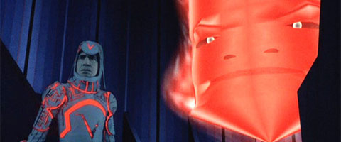

A recent post from Paul Romer about Robert Lucas triggered a memory of a post from awhile ago by Tyler Cowen. I think it illustrates how economics slips into _ad hoc_ theorizing and re-inventing the wheel.

[Romer describes](http://paulromer.net/mathiness-lucas-2009/) Lucas's model of economic growth

> _There is a person we can call Mr. Googolplex, with productivity that is googolplex times y. When Mr. Googolplex bumps into another worker, he explains what he knows and the productivity of the other worker increases (on average) by a factor of googolplex._ 

> _In the model, this can’t happen often because Mr. Googolplex can only bump into only a few people each year. But suppose that Mr. Googolplex could write what he knows in a book and send a copy to everyone. If the book can record the words he would say when he bumps into someone in the hall, anyone who reads the book can enjoy the same increase in productivity that they’d get from a hallway encounter. So output in the economy will increase by a factor of googolplex._

The next piece is [Tyler Cowen's post](http://marginalrevolution.com/marginalrevolution/2015/04/progressive-finnish-fines-for-traffic-tickets.html) on progressive fines for speeding in Finland -- you make more, you pay more. With typical deference to the wealthy and powerful elite, Cowen comments:

> _Wealthier people have a higher value of time, and it is probably efficient to allow them to speed more._

You can certainly make a lot of money saying things like that to wealthy people! However ...

If their time was so valuable, why spend any time in transit to anywhere? As the limit of the value of one person's time goes up, other people (with less valuable time) should be spending their time _in transit to them_. As that value goes to a googolplex, Mr. Googolplex (using Romer's analogy) should be stationary. Like a real-life version of [the MCP](http://tron.wikia.com/wiki/MCP). Speeding fines tax the inefficient movement of Mr. Googolplex.

Someone might say: Mr. Googolplex can work on his private jet or the back of his (speeding) limo, so moving around isn't inefficient. I say: if he can do that without inefficiency, he apparently can work from anywhere, hence why be anywhere specific? If you can work from your private jet, you _a fortiori_ can work from your office.

What this implies is that it isn't Mr. Googolplex's time that's valuable, it's his presence. That's the gist of CEO's flying around to various places -- the higher up in the company, the more you seem to travel. This style has even made it into management strategy guides; they call it [managing by wandering around](http://en.wikipedia.org/wiki/Management_by_wandering_around). That's probably the intuition behind Lucas's model as well (though Lucas might not even know it). You can't put presence in a book. And since presence is required, it can't be knowledge that is being transferred.

So -- assuming this is a real and economically important effect -- what is being transferred? Do people look busy when the boss is around, accidentally doing some actual work?

I have a guess and ironically it's deeply connected with some key insights of economics: [transaction costs](http://en.wikipedia.org/wiki/Ronald_Coase) and the [Theory of the Firm](http://en.wikipedia.org/wiki/Theory_of_the_firm). It's ironic in the sense that Lucas is coming up with a whole new model of knowledge transfer and Cowen naively interprets Econ 101 when they both could have pushed their world-views with established economic theory. It's kind of like two physicists trying to explain why electrons behave like waves where one comes up with a [pilot wave theory](http://en.wikipedia.org/wiki/Pilot_wave) and the other says it has something to do with Newton's laws in order keep everything classical.

My guess is this: (assuming the effect is real, a big if) when Mr. Googolplex shows up in-person, he can form alliances, make peace and establish trust. Note that trust and alliances are ancient human (and pre-human) concepts, and since we didn't evolve with TV's around (but we did have "leaders") they probably require presence of all the parties involved. Trust reduces transaction costs. Contracts between parties that don't trust each other have to be spelled out very explicitly; contracts between trusting parties can be implicit. Trust reduces transaction costs which leads to greater productivity. Trust also lasts after it's been established, so it's  not just a transient increase.

However, that is just a guess. The thing is: who really knows? If only there was a discipline that studied human interactions in social settings ... Oh, wait! There is! It's called sociology. Economists _ad hoc_ sociology does seem a fertile ground for models, but it lends itself to a different kind of managing by wandering around: academic economists manage to get by producing papers by wandering around the purview of sociology.

In the end, the idea of the presence of Mr. Googolplex enhancing productivity (or letting wealthy people speed) seems very much in line with Max Weber's theory of [charismatic authority](http://en.wikipedia.org/wiki/Charismatic_authority). If only economists paid attention to 100-year-old sociology.
