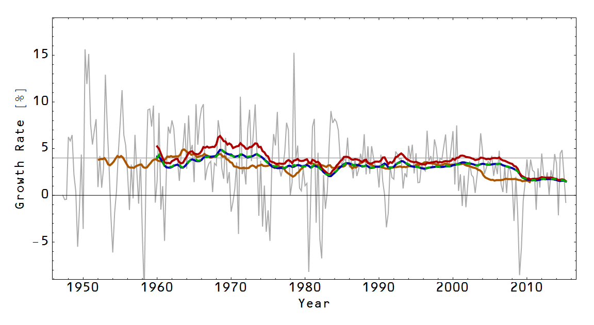

[excellent title](http://econospeak.blogspot.com/2015/05/mathiness-and-growthiness.html)

John Cochrane [put up a graph today](http://johnhcochrane.blogspot.com/2015/06/four-percent.html) trying to persuade us that Jeb Bush's goal of 4% real GDP growth is possible contra several other economists. I tried to figure out what he did because it couldn't have been a simple moving average (orange curve). His graph went until 2015 so it would have to be a backward looking average of some kind. But then both a backward looking moving average (green dashed) and a backward looking integral average (blue, they're basically on top of each other) don't quite make it up to 4% since the 1970s.

I did eventually figure it out (the red curve), but it involves the same mistake [that I took Scott Sumner to task for back awhile ago](http://informationtransfereconomics.blogspot.com/2014/07/i-do-not-think-that-calculation-means.html). Cochrane took the change in RGDP from a point _t - 10_ to _t_ and divided by RGDP at _t_. That gives the slope of the secant from the start point to the end point.

It may be called the [mean value theorem](https://en.wikipedia.org/wiki/Mean_value_theorem), but that doesn't mean that the secant gives an average value. All it does is say there is at least one point that has that slope -- that 4% growth happened sometime during that 10 year period.

These diagrams might make this clearer. The first one (on the left) shows an RGDP function that gives 4% growth between the endpoints 10 years apart. You can see there is a point just after year 8 that has a tangent with the same slope. In the second graph (on the right) you can see that this function has nearly zero growth across the entire 10 year period. Not many people would consider that averaging 4% RGDP growth (it actually averages around 3.5% growth during that entire period per the averaging methods above). Cochrane's method over-weights the high growth spikes.

The method other economists are using to say growth has been less than 4% is the better method. Of course, you can choose to use the mean value theorem method if you want to overweight growth spikes to make growth to look higher ... and you're into mathiness.
