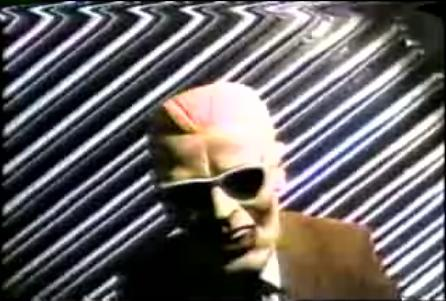
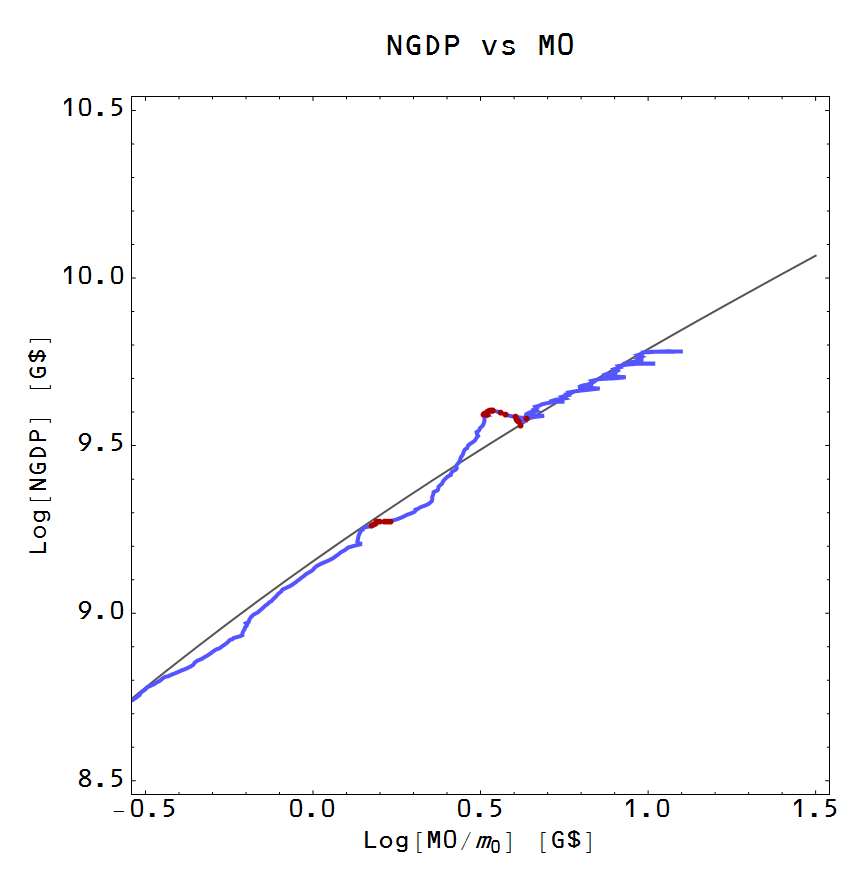

[John Cochrane](http://johnhcochrane.blogspot.com/2015/05/small-shoes-and-headroom.html) reasons through the idea of the Fed raising rates now-ish to create "headroom" to fight a future downturn. His arguments about linear models are pretty logical. Raising rates will hurt the economy as much as future drop will help, _ceteris paribus_, so maybe there is a path dependence effect that saves you ... but maybe not.

I'd just like to add the information transfer model view. What follows assumes the IT model is true -- it may be wrong, so you should add that caveat to what is said below.

Basically, monetary policy has little to no effect on the US macroeconomy except as a possible source of coordination because it's in a "[liquidity trap](http://informationtransfereconomics.blogspot.com/2014/06/krugman-keynes-and-liquidity-trap.html)". However that coordination effect [can be sizable](http://informationtransfereconomics.blogspot.com/2015/03/non-ideal-information-transfer-tail.html) (essentially limiting how much the fall in NGDP is due to non-ideal information transfer/market failure/panic). All of the impact of QE or interest rates is almost entirely short term and emotional at this point.

Whether one should raise rates now would be based on a few considerations:

1.  Would the rise trigger an immediate recession?
2.  Would the future rate cut help a future recession?

If we look at the US growth path in NGDP-M0 space, we can see that we're not terribly off the curve so the worst we could expect from a rate rise is something on the order of the 2001 "recession":

Regarding the second question, yes it could help shave off some of the non-ideal bit and possibly arrest the [panicked coordination of market actors](http://informationtransfereconomics.blogspot.com/2014/10/coordination-costs-money-causes.html). But this should be compared to the alternatives -- another round of QE at the ZLB could just as easily arrest the fall.

So overall, a rate hike probably won't be the end of the world, but we don't actually need it. In my job, I occasionally do risk analysis. The risk of a rate hike is moderate -- there is a low probability of a high impact (bad) result. However, the benefit is low at a fairly high probability since there are other options (namely QE) and you loose the option to invest in infrastructure with all that free money.
