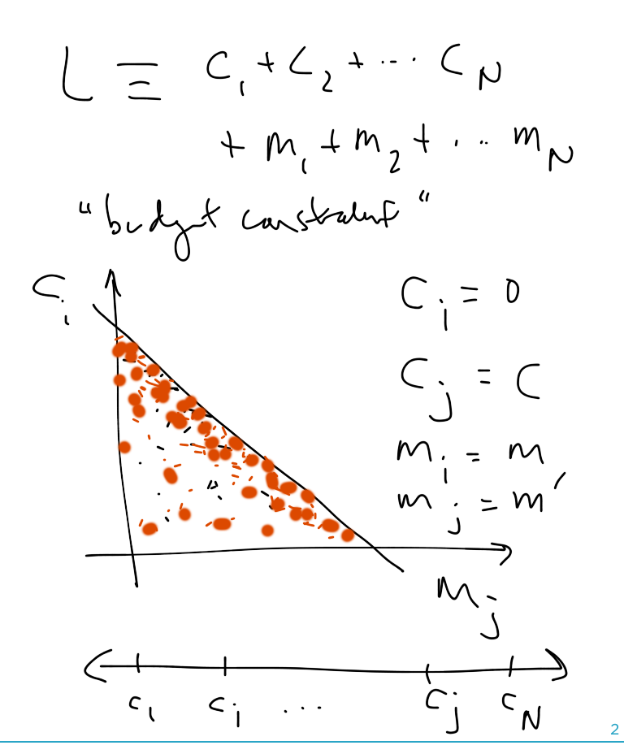
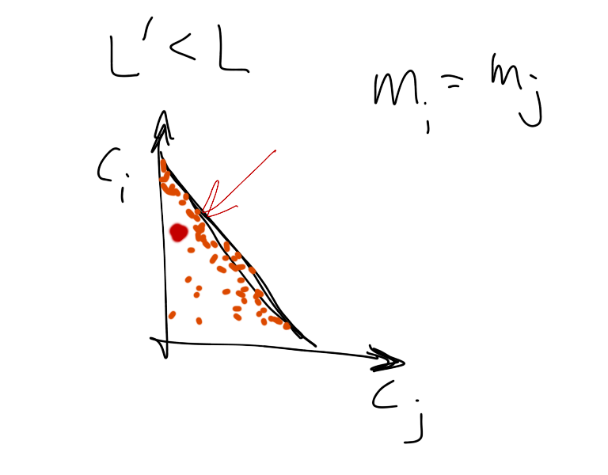
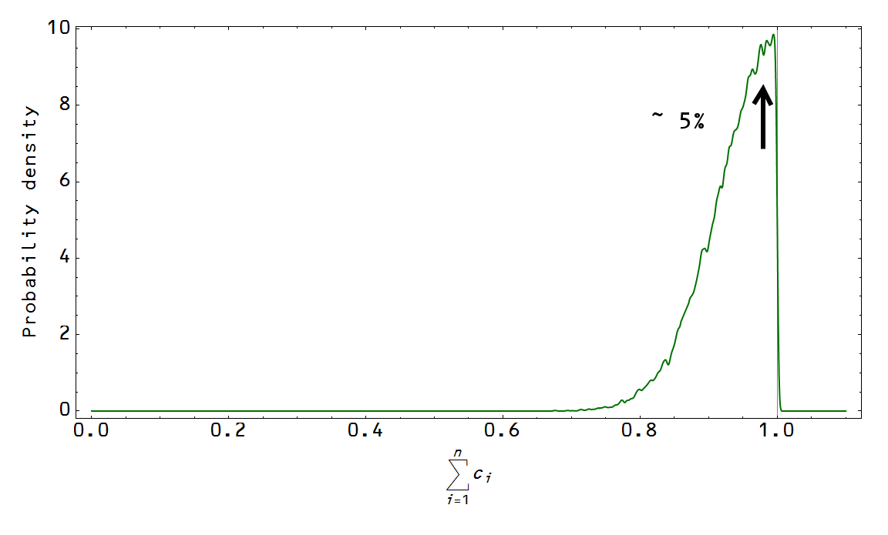

[Nick Rowe has a post up](http://worthwhile.typepad.com/worthwhile_canadian_initi/2015/06/i-need-a-3d-symmetric-edgeworth-box.html) where he blegs the impossible ... A 3D Edgeworth box does not exist (it is at a minimum 6D as I mention in a comment at the post) \[1\]. However, Nick does cite MINIMAC, a minimal macro model described by [Paul Krugman here](http://web.mit.edu/krugman/www/MINIMAC.html). It gives us a fun new example to apply the information equilibrium framework!

We'll start with our typical utility framework (see e.g. [here](http://informationtransfereconomics.blogspot.com/2015/05/the-basic-asset-pricing-equation-as.html) or [here](http://informationtransfereconomics.blogspot.com/2015/04/diamond-dybvig-as-maximum-entropy-model.html)) with

Where there are a large number of periods $i = 1 ... n$. Our utility function is:

$$ U \sim \prod_{i}^{n} C_{i}^{s} \prod_{j}^{n} M_{j}^{\sigma} $$

I'm going to build in a connection to the information transfer model right off the bat by adding (assuming constant information transfer index for simplicity):

$$ 
P : N \rightarrow M 
$$

so that:

$$ 
P \sim M^{k - 1} 
$$

and more importantly for us:

$$ 
\left( \frac{M}{P} \right)^{1 - s} \sim M^{(2 - k)(1 - s)} 
$$

Which means that our utility function matches the MINIMAC utility function up to a logarithm (our $U$ would be $\log U$ using Krugman's $U$) if $\sigma = (2 - k) (1 -s)$:

$$ U \sim \prod_{i}^{n} C_{i}^{s} \prod_{j}^{n}&nbsp;\left( \frac{M_{j}}{P_{j}} \right)^{1 - s} $$

The general budget constraint is given by:

$$ 
L = \sum_{i} C_{i}&nbsp;+ \sum_{j} M_{j} 
$$

In the MINIMAC model, we're only concerned with two periods (call them $i$ and $j$). Essentially in period $i$, $C_{k \leq i} = 0$ and $M_{k \leq i} = M$ and in period $j$, $C_{k \geq j} = C$ and $M_{k \geq j} = M'$ to make the connection with Krugman's notation. We'll use the maximum entropy assumption with a large number of time periods so that the most likely point is near the budget constraint (first shown [here](http://informationtransfereconomics.blogspot.com/2015/03/utility-in-information-equilibrium-model.html)):

There are some interesting observations. If $k = 2$, which is $\kappa = 1/2$, then we have the quantity theory of money, but $\sigma = 0$, so utility only depends on consumption. Also if we take $M_{i} = M_{j}$ (constant money supply), we should randomly observe cases of unemployment where $L' &lt; L$ and consumption is below the maximum entropy level near the budget constraint:

In fact, we should **_typically_** observe $L' &lt; L$ since the maximum entropy point is near, but not exactly at the budget constraint. _Voilà!_ The natural rate of unemployment is essentially dependent on the dimensionality of the consumption periods. With an infinite number, you'd observe no unemployment. For two time periods, you'd observe ~ 50% unemployment (the red dot in the image above would appear near the center of the triangle most of the time). In our world with some large, but not infinite, number of periods we have a distribution that peaks around a natural rate around ~ 5%:

**Footnotes:**

\[1\] You can easily fit a pair of _xy_ axes together where _x1 = x0 - x2_ and _y1 = y0 - y2_ (flip both axes) but you can't do it for three sets of _xyz_ axes since _x1 = x0 - x2 -x3_ (i.e. it depends on two axes). As Nick mentions in reply to my comment, you can do it for 2 agents and 3 goods. And he's right that the math works out fine -- it's basically a three-good Arrow-Debreu general equilibrium model. For my next trick, I think I will build Nick's model.
